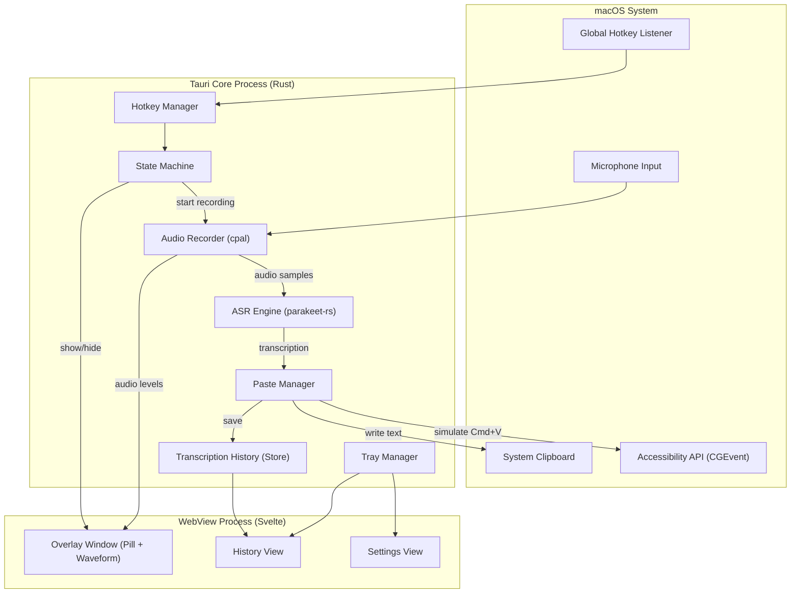
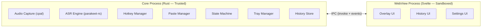
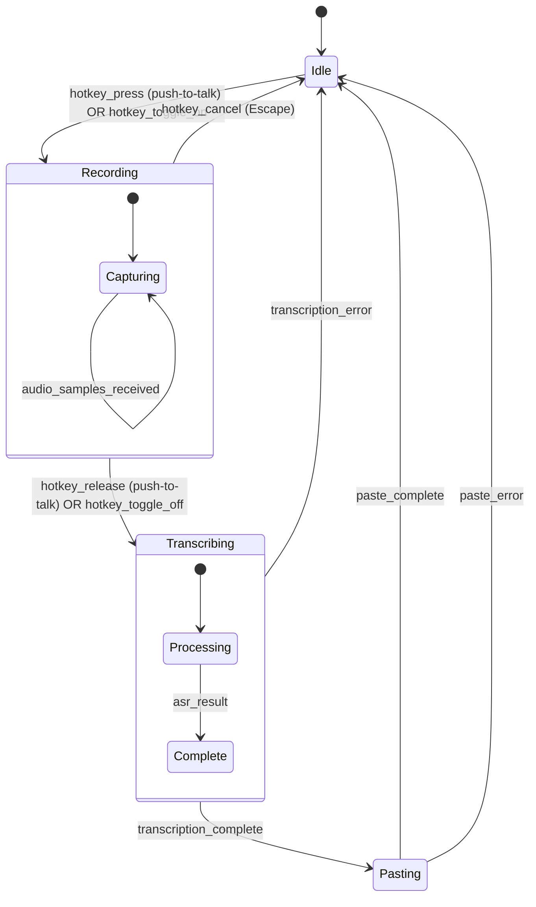
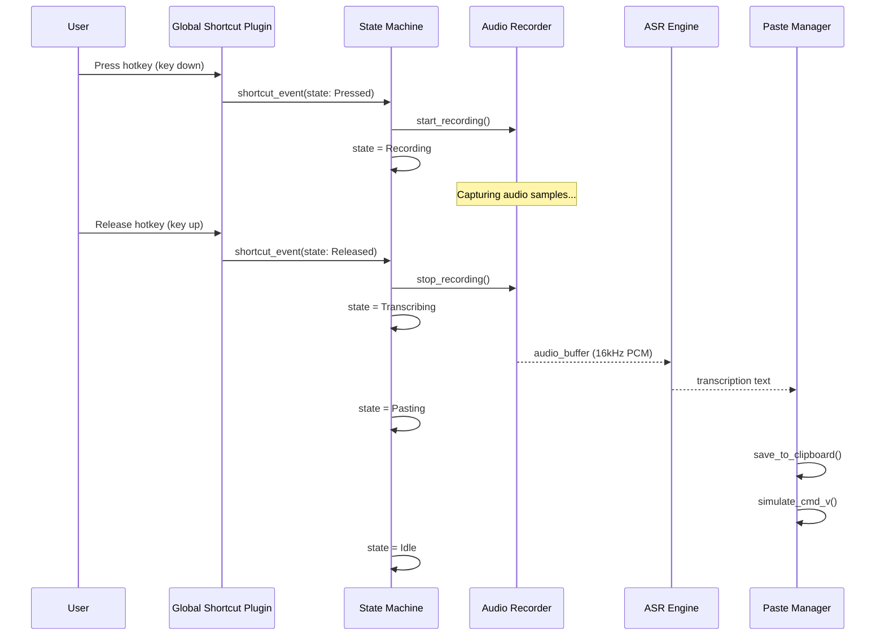
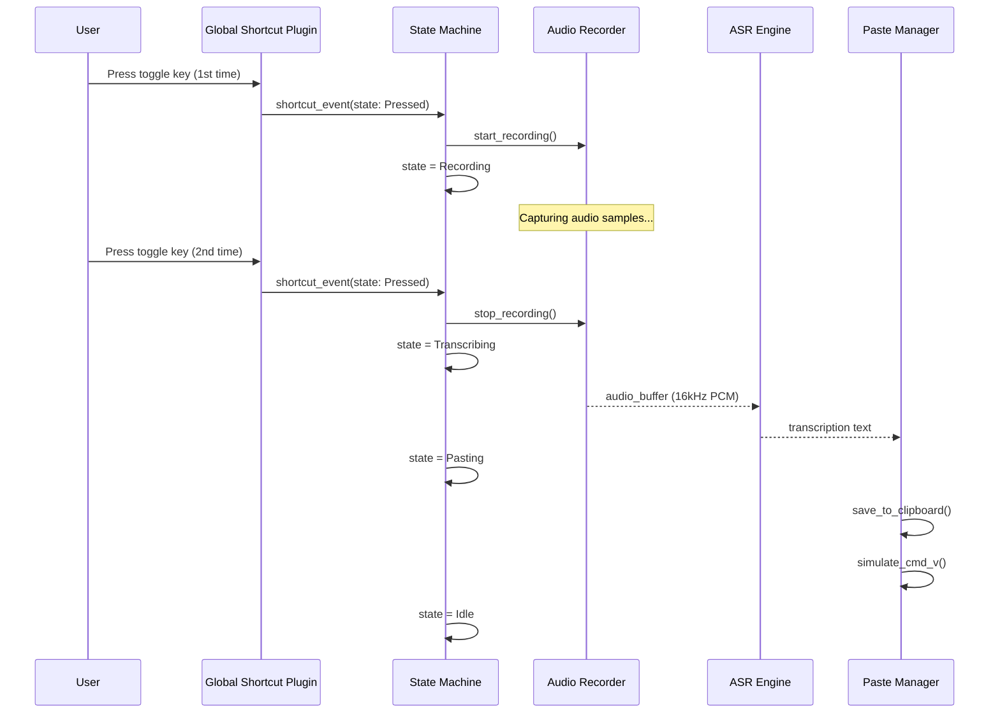
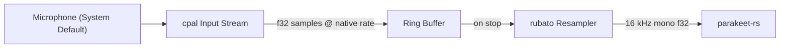
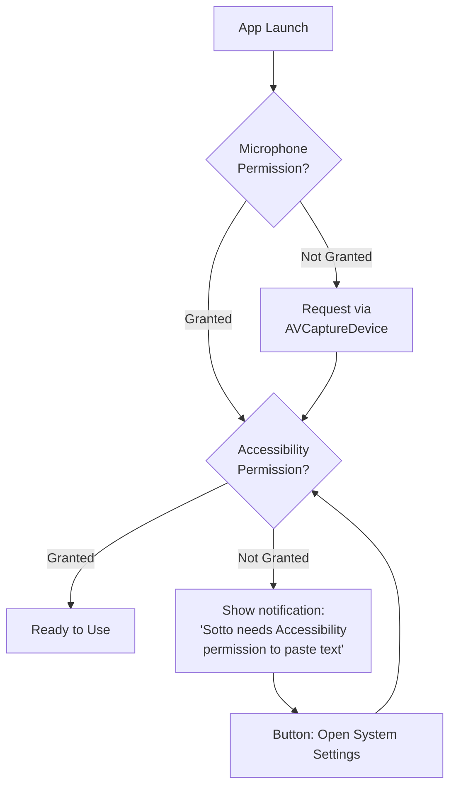

# Sotto — Architecture & Design Document

- **Version**: 2.0
- **Date**: 2026-03-21
- **Status**: Implemented
- **Author**: juanqui + Claude

---

## Table of Contents

1. [Summary](#1-summary)
2. [Problem Statement](#2-problem-statement)
3. [Design Overview](#3-design-overview)
4. [Technology Stack & Rationale](#4-technology-stack--rationale)
5. [Architecture](#5-architecture)
6. [Detailed Design](#6-detailed-design)
7. [Hotkey System](#7-hotkey-system)
8. [Audio Capture Pipeline](#8-audio-capture-pipeline)
9. [ASR Engine Integration](#9-asr-engine-integration)
10. [Paste-at-Cursor Mechanism](#10-paste-at-cursor-mechanism)
11. [Floating Overlay Window](#11-floating-overlay-window)
12. [System Tray & Menu](#12-system-tray--menu)
13. [Transcription History](#13-transcription-history)
14. [Permissions Management](#14-permissions-management)
15. [Edge Cases & Error Handling](#15-edge-cases--error-handling)
16. [File Structure](#16-file-structure)
17. [Testing Strategy](#17-testing-strategy)
18. [Security Considerations](#18-security-considerations)
19. [Performance Targets](#19-performance-targets)
20. [Future: Cross-Platform Support](#20-future-cross-platform-support)

---

## 1. Summary

Sotto is a local, privacy-first automatic speech recognition (ASR) application for macOS. Users press a system-wide hotkey to activate dictation, speak naturally, and transcribed text is automatically pasted wherever their cursor is positioned. All processing happens on-device using NVIDIA Parakeet models via ONNX Runtime — no audio data ever leaves the machine.

The application lives exclusively in the macOS menu bar (no Dock icon, no main window) and provides two dictation modes: **press-and-hold** (hold hotkey, speak, release to transcribe) and **toggle** (press once to start, press again to stop and transcribe). A floating pill overlay with an audio waveform animation provides visual feedback during recording.

---

## 2. Problem Statement

### Current State

macOS includes a built-in dictation feature, but it:
- Routes audio through Apple's cloud servers (privacy concern)
- Provides limited accuracy compared to modern ASR models
- Offers no transcription history
- Has minimal visual feedback during recording
- Cannot be customized (hotkeys, output formatting)

Third-party alternatives like Superwhisper and Wispr Flow either require cloud processing, charge monthly subscriptions, or lack the polish needed for daily use.

### Goals

1. **Privacy-first**: All audio processing happens locally on the user's machine
2. **Low latency**: Transcription completes within 1-2 seconds of speech ending
3. **Two dictation modes**: Press-and-hold for quick dictation, toggle for longer sessions
4. **Invisible when idle**: Menu bar icon only, no Dock presence, no windows unless recording
5. **Paste anywhere**: Transcribed text appears at the cursor position in any application
6. **Transcription history**: All transcriptions are saved and accessible
7. **Polished UX**: Floating pill overlay with waveform animation during recording
8. **Performant**: <50 MB memory when idle, <200 MB during transcription

### Non-Goals

- Real-time streaming transcription (words appearing as spoken) — future enhancement
- Cloud-based ASR fallback — strictly local
- Audio file transcription (file import) — future enhancement
- Speaker diarization — future enhancement
- Translation — future enhancement
- Mobile platforms — future enhancement (macOS first)

---

## 3. Design Overview

### High-Level Architecture



### Key Design Decisions

| Decision | Choice | Rationale |
|----------|--------|-----------|
| Desktop framework | Tauri v2.10 | Rust backend for audio/ASR performance, ~10 MB bundle vs Electron's ~150 MB. Source: [Tauri docs](https://v2.tauri.app/) |
| Frontend framework | Svelte 5 | ~1.6 KB runtime (vs React's ~42 KB), compiled reactivity, best Tauri alignment. Source: [Svelte docs](https://svelte.dev/) |
| ASR engine (macOS) | FluidAudio via fluidaudio-rs | CoreML/Apple Neural Engine, ~44x real-time on M4, Parakeet TDT v3 (25 languages). Automatic model download. Source: [fluidaudio-rs](https://github.com/FluidInference/fluidaudio-rs) |
| ASR engine (cross-platform) | parakeet-rs v0.3.4 (optional) | ONNX Runtime CPU fallback via `asr-parakeet` feature flag. Source: [parakeet-rs](https://github.com/altunenes/parakeet-rs) |
| Audio capture | cpal v0.15 | Cross-platform audio I/O in Rust. Pinned to 0.15.x for stability; 0.17.x available but 0.15 API is sufficient. Source: [cpal](https://github.com/RustAudioGroup/cpal) |
| Audio resampling | rubato v0.16 | High-quality resampling to 16 kHz. Note: rubato v1.0 released Jan 2026 with new API; using 0.16 for proven stability with parakeet-rs ecosystem. Source: [rubato](https://github.com/HEnquist/rubato) |
| Paste mechanism | Clipboard + CGEvent Cmd+V | Industry standard used by Superwhisper, Wispr Flow, Dictato. Uses `core-graphics` crate for CGEvent (note: `cocoa` crate is deprecated; direct `objc2` or `core-graphics` preferred). |
| Storage | tauri-plugin-store | Lightweight JSON-based persistent storage for settings and history. |
| Hotkeys | tauri-plugin-global-shortcut | Official Tauri plugin for system-wide keyboard shortcuts. |
| App type | Menu bar only (LSUIElement) | Standard pattern for dictation apps (Superwhisper, Wispr Flow, MacWhisper all do this). |

### Alternatives Considered and Rejected

| Alternative | Rejected Because |
|-------------|-----------------|
| **FluidAudio / fluidaudio-rs** | ~~Initially rejected~~ → **Adopted as primary macOS backend.** CoreML/ANE provides ~44x RTF on M4, vastly superior to ONNX CPU. Automatic model download. Apple-only is acceptable since macOS is the primary target. parakeet-rs retained as cross-platform fallback via feature flag. |
| **whisper-rs** | Good option but Parakeet TDT v3 has better accuracy (6.34% avg WER on Open ASR Leaderboard) and faster inference on CPU. whisper-rs is a fallback option if parakeet-rs proves problematic. |
| **React + Vite** | Larger runtime (~42 KB vs ~1.6 KB), no advantage for this minimal UI. Svelte's compiled output is better aligned with Tauri's lightweight philosophy. |
| **Next.js** | Must use static export mode, losing all SSR benefits. Adds unnecessary complexity for a desktop app. |
| **Electron** | 150-200 MB bundle, 300-500 MB memory. Antithetical to a lightweight, performant dictation tool. |
| **AXUIElement paste** | Only works in a few apps (TextEdit, Xcode). Clipboard + Cmd+V works universally. |

---

## 4. Technology Stack & Rationale

### Runtime Dependencies

| Component | Package | Version | Purpose |
|-----------|---------|---------|---------|
| Desktop framework | `tauri` | 2.10.x | Cross-platform desktop app with Rust backend |
| Frontend | `svelte` | 5.x | Reactive UI with minimal runtime |
| Build tool | `vite` | 8.x | Fast frontend bundling |
| ASR | `parakeet-rs` | 0.3.4 | Parakeet TDT model inference via ONNX Runtime |
| Audio capture | `cpal` | 0.15.x | Cross-platform audio input (0.17.x available; 0.15 pinned for stability) |
| Resampling | `rubato` | 0.16.x | Resample to 16 kHz for Parakeet (1.0.x available; 0.16 pinned for ecosystem compat) |
| Audio encoding | `hound` | 3.5.x | WAV file read/write |
| Global shortcuts | `tauri-plugin-global-shortcut` | 2.x | System-wide hotkey registration |
| Clipboard | `tauri-plugin-clipboard-manager` | 2.x | Read/write system clipboard |
| Storage | `tauri-plugin-store` | 2.x | Persistent key-value storage |
| Positioning | `tauri-plugin-positioner` | 2.x | Window positioning (tray-relative) |
| macOS interop | `core-graphics` + `core-foundation` | 0.24.x / 0.10.x | CGEvent for paste simulation. Note: `cocoa`/`objc` crates are deprecated in favor of `objc2-*`; we use `core-graphics` directly for CGEvent API. |
| Date/time | `chrono` | 0.4.x | Timestamp transcriptions |
| IDs | `uuid` | 1.x | Unique transcription identifiers |
| Async runtime | `tokio` | 1.x | Async task execution for ASR |
| Error handling | `anyhow` | 1.x | Ergonomic error handling |
| User dirs | `dirs` | 6.x | Platform-specific data directories |

### macOS System Requirements

- macOS 12 Monterey or later (for WKWebView compatibility)
- Apple Silicon recommended (M1+) for optimal ASR performance
- ~670 MB disk for ASR model (Parakeet TDT 0.6B int8 ONNX: encoder ~652 MB + decoder ~18 MB)
- Microphone permission (TCC — Transparency, Consent, and Control, Apple's privacy permissions framework)
- Accessibility permission (TCC) for paste-at-cursor

### Glossary

| Term | Definition |
|------|-----------|
| TCC | Transparency, Consent, and Control — Apple's privacy permissions framework for macOS |
| WER | Word Error Rate — percentage of incorrectly transcribed words |
| RTF | Real-Time Factor — ratio of processing time to audio duration. 20x RTF means 1 second of audio processes in 50ms |
| LSUIElement | An Info.plist key that hides the app from the macOS Dock, making it a background/agent app |
| NSPanel | A macOS window type designed for auxiliary/floating panels that don't steal focus |
| Template image | A macOS menu bar image that automatically adapts to light/dark appearance |
| FIFO | First In, First Out — oldest items are removed first when a limit is reached |

---

## 5. Architecture

### Process Model

Tauri uses a multi-process architecture:



**Core Process (Rust)** handles all sensitive and performance-critical operations:
- Audio capture and buffering
- ASR model inference
- System clipboard manipulation
- CGEvent posting (simulated paste)
- Global hotkey registration
- Tray icon and menu management
- Transcription history persistence

**WebView Process (Svelte)** handles UI rendering only:
- Floating overlay with waveform animation
- Transcription history list view
- Settings/preferences panel
- All UI state driven by Tauri events from Rust

### State Machine

The application has a clear state machine governing recording behavior:



**States:**

| State | Description | Overlay | Tray Icon |
|-------|-------------|---------|-----------|
| `Idle` | No recording active | Hidden | Default icon |
| `Recording` | Capturing audio from microphone | Visible (pill + waveform) | Recording icon (red dot) |
| `Transcribing` | ASR model processing audio | Visible (processing spinner) | Processing icon |
| `Pasting` | Writing to clipboard and simulating Cmd+V | Hidden | Brief flash |

---

## 6. Detailed Design

### 6.1 IPC Commands (Rust → Frontend)

All Tauri commands exposed to the frontend:

```rust
// Recording control
#[tauri::command]
async fn start_recording(state: State<'_, AppState>) -> Result<(), String>;

#[tauri::command]
async fn stop_recording(state: State<'_, AppState>) -> Result<(), String>;
// Note: transcription result arrives asynchronously via `transcription-complete` event

#[tauri::command]
async fn cancel_recording(state: State<'_, AppState>) -> Result<(), String>;

// Transcription history
#[tauri::command]
async fn get_transcriptions(state: State<'_, AppState>) -> Result<Vec<Transcription>, String>;

#[tauri::command]
async fn get_last_transcription(state: State<'_, AppState>) -> Result<Option<Transcription>, String>;

#[tauri::command]
async fn delete_transcription(id: String, state: State<'_, AppState>) -> Result<(), String>;

#[tauri::command]
async fn clear_transcriptions(state: State<'_, AppState>) -> Result<(), String>;

// Settings
#[tauri::command]
async fn get_settings(state: State<'_, AppState>) -> Result<Settings, String>;

#[tauri::command]
async fn update_settings(settings: Settings, state: State<'_, AppState>) -> Result<(), String>;

// Permissions
#[tauri::command]
async fn check_microphone_permission() -> Result<bool, String>;

#[tauri::command]
async fn check_accessibility_permission() -> Result<bool, String>;

#[tauri::command]
async fn request_accessibility_permission() -> Result<(), String>;

// ASR model management
#[tauri::command]
async fn get_model_status(state: State<'_, AppState>) -> Result<ModelStatus, String>;

#[tauri::command]
async fn download_model(state: State<'_, AppState>) -> Result<(), String>;
```

### 6.2 Tauri Events (Rust → Frontend)

Events emitted from Rust to update the frontend:

| Event | Payload | Description |
|-------|---------|-------------|
| `recording-started` | `{}` | Recording has begun |
| `recording-stopped` | `{}` | Recording has stopped, transcription starting |
| `recording-cancelled` | `{}` | Recording was cancelled (Escape pressed), no transcription will occur |
| `audio-level` | `{ level: f32 }` | Current audio amplitude (0.0–1.0), emitted ~30 fps |
| `transcription-complete` | `{ id, text, duration_ms }` | ASR finished, text available |
| `transcription-error` | `{ error: string }` | ASR failed |
| `paste-complete` | `{ id: string }` | Text was pasted at cursor successfully |
| `paste-error` | `{ error: string }` | Paste failed (e.g., no accessibility permission) |
| `model-download-started` | `{}` | Model download has begun |
| `model-download-progress` | `{ progress: f32 }` | Model download progress (0.0–1.0) |
| `model-download-complete` | `{}` | Model download finished successfully |
| `model-download-error` | `{ error: string }` | Model download failed |
| `state-changed` | `{ state: AppStateEnum }` | State machine transition |

### 6.3 Data Models

```typescript
// TypeScript (frontend)
interface Transcription {
  id: string;           // UUID v4
  text: string;         // Transcribed text
  duration_ms: number;  // Recording duration in milliseconds
  created_at: string;   // ISO 8601 timestamp
  word_count: number;   // Number of words
}

interface Settings {
  push_to_talk_shortcut: string;  // e.g., "CommandOrControl+Shift+Space"
  toggle_shortcut: string;        // e.g., "CommandOrControl+Shift+D"
  cancel_shortcut: string;        // e.g., "Escape"
  show_overlay: boolean;          // Show floating pill during recording
  auto_paste: boolean;            // Automatically paste after transcription
  restore_clipboard: boolean;     // Restore clipboard after paste
  model_path: string;             // Path to ONNX model file
  language: string;               // Language code or "auto"
  max_history: number;            // Maximum transcriptions to keep
  launch_at_login: boolean;       // Start app on macOS login
}

interface ModelStatus {
  downloaded: boolean;
  loaded: boolean;
  path: string | null;
  name: string;
  size_bytes: number | null;
}
```

```rust
// Rust (backend)

/// Global application state, managed by Tauri's State<AppState>.
///
/// Uses std::sync::Mutex for state accessed in sync contexts (cpal callback).
/// Uses tokio::sync::Mutex for state accessed in async Tauri commands (avoids
/// deadlock when holding a lock across .await points).
/// Audio buffer uses a channel-based approach: cpal callback sends samples
/// to a receiver held by the recording manager, avoiding shared Mutex contention.
pub struct AppState {
    pub current_state: std::sync::Mutex<AppStateEnum>,
    pub settings: tokio::sync::Mutex<Settings>,
    pub asr_engine: tokio::sync::Mutex<Option<parakeet_rs::ParakeetTDT>>,
    pub last_transcription: tokio::sync::Mutex<Option<Transcription>>,
    pub is_model_loaded: std::sync::atomic::AtomicBool,
    // Audio samples are sent via crossbeam channel from cpal callback,
    // not stored in a shared Mutex. See audio/capture.rs.
}

#[derive(Debug, Clone, Serialize, Deserialize)]
pub struct ModelStatus {
    pub downloaded: bool,
    pub loaded: bool,
    pub path: Option<String>,
    pub name: String,
    pub size_bytes: Option<u64>,
}

#[derive(Debug, Clone, Serialize, Deserialize)]
pub struct Transcription {
    pub id: String,
    pub text: String,
    pub duration_ms: u64,
    pub created_at: chrono::DateTime<chrono::Utc>,
    pub word_count: usize,
}

#[derive(Debug, Clone, Serialize, Deserialize)]
pub struct Settings {
    pub push_to_talk_shortcut: String,
    pub toggle_shortcut: String,
    pub cancel_shortcut: String,
    pub show_overlay: bool,
    pub auto_paste: bool,
    pub restore_clipboard: bool,
    pub model_path: String,
    pub language: String,
    pub max_history: usize,
    pub launch_at_login: bool,
}

impl Default for Settings {
    fn default() -> Self {
        Self {
            push_to_talk_shortcut: "CommandOrControl+Shift+Space".into(),
            toggle_shortcut: "CommandOrControl+Shift+D".into(),
            cancel_shortcut: "Escape".into(),
            show_overlay: true,
            auto_paste: true,
            restore_clipboard: true,
            model_path: String::new(), // Auto-detected
            language: "auto".into(),
            max_history: 500,
            launch_at_login: false,
        }
    }
}

#[derive(Debug, Clone, Serialize, Deserialize)]
pub enum AppStateEnum {
    Idle,
    Recording,
    Transcribing,
    Pasting,
}
```

---

## 7. Hotkey System

### Implementation

Uses `tauri-plugin-global-shortcut` to register system-wide keyboard shortcuts. The plugin fires callbacks on both `Pressed` and `Released` states on macOS, which enables press-and-hold detection.

### Press-and-Hold Mode



### Toggle Mode



### Hotkey Registration (Rust)

```rust
use tauri_plugin_global_shortcut::{Code, GlobalShortcutExt, Modifiers, Shortcut, ShortcutState};

fn setup_shortcuts(app: &mut tauri::App) -> Result<(), Box<dyn std::error::Error>> {
    let push_to_talk = Shortcut::new(
        Some(Modifiers::SHIFT | Modifiers::SUPER),
        Code::Space
    );
    let toggle = Shortcut::new(
        Some(Modifiers::SHIFT | Modifiers::SUPER),
        Code::KeyD
    );

    app.global_shortcut().on_shortcut(push_to_talk, move |_app, shortcut, event| {
        match event.state {
            ShortcutState::Pressed => {
                // Start recording
            }
            ShortcutState::Released => {
                // Stop recording, begin transcription
            }
        }
    })?;

    app.global_shortcut().on_shortcut(toggle, move |_app, shortcut, event| {
        if event.state == ShortcutState::Pressed {
            // Toggle recording on/off
        }
    })?;

    Ok(())
}
```

### Cancel Mechanism

Pressing `Escape` during recording cancels the current dictation session without transcribing or pasting. The audio buffer is discarded.

**Important**: The Escape shortcut is only registered while in the `Recording` state to avoid conflicting with Escape usage in other applications. It is unregistered when returning to `Idle`.

---

## 8. Audio Capture Pipeline

### Flow



### Implementation Details

1. **Input**: `cpal` opens the default input device with the device's native sample rate and channel count
2. **Buffering**: Audio samples are appended to a pre-allocated `Vec<f32>` buffer (capacity for up to 5 minutes of 16 kHz mono audio)
3. **Resampling**: On recording stop, `rubato` resamples from native rate to 16 kHz mono (Parakeet requirement)
4. **Format**: 16 kHz, mono, 32-bit float PCM — the format parakeet-rs expects

### Audio Level Metering

During recording, RMS (Root Mean Square) amplitude is calculated every ~33ms (30 fps) from the latest audio samples and emitted as a `audio-level` event to the frontend for waveform visualization:

```rust
fn calculate_rms(samples: &[f32]) -> f32 {
    let sum: f32 = samples.iter().map(|s| s * s).sum();
    (sum / samples.len() as f32).sqrt()
}
```

### Memory Budget

Audio is captured at the device's native sample rate (typically 48 kHz stereo on macOS) and downmixed to mono in the cpal callback. Resampling to 16 kHz happens after recording stops.

- **During recording** (mono at native rate, e.g., 48 kHz):
  - 48 kHz × 4 bytes (f32) × 60 seconds = ~11.5 MB per minute
  - Pre-allocated buffer for 5 minutes = ~57.5 MB
- **After stop** (resampled to 16 kHz):
  - 16 kHz × 4 bytes (f32) × 5 minutes = ~18.75 MB
  - Resampling buffer overhead: ~10 MB
- **Total audio pipeline peak**: ~70 MB during recording

---

## 9. ASR Engine Integration

### parakeet-rs Setup

`parakeet-rs` wraps NVIDIA Parakeet models via ONNX Runtime. It supports multiple model variants:

| Model | Type | Languages | Size (ONNX) | Recommended |
|-------|------|-----------|-------------|-------------|
| Parakeet TDT 0.6B v3 | Offline | 25 | ~600 MB | **Yes — primary** |
| Parakeet CTC 110M | Offline | English | ~110 MB | Lightweight fallback |
| Parakeet EOU 120M | Streaming | English | ~120 MB | Future (streaming mode) |

### Model Download & Storage

Models are stored in the platform data directory:
- macOS: `~/Library/Application Support/com.sotto.app/models/`

On first launch, Sotto checks for the model file. If not present, it prompts the user to download it and shows progress via the tray menu.

### Transcription Flow

```rust
use parakeet_rs::ParakeetTDT;

async fn transcribe(audio_samples: &[f32], sample_rate: u32) -> Result<String, anyhow::Error> {
    // parakeet-rs expects 16kHz mono f32 audio
    // Note: ParakeetTDT::from_pretrained takes (model_dir, options)
    // CTC/TDT models have ~4-5 minute audio length limit
    let mut parakeet = ParakeetTDT::from_pretrained("./models/parakeet-tdt", None)?;
    let result = parakeet.transcribe_samples(audio_samples, sample_rate, 1, None)?;
    Ok(result.text)
}
```

**API Notes (parakeet-rs v0.3.4):**
- Use `ParakeetTDT::from_pretrained(model_dir, options)` — not `Recognizer` (which does not exist)
- `transcribe_samples` takes 4 args: `(&mut self, samples, sample_rate, channels, timestamp_mode)`
- Methods require `&mut self` — use `let mut parakeet`
- Model audio length limit: ~4-5 minutes per call (aligns with our 5-minute max recording)

### Performance Expectations

Based on parakeet-rs benchmarks and community reports:
- **Apple Silicon CPU**: ~20-30x real-time factor (10 seconds of speech in ~300-500ms)
- **GPU (CUDA/TensorRT)**: ~500x real-time factor on dedicated GPUs
- **CPU-only on Mac**: Faster than Whisper with Metal for short utterances
- **Accuracy**: 6.34% average WER on Open ASR Leaderboard (Parakeet TDT 0.6B v3)
- **Latency target**: <1.5 seconds for typical dictation (5-30 seconds of speech)

---

## 10. Paste-at-Cursor Mechanism

### Strategy

Use the industry-standard approach: write text to the system clipboard, then simulate Cmd+V via CGEvent API. This is the same approach used by Superwhisper, Wispr Flow, and Dictato.

### Implementation (Rust, macOS-specific)

Clipboard operations use `tauri-plugin-clipboard-manager` via the Tauri app handle. CGEvent simulation uses the `core-graphics` crate (not the deprecated `cocoa` crate).

```rust
use core_graphics::event::{CGEvent, CGEventFlags};
use core_graphics::event_source::{CGEventSource, CGEventSourceStateID};
use core_graphics::event::CGEventTapLocation;

pub fn paste_text(
    app: &tauri::AppHandle,
    text: &str,
    restore_clipboard: bool,
) -> Result<(), anyhow::Error> {
    // 1. Save current clipboard via tauri-plugin-clipboard-manager (optional)
    let previous = if restore_clipboard {
        app.clipboard().read_text().ok()
    } else {
        None
    };

    // 2. Write transcription to clipboard
    app.clipboard().write_text(text)?;

    // 3. Small delay to let clipboard propagate
    std::thread::sleep(std::time::Duration::from_millis(50));

    // 4. Simulate Cmd+V via CGEvent
    simulate_paste()?;

    // 5. Restore clipboard after delay (optional)
    if restore_clipboard {
        let app_handle = app.clone();
        std::thread::spawn(move || {
            std::thread::sleep(std::time::Duration::from_millis(500));
            if let Some(prev) = previous {
                let _ = app_handle.clipboard().write_text(&prev);
            }
        });
    }

    Ok(())
}

fn simulate_paste() -> Result<(), anyhow::Error> {
    let source = CGEventSource::new(CGEventSourceStateID::HIDSystemState)
        .map_err(|_| anyhow::anyhow!("Failed to create CGEventSource"))?;

    // Key code 0x09 = kVK_ANSI_V (verified via macOS virtual keycodes)
    let key_down = CGEvent::new_keyboard_event(source.clone(), 0x09, true)
        .map_err(|_| anyhow::anyhow!("Failed to create key down event"))?;
    let key_up = CGEvent::new_keyboard_event(source, 0x09, false)
        .map_err(|_| anyhow::anyhow!("Failed to create key up event"))?;

    key_down.set_flags(CGEventFlags::CGEventFlagCommand);
    key_up.set_flags(CGEventFlags::CGEventFlagCommand);

    key_down.post(CGEventTapLocation::HID);
    key_up.post(CGEventTapLocation::HID);

    Ok(())
}
```

**Note on AXIsProcessTrusted()**: This function can return `true` before permissions are fully propagated. Consider implementing a functional test (attempt to post a test CGEvent) in addition to the API check.

### Requirements

- **Accessibility permission** must be granted in System Settings → Privacy & Security → Accessibility
- On macOS 15 Sequoia, permissions may need to be re-granted after OS updates
- `AXIsProcessTrusted()` is used to check permission status

### Clipboard Restore

When `restore_clipboard` is enabled (default: true):
1. Read current clipboard contents before writing transcription
2. Write transcription to clipboard
3. Simulate Cmd+V
4. After 500ms delay, restore original clipboard contents

This prevents the user's clipboard from being permanently overwritten by each transcription.

---

## 11. Floating Overlay Window

### Design

A borderless, transparent, always-on-top floating pill that appears at the bottom-center of the screen during recording. It provides visual feedback that Sotto is actively capturing audio.

### Visual Specifications

```
┌────────────────────────────────────────┐
│  🔴  ███ ██ ████ ██ ███ ██ ████  0:03 │
└────────────────────────────────────────┘

Width: 280px
Height: 44px
Corner radius: 22px (full pill)
Background: rgba(0, 0, 0, 0.85) with backdrop blur
Position: Bottom-center of primary display, 80px from bottom edge
```

Components:
1. **Recording indicator**: Small red pulsing dot (left side)
2. **Waveform bars**: 12-16 vertical bars animated by real-time audio levels (center)
3. **Duration timer**: Elapsed recording time in M:SS format (right side)

### Window Properties (Tauri)

```json
{
  "label": "overlay",
  "url": "/overlay",
  "width": 280,
  "height": 44,
  "resizable": false,
  "decorations": false,
  "transparent": true,
  "alwaysOnTop": true,
  "skipTaskbar": true,
  "focus": false,
  "center": false,
  "visible": false,
  "x": null,
  "y": null
}
```

The overlay window is created at app startup but kept hidden. On recording start:
1. Calculate position: center horizontally on primary display, 80px from bottom
2. Set `visible: true`
3. Begin streaming `audio-level` events from Rust

On recording stop (entering `Transcribing` state):
1. Switch overlay to "processing" mode (spinner instead of waveform, text "Transcribing...")

On transcription complete or cancel:
1. Set `visible: false`

**Clarification**: The overlay stays visible during the `Transcribing` state to show the user their speech is being processed. It hides only when the state returns to `Idle` (after paste completes, transcription errors, or cancellation).

### Waveform Animation (Svelte)

The waveform consists of vertical bars whose heights are driven by audio level data from the Rust backend. Each bar has a slight delay offset to create a smooth wave effect:

```svelte
<script lang="ts">
  import { listen } from '@tauri-apps/api/event';
  import { onMount, onDestroy } from 'svelte';

  // Svelte 5: use $state() rune for reactive state
  let levels = $state<number[]>(new Array(14).fill(0.1));
  let unlisten: (() => void) | null = null;

  onMount(async () => {
    unlisten = await listen<{ level: number }>('audio-level', (event) => {
      // Shift left and append new level — triggers Svelte 5 reactivity
      levels = [...levels.slice(1), event.payload.level];
    });
  });

  onDestroy(() => unlisten?.());
</script>

<div class="waveform">
  {#each levels as level, i}
    <div
      class="bar"
      style="height: {Math.max(4, level * 28)}px; transition-delay: {i * 15}ms"
    />
  {/each}
</div>
```

**Design note**: 14 bars at 4px minimum height produces a minimal flat-line animation during silence, indicating the app is still recording. During speech, bars animate to heights proportional to audio amplitude (up to 28px max).

### Non-Focus-Stealing Behavior

Critical: The overlay must never steal focus from the application where the user is typing.

**Important**: Tauri's `focus: false` window config does NOT work on macOS (open issue [tauri#9065](https://github.com/tauri-apps/tauri/issues/9065)). Similarly, `skipTaskbar` has no effect on macOS. We must use native macOS APIs instead:

**Approach: Direct NSWindow manipulation via `objc2` / raw objc FFI**. We access the underlying NSWindow from the Tauri WebviewWindow and configure it as a non-activating floating panel:

1. Set window level to `NSFloatingWindowLevel` (above normal windows)
2. Set `styleMask` to include `NSWindowStyleMaskNonactivatingPanel` — the key flag that prevents focus stealing
3. Set `window.setIgnoresMouseEvents(true)` — clicks pass through to the app below
4. Override `canBecomeKey -> false` and `canBecomeMain -> false`
5. Set `window.collectionBehavior = [.canJoinAllSpaces, .fullScreenAuxiliary]` for multi-Space support
6. Set `app.set_activation_policy(tauri::ActivationPolicy::Accessory)` to prevent Dock icon (supplements `LSUIElement`)
7. Set `window.sharingType = .none` to hide overlay from screen recordings

**Rejected alternative**: `tauri-nspanel` plugin — adds a dependency for something achievable with ~30 lines of unsafe objc FFI. Keeping the dependency count minimal.

---

## 12. System Tray & Menu

### Tray Icon

The tray icon is a small template image (for automatic dark/light mode adaptation) showing a microphone silhouette. It changes state to indicate:

| State | Icon | Description |
|-------|------|-------------|
| Idle | Microphone outline | Default state |
| Recording | Microphone with red dot | Currently recording |
| Processing | Microphone with spinner dots | Transcribing audio |
| No model | Microphone with warning | ASR model not downloaded |

### Right-Click Context Menu

```
┌─────────────────────────────────┐
│ Sotto                    v0.1.0 │
│─────────────────────────────────│
│ Copy Last Transcription    ⌘C   │
│ View Transcription History ⌘H   │
│─────────────────────────────────│
│ Settings...                ⌘,   │
│─────────────────────────────────│
│ ✓ Push-to-Talk (⇧⌘Space)       │
│   Toggle Mode  (⇧⌘D)           │
│─────────────────────────────────│
│ About Sotto                     │
│ Quit Sotto                 ⌘Q   │
└─────────────────────────────────┘
```

### Menu Implementation (Rust)

```rust
use tauri::{
    menu::{Menu, MenuItem, PredefinedMenuItem, Submenu},
    tray::{TrayIcon, TrayIconBuilder},
};

fn build_tray_menu(app: &tauri::AppHandle) -> Result<Menu<tauri::Wry>, tauri::Error> {
    let copy_last = MenuItem::with_id(app, "copy_last", "Copy Last Transcription", true, Some("CmdOrCtrl+C"))?;
    let view_history = MenuItem::with_id(app, "view_history", "View Transcription History", true, Some("CmdOrCtrl+H"))?;
    let settings = MenuItem::with_id(app, "settings", "Settings...", true, Some("CmdOrCtrl+,"))?;
    let about = MenuItem::with_id(app, "about", "About Sotto", true, None::<&str>)?;
    let quit = MenuItem::with_id(app, "quit", "Quit Sotto", true, Some("CmdOrCtrl+Q"))?;

    let menu = Menu::with_items(app, &[
        &copy_last,
        &view_history,
        &PredefinedMenuItem::separator(app)?,
        &settings,
        &PredefinedMenuItem::separator(app)?,
        &about,
        &quit,
    ])?;

    Ok(menu)
}
```

### Menu Actions

| Action | Behavior |
|--------|----------|
| Copy Last Transcription | Writes the most recent transcription text to clipboard |
| View Transcription History | Opens a window showing all past transcriptions |
| Settings | Opens settings window |
| About | Shows version info |
| Quit | Unregisters hotkeys, stops any recording, exits app |

---

## 13. Transcription History

### Storage

Transcription history is stored using `tauri-plugin-store` in a JSON file at:
- macOS: `~/Library/Application Support/com.sotto.app/transcriptions.json`

### Schema

```json
{
  "transcriptions": [
    {
      "id": "a1b2c3d4-e5f6-7890-abcd-ef1234567890",
      "text": "Hello, this is a test transcription.",
      "duration_ms": 3200,
      "created_at": "2026-03-20T15:30:00Z",
      "word_count": 7
    }
  ]
}
```

### History Limits

- Default maximum: 500 transcriptions
- Configurable in settings
- When limit is reached, oldest transcriptions are removed (FIFO)
- Users can manually delete individual transcriptions or clear all

### History Window UI

The history window is a separate Tauri window (not the overlay) that opens when requested from the tray menu:

- Window size: 480 × 640
- Shows transcriptions in reverse chronological order (newest first)
- Each entry shows: text preview, timestamp, duration, word count
- Click to expand full text
- Copy button per entry
- Search/filter capability
- Delete individual or all entries

---

## 14. Permissions Management

### Required Permissions

| Permission | Purpose | How to Request |
|------------|---------|----------------|
| Microphone | Audio capture for transcription | macOS TCC prompt (automatic on first use) |
| Accessibility | Simulate Cmd+V for paste-at-cursor | Must open System Settings manually |

### Permission Check Flow



### Implementation

```rust
// Microphone permission check (macOS)
fn check_microphone_permission() -> bool {
    // Uses AVCaptureDevice.authorizationStatus(for: .audio)
    // via objc bindings
    true // Simplified — actual implementation uses objc
}

// Accessibility permission check (macOS)
fn check_accessibility_permission() -> bool {
    // Uses AXIsProcessTrusted() from ApplicationServices framework
    unsafe {
        extern "C" {
            fn AXIsProcessTrusted() -> bool;
        }
        AXIsProcessTrusted()
    }
}

// Open System Settings to Accessibility pane
fn request_accessibility_permission() {
    // open x-apple.systempreferences:com.apple.preference.security?Privacy_Accessibility
    std::process::Command::new("open")
        .arg("x-apple.systempreferences:com.apple.preference.security?Privacy_Accessibility")
        .spawn()
        .ok();
}
```

---

## 15. Edge Cases & Error Handling

### Audio Issues

| Scenario | Handling |
|----------|----------|
| No microphone available | Show error notification via tray, disable recording |
| Microphone disconnected during recording | Stop recording, save partial audio, attempt transcription |
| Microphone permission denied | Show permission setup dialog with instructions |
| Very short recording (<0.5s) | Discard — likely accidental press |
| Very long recording (>5 min) | Stop automatically with notification |
| Silent recording (no speech detected) | Transcribe anyway (Parakeet handles silence) |

### ASR Issues

| Scenario | Handling |
|----------|----------|
| Model not downloaded | Show download prompt in tray menu |
| Model file corrupted | Detect via checksum, prompt re-download |
| Transcription returns empty | Show "No speech detected" notification |
| ONNX Runtime initialization failure | Fall back to error state, log details, show user-friendly error |
| Out of memory during inference | Catch panic, show error, suggest closing other apps |

### Paste Issues

| Scenario | Handling |
|----------|----------|
| Accessibility permission not granted | Show notification with link to System Settings |
| Target application doesn't accept paste | Text remains in clipboard; show notification |
| Clipboard restore fails | Log warning, do not crash |
| Rapid successive pastes | Queue paste operations with 100ms delay between |

### Hotkey Issues

| Scenario | Handling |
|----------|----------|
| Hotkey conflict with another app | Show warning, suggest alternative shortcut |
| Hotkey registration fails | Fall back to default, notify user |
| Double-trigger on press-and-hold | Debounce with 50ms threshold |
| Cross-mode conflict (push-to-talk pressed during toggle recording) | Ignore the second mode's hotkey while recording is active. Only the active mode's stop mechanism works. |
| Escape pressed while holding push-to-talk key | Escape takes priority — cancel recording. Subsequent release of push-to-talk key is ignored (no-op). |
| Settings hotkey change while recording | Queue the change; apply after current recording completes |
| Model not loaded when hotkey pressed | Show "Loading model..." notification. If model loads within 3 seconds, start recording. Otherwise, show error. |
| App crash during recording | Partial audio buffer is lost (not persisted to disk). No cleanup needed. |

---

## 16. File Structure

### Project Layout

```
sotto/
├── .claude/
│   ├── CLAUDE.md                          # Project brief
│   └── rules/
│       ├── critical.md                    # Hard rules
│       ├── dev-workflow.md                # Dev conventions
│       ├── docs.md                        # Documentation conventions
│       ├── project.md                     # Project-specific context
│       └── spec-workflow.md               # Spec-driven development
├── docs/
│   ├── designs/
│   │   └── architecture.md               # This document
│   ├── specs/                             # Feature specifications
│   └── research/                          # Research notes
├── src/                                   # Svelte frontend
│   ├── lib/
│   │   ├── components/
│   │   │   ├── overlay-pill.svelte        # Floating recording pill
│   │   │   ├── waveform.svelte            # Audio waveform visualization
│   │   │   ├── recording-timer.svelte     # Duration counter
│   │   │   ├── history-list.svelte        # Transcription history list
│   │   │   ├── history-item.svelte        # Single transcription entry
│   │   │   └── settings-panel.svelte      # Settings UI
│   │   ├── stores/
│   │   │   ├── recording.ts               # Recording state store
│   │   │   ├── transcriptions.ts          # Transcription history store
│   │   │   └── settings.ts                # Settings store
│   │   └── utils/
│   │       ├── tauri.ts                   # Tauri IPC wrappers
│   │       └── format.ts                  # Text formatting utilities
│   ├── overlay.html                       # HTML entry for overlay window
│   ├── overlay.ts                         # Svelte mount for overlay window
│   ├── history.html                       # HTML entry for history window
│   ├── history.ts                         # Svelte mount for history window
│   ├── settings.html                      # HTML entry for settings window
│   ├── settings.ts                        # Svelte mount for settings window
│   ├── app.css                            # Global styles
│   └── main.ts                            # Main entry (unused — each window has its own entry)
├── src-tauri/                             # Rust backend
│   ├── src/
│   │   ├── lib.rs                         # Tauri app setup, plugin registration
│   │   ├── main.rs                        # Entry point
│   │   ├── commands/
│   │   │   ├── mod.rs                     # Command module exports
│   │   │   ├── recording.rs               # Recording start/stop/cancel commands
│   │   │   ├── transcription.rs           # History CRUD commands
│   │   │   ├── settings.rs                # Settings read/write commands
│   │   │   └── permissions.rs             # Permission check commands
│   │   ├── audio/
│   │   │   ├── mod.rs                     # Audio module exports
│   │   │   ├── capture.rs                 # cpal audio capture
│   │   │   └── resample.rs                # rubato resampling to 16kHz
│   │   ├── asr/
│   │   │   ├── mod.rs                     # ASR module exports
│   │   │   ├── engine.rs                  # parakeet-rs integration
│   │   │   └── model.rs                   # Model download & management
│   │   ├── paste/
│   │   │   ├── mod.rs                     # Paste module exports
│   │   │   └── macos.rs                   # CGEvent paste simulation (macOS)
│   │   ├── hotkeys/
│   │   │   ├── mod.rs                     # Hotkey module exports
│   │   │   └── manager.rs                 # Hotkey registration & state machine
│   │   ├── tray/
│   │   │   ├── mod.rs                     # Tray module exports
│   │   │   └── menu.rs                    # Tray icon & context menu
│   │   ├── state.rs                       # Global app state (AppState)
│   │   └── models.rs                      # Shared data structures
│   ├── Cargo.toml                         # Rust dependencies
│   ├── tauri.conf.json                    # Tauri configuration
│   ├── capabilities/
│   │   └── default.json                   # Permissions & capabilities
│   ├── Entitlements.plist                 # macOS entitlements
│   ├── Info.plist                         # macOS app metadata
│   └── icons/                             # App icons
├── package.json                           # Frontend dependencies
├── vite.config.ts                         # Vite configuration
├── svelte.config.js                       # Svelte configuration
├── tsconfig.json                          # TypeScript configuration
└── README.md                             # Project documentation
```

### File Changes Table

| File | Action | Description |
|------|--------|-------------|
| `src-tauri/src/lib.rs` | Modify | Add plugin registration, setup hotkeys, tray, state |
| `src-tauri/src/state.rs` | Create | Global AppState with Mutex-protected state machine |
| `src-tauri/src/models.rs` | Create | Transcription, Settings, AppStateEnum structs |
| `src-tauri/src/commands/mod.rs` | Create | Re-export all command modules |
| `src-tauri/src/commands/recording.rs` | Create | start/stop/cancel recording commands |
| `src-tauri/src/commands/transcription.rs` | Create | History CRUD commands |
| `src-tauri/src/commands/settings.rs` | Create | Settings read/write commands |
| `src-tauri/src/commands/permissions.rs` | Create | Permission check/request commands |
| `src-tauri/src/audio/mod.rs` | Create | Audio module exports |
| `src-tauri/src/audio/capture.rs` | Create | cpal microphone capture with ring buffer |
| `src-tauri/src/audio/resample.rs` | Create | rubato 16kHz resampling |
| `src-tauri/src/asr/mod.rs` | Create | ASR module exports |
| `src-tauri/src/asr/engine.rs` | Create | parakeet-rs transcription wrapper |
| `src-tauri/src/asr/model.rs` | Create | Model download/status management |
| `src-tauri/src/paste/mod.rs` | Create | Paste module exports |
| `src-tauri/src/paste/macos.rs` | Create | CGEvent Cmd+V simulation |
| `src-tauri/src/hotkeys/mod.rs` | Create | Hotkey module exports |
| `src-tauri/src/hotkeys/manager.rs` | Create | Shortcut registration and state machine |
| `src-tauri/src/tray/mod.rs` | Create | Tray module exports |
| `src-tauri/src/tray/menu.rs` | Create | Tray icon and context menu builder |
| `src/lib/components/overlay-pill.svelte` | Create | Floating pill overlay component |
| `src/lib/components/waveform.svelte` | Create | Waveform bar visualization |
| `src/lib/components/recording-timer.svelte` | Create | M:SS timer display |
| `src/lib/components/history-list.svelte` | Create | Transcription history list |
| `src/lib/components/history-item.svelte` | Create | Individual transcription card |
| `src/lib/components/settings-panel.svelte` | Create | Settings form |
| `src/lib/stores/recording.ts` | Create | Recording state Svelte store |
| `src/lib/stores/transcriptions.ts` | Create | History data Svelte store |
| `src/lib/stores/settings.ts` | Create | Settings Svelte store |
| `src/lib/utils/tauri.ts` | Create | Typed wrappers for Tauri invoke/listen |
| `src/lib/utils/format.ts` | Create | Duration/date formatting helpers |
| `src/main.ts` | Modify | Entry point — mount correct Svelte component based on URL |
| `src/overlay.html` | Create | HTML entry for overlay window |
| `src/history.html` | Create | HTML entry for history window |
| `src/settings.html` | Create | HTML entry for settings window |
| `src/overlay.ts` | Create | Svelte mount for overlay window |
| `src/history.ts` | Create | Svelte mount for history window |
| `src/settings.ts` | Create | Svelte mount for settings window |
| `src/app.css` | Modify | Global styles (dark theme, fonts) |
| `src-tauri/tauri.conf.json` | Modify | Window configs, tray, security |
| `src-tauri/Cargo.toml` | Modify | Add all Rust dependencies |
| `src-tauri/capabilities/default.json` | Modify | All required permissions |
| `vite.config.ts` | Modify | Multi-page app support for overlay/history routes |

---

## 17. Testing Strategy

### Rust Unit Tests

| Module | Tests |
|--------|-------|
| `audio/capture.rs` | Audio buffer accumulation, channel downmixing |
| `audio/resample.rs` | Resampling accuracy (44.1kHz→16kHz, 48kHz→16kHz) |
| `asr/engine.rs` | Transcription with test audio file |
| `paste/macos.rs` | Clipboard read/write (no CGEvent in CI) |
| `hotkeys/manager.rs` | State machine transitions |
| `state.rs` | State machine correctness, concurrent access |
| `models.rs` | Serialization/deserialization round-trips |

### Integration Tests

| Test | Description |
|------|-------------|
| Audio→ASR pipeline | Record 5s test audio, resample, transcribe, verify output |
| Settings persistence | Write settings, restart, verify settings loaded |
| History CRUD | Add, list, delete, clear transcriptions |
| Hotkey state machine | Simulate press/release sequences, verify state transitions |

### Manual Testing Checklist

- [ ] Press-and-hold hotkey activates recording, release transcribes and pastes
- [ ] Toggle hotkey starts recording on first press, stops on second press
- [ ] Escape cancels recording without transcribing
- [ ] Overlay pill appears during recording with waveform animation
- [ ] Overlay disappears when recording stops
- [ ] Tray icon shows correct state (idle/recording/processing)
- [ ] Right-click tray menu shows all items
- [ ] "Copy Last Transcription" copies to clipboard
- [ ] "View Transcription History" opens history window
- [ ] History window shows all past transcriptions
- [ ] Settings can be changed and persist across restart
- [ ] Microphone permission prompt appears on first use
- [ ] Accessibility permission check works
- [ ] App does not appear in Dock (LSUIElement)
- [ ] Overlay does not steal focus from target application
- [ ] Paste works in: Terminal, VS Code, Chrome, Safari, Slack, Notes

---

## 18. Security Considerations

### Privacy

- **No audio/text network transmission**: Sotto never sends audio recordings or transcription text over the network. The only network access is for ASR model download on first launch (from HuggingFace Hub).
- **Local-only ASR**: All transcription happens on-device via ONNX Runtime — no cloud API calls
- **No telemetry**: No analytics, crash reporting, or usage tracking
- **Clipboard handling**: Original clipboard is restored after paste (configurable)
- **History storage**: Unencrypted JSON on local disk. Future: offer encryption option

### Permissions

- Request only the minimum permissions needed (microphone, accessibility)
- Clearly explain why each permission is needed before requesting
- Gracefully degrade when permissions are denied (disable paste-at-cursor, show clipboard-only mode)

### Code Safety

- All audio buffers are zeroed after use
- No unsafe Rust code except for FFI boundaries (CGEvent, AXIsProcessTrusted)
- All unsafe blocks are isolated in dedicated modules with clear safety documentation
- Input validation on all IPC commands

---

## 19. Performance Targets

| Metric | Target | Measurement |
|--------|--------|-------------|
| Memory (idle) | <50 MB | Activity Monitor RSS |
| Memory (recording) | <150 MB | Activity Monitor RSS (includes ~70 MB audio buffer at native rate) |
| Memory (transcribing) | <300 MB | Activity Monitor RSS (model loaded ~670 MB on disk, but ONNX Runtime uses memory-mapped I/O) |
| CPU (idle) | <0.1% | Activity Monitor |
| Startup time | <1 second | Time from launch to tray icon visible |
| Recording latency | <50 ms | Time from hotkey press to audio capture start |
| Transcription latency | <1.5s for 10s audio | Time from recording stop to text pasted |
| Bundle size | <15 MB (without model) | Built .app size |
| Model size | ~670 MB | Parakeet TDT 0.6B int8 ONNX (encoder ~652 MB + decoder ~18 MB) |

---

## 20. Future: Cross-Platform Support

### Architecture for Portability

The codebase is designed for cross-platform expansion:

| Component | macOS | Windows (Future) | Linux (Future) |
|-----------|-------|-------------------|-----------------|
| Desktop framework | Tauri (WKWebView) | Tauri (WebView2) | Tauri (WebKitGTK) |
| Audio capture | cpal | cpal | cpal |
| ASR | parakeet-rs (ONNX) | parakeet-rs (ONNX) | parakeet-rs (ONNX) |
| Resampling | rubato | rubato | rubato |
| Paste | CGEvent Cmd+V | SendInput Ctrl+V | xdotool Ctrl+V |
| Tray | NSStatusItem | NotifyIcon | StatusNotifierItem |
| Permissions | TCC framework | N/A (auto-granted) | PipeWire/PulseAudio |

The paste module (`src-tauri/src/paste/`) uses conditional compilation (`#[cfg(target_os)]`) to isolate platform-specific code. Audio capture and ASR are already cross-platform via cpal and parakeet-rs.

---

## Review Notes

*(To be filled during review passes)*

### Review Pass 1 — Assumption Validation
**Completed 2026-03-20.** Found 2 invalid, 5 partially validated, 7 validated assumptions. Key fixes applied:
- ❌ Fixed parakeet-rs API: `Recognizer` does not exist → use `ParakeetTDT::from_pretrained()` and `transcribe_samples()`
- ❌ Fixed overlay focus-stealing: Tauri's `focus: false` broken on macOS → must use NSPanel/native window manipulation
- ⚠️ Corrected WER (6.34% not 6.05%), model size (~670 MB not ~600 MB), RTF estimates (~20-30x CPU)
- ⚠️ Noted `cocoa`/`objc` crates deprecated → switched to `core-graphics`/`core-foundation`
- ⚠️ Noted rubato 1.0 and cpal 0.17 available; keeping 0.16/0.15 for ecosystem stability
- ⚠️ Added `skipTaskbar` has no macOS effect → use `ActivationPolicy::Accessory`
- Added parakeet-rs 4-5 minute model audio length limit documentation

### Review Pass 2 — Completeness & Consistency
**Completed 2026-03-20.** Found 17 missing elements, 7 contradictions, 10 undefined terms, 10 flow gaps. Key fixes applied:
- Added AppState struct definition and ModelStatus Rust struct
- Fixed `stop_recording` to return `()` (transcription is async via events)
- Added missing events: recording-cancelled, paste-complete/error, model download lifecycle
- Fixed overlay visibility contradiction: stays visible during Transcribing (spinner mode)
- Added glossary defining TCC, WER, RTF, LSUIElement, NSPanel, template image, FIFO
- Fixed "ring buffer" terminology to "pre-allocated Vec<f32> buffer"
- Added cross-mode hotkey conflict handling and Escape priority rules
- Clarified network access: only for model download, never for audio/text
- Clarified vanilla Svelte (not SvelteKit) with Vite multi-page entries
- Added model loading latency handling (what happens when model not yet loaded)

### Review Pass 3 — Clarity & Actionability
**Completed 2026-03-20.** Found 5 vague phrases, 10 implementability issues, 4 coherence issues, 8 missing files, 7 code sample issues. Key fixes applied:
- Fixed SvelteKit→vanilla Svelte project layout (removed routes/, added multi-page HTML entries)
- Fixed AppState to use tokio::sync::Mutex for async fields, crossbeam channel for audio
- Fixed WER inconsistency (6.05%→6.34% in all locations)
- Fixed Svelte 5 waveform code to use $state() rune
- Committed to direct NSWindow FFI approach (rejected tauri-nspanel as unnecessary dependency)
- Added TypeScript ModelStatus.loaded field
- Specified 14 waveform bars with documented design rationale

---

## Implementation Status

| Component | Status | Notes |
|-----------|--------|-------|
| Project scaffold | ✅ Complete | Tauri v2 + Svelte 5 + TypeScript |
| Claude Code steering | ✅ Complete | 5 rule files in .claude/rules/ |
| Design document | ✅ Complete | This document (v2.0, updated post-implementation) |
| Rust backend | ✅ Complete | 24 source files across 8 modules |
| Svelte frontend | ✅ Complete | 7 components, 3 stores, 2 utility modules |
| ASR — FluidAudio (macOS) | ✅ Complete | CoreML/ANE, ~44x RTF on M4, auto model download |
| ASR — parakeet-rs (cross-platform) | ✅ Complete | ONNX Runtime CPU, feature-flagged |
| Audio capture pipeline | ✅ Complete | cpal → mono downmix → WAV → FluidAudio |
| Paste at cursor | ✅ Complete | CGEvent Cmd+V via core-graphics |
| System tray + menu | ✅ Complete | Copy Last, View History, Settings, Quit |
| Floating overlay | ✅ Complete | Canvas waveform, dynamic range normalization |
| Onboarding flow | ✅ Complete | Permissions + model download |
| Transcription history | ✅ Complete | In-memory store with UI |
| Settings panel | ✅ Complete | UI present, persistence pending |
| Production build | ✅ Complete | 14 MB .app, .dmg installer |

### Deviations from Original Design

| Area | Original Plan | Actual Implementation | Reason |
|------|--------------|----------------------|--------|
| ASR engine | parakeet-rs only | FluidAudio (default) + parakeet-rs (feature flag) | FluidAudio uses CoreML/ANE for vastly better performance on macOS |
| Waveform rendering | CSS DOM bars | Canvas 2D with ring buffer | DOM bars caused layout reflow; Canvas is 60fps smooth |
| Dynamic range | Fixed amplification | Rolling-window normalization with sqrt curve | Fixed gain caused clipping or invisible bars |
| Overlay positioning | Tauri `focus: false` | `ActivationPolicy::Accessory` + manual positioning | Tauri's focus config broken on macOS |
| Window management | All windows created at startup | On-demand creation with `ActivationPolicy` switching | Accessory policy hides windows; must switch to Regular temporarily |
| Routing | SvelteKit routes | Vite multi-page with root HTML entries | Vanilla Svelte + Vite simpler than SvelteKit for desktop app |
| Svelte stores | `.ts` files | `.svelte.ts` files | `$state()` runes only compiled in `.svelte` and `.svelte.ts` files |
| macOS interop | `cocoa` + `objc` crates | `core-graphics` + `core-foundation` | `cocoa`/`objc` are deprecated |
