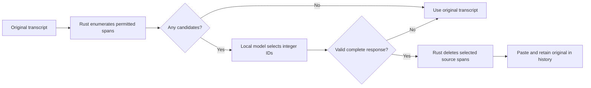

# Conservative Transcript Cleanup Experiments

- **Version:** 1.0
- **Date:** 2026-09-08
- **Status:** Superseded

## Table of Contents

1. [Decision](#1-decision)
2. [Protocol and limits](#2-protocol-and-limits)
3. [Model evidence](#3-model-evidence)
4. [Measured comparison](#4-measured-comparison)
5. [Reproduction and verification](#5-reproduction-and-verification)
6. [Limitations](#6-limitations)

## 1. Decision

This is the historical initial experiment. Its automatic-cleanup recommendation and 24/25 quality conclusion are superseded by the [broader small-model investigation](../research/2026-09-08-small-cleanup-models.md): the same stock model later made 32 harmful deletions in 96 cases. The final product keeps AI output only as a separate experimental History suggestion requiring explicit review and Copy; ordinary dictation does not use it. The measurements below remain unchanged as historical evidence.

Replace the custom fine-tuned rewriting model with the **stock, instruction-tuned LiquidAI LFM2.5-350M, official MLX 4-bit conversion**, used only to select deletions. Keep cleanup disabled by default. The larger Qwen3.5-0.8B alternative was tested and performed worse on this specific task; its newer family number was not a useful selection criterion.

The material improvement is the editing contract. Rust enumerates narrow permissible deletions, the model returns integer IDs, and Rust copies the remaining original bytes. Generated prose cannot reach the clipboard, rewrite a technical term, translate a sentence, or replace a transcript with a summary. The governing specification is [Dictation Reliability](../specs/2026-09-07-dictation-reliability.md).

## 2. Protocol and limits

Eligible hesitations are lowercase `um,`, `uh,`, `uhm,`, and `erm,` as complete whitespace-delimited tokens. Only the first token in an immediately repeated `I`, `i`, `the`, `a`, `an`, `to`, `we`, `it`, `and`, or `of` pair can be proposed as a stutter. Horizontal spaces/tabs separating a deleted token from the next word are removed with it; paragraph separators remain unchanged. An earlier comma remains as originally transcribed.

Quoted strings and backtick code are protected, including unmatched quotes through the end of the input. Capitalized `Um` is preserved because it can be a name. Numbers, negations, content-word emphasis such as “very very,” self-corrections, and ambiguous crutches such as “like,” “right,” and “you know” are outside the deletion vocabulary. Unquoted lowercase words being discussed can still be ambiguous; the model is asked to preserve them.

Inputs shorter than five words, inputs over 16,000 characters, inputs yielding over 128 candidates, and inputs without candidates bypass inference. The final token is never a deletion candidate. Invalid/duplicate/out-of-range IDs, malformed JSON, generation that reaches its token limit, and model/runtime failures preserve the original transcript. No accepted deletion returns an empty transcript.



## 3. Model evidence

| Candidate | Verified public artifact | Snapshot used | Total repository bytes |
|---|---|---|---:|
| Previous custom fine-tune | [Sotto cleanup LFM2.5 350M, MLX 5-bit](https://huggingface.co/juanquivilla/sotto-cleanup-lfm25-350m-mlx-5bit) | `1b04172dbb5aeb2d9a585881592f6473e21e4889` | 248,593,965 |
| Selected stock model | [Official LiquidAI LFM2.5 350M, MLX 4-bit](https://huggingface.co/LiquidAI/LFM2.5-350M-MLX-4bit) | `f6cb4e006bb7a2d8a6afa14ec0a53e0586f65a5b` | 226,574,917 |
| Alternative | [MLX Qwen3.5 0.8B, 4-bit](https://huggingface.co/mlx-community/Qwen3.5-0.8B-4bit) | `da28692b5f139cb0ec58a356b437486b7dac7462` | 652,029,391 |

[Qwen's official model card](https://huggingface.co/Qwen/Qwen3.5-0.8B) confirms the post-trained 0.8B language model and non-thinking support. Its Hugging Face repository was created February 28, 2026; the [stock LFM2.5-350M repository](https://huggingface.co/LiquidAI/LFM2.5-350M) was created March 31. Qwen3.5-0.8B therefore is not a strictly newer checkpoint than LFM2.5-350M. Searches of the official Qwen and LiquidAI model catalogs did not verify a newer-family sub-1B replacement that outperforms this stock model on the tested cleanup contract.

The selected artifact retains the LFM2.5 family; it replaces our custom fine-tuning with the vendor's general instruction-tuned model and a sparse classification prompt. No claim is made that this is the best general-purpose small language model.

## 4. Measured comparison

Machine: Apple M4, 32 GiB unified memory, macOS 15.6.1, Python 3.14.5, `mlx==0.31.1`, `mlx-lm==0.31.1`, `transformers==5.3.0`. All inference was local. Public weights were downloaded only into `/tmp/experiments/sotto-cleanup`; no installed-app model cache or settings were changed.

The [25-case synthetic fixture](../../benchmarks/llm/sparse-holdout.json) contains nine cases requiring deletions and sixteen cases requiring exact preservation. It covers names, quoted/code content, numbers, self-corrections, meaningful repetition, Unicode, embedded instructions, `###` markers, paragraph boundaries, a one-minute-scale dictation with a factual ending, and an oversized transcript. It was assembled after exploratory prompting and was not used to revise the selected production prompt after scores were observed; some protection categories overlap exploratory cases, so it is a regression holdout, not a blind benchmark.

| Metric | Previous fine-tune + original sidecar | Qwen 0.8B + sparse protocol | Stock LFM 350M + sparse protocol |
|---|---:|---:|---:|
| Exact desired outputs | 8/25 | 20/25 | **24/25** |
| Preservation-only cases unchanged | 4/16 | 16/16 | **16/16** |
| Required-edit cases with a useful edit | See note below | 6/9 | **9/9** |
| Invalid model-ID responses | Not applicable | 2 | **0** |
| Median measured latency | 55.9 ms | 267.2 ms | **80.3 ms** |
| First measured case including load | Separate 1.36 s load/warmup | 2.32 s | **0.92 s** |
| Peak Metal memory | Not collected | 0.81 GiB | **0.61 GiB** |

The original pipeline and new pipeline have different scopes: exact-match scores use the user's new conservative contract. The former fine-tune often removes fillers successfully while also changing content, so its edit count alone is not a useful success measure. Its latency median covers all non-short cases; the sparse medians cover only cases with candidates and include the first cold case. These are interactive measurements on one machine, not controlled throughput benchmarks.

The stock model's only mismatch retained the second hesitation in “We um, need to uh, test the final audio.” All nine cases needing cleanup received at least one correct deletion. All sixteen cases requiring preservation remained byte-identical. The final code, amount, and sentence in the long dictation survived exactly.

Observed old-pipeline failures include:

| Original content | Previous output | New behavior |
|---|---|---|
| `Um, Kim, and Lee joined the meeting yesterday.` | `Kim, and Lee joined the meeting yesterday.` | Original preserved |
| `Um is a Korean surname; preserve the name.` | `Is a Korean surname? Preserve the name.` | Original preserved |
| `src-tauri/sidecar/llm_cleanup.py` in a code-related sentence | `src-taeri/sidecar/llm_cleanup.py` | Original preserved |
| Literal `### Input:` and `### Output:` in a sentence | `Print` | Original preserved |
| Spanish sentence containing Qwen | English translation containing `Q1` | Spanish/Qwen preserved; only eligible filler deleted |
| New paragraph beginning with a repeated `I` | Paragraph removed | Paragraph preserved |

The oversized input contained 18,229 characters and ended with reference **91735**. The old sidecar generated 41,432 characters of repetitive text over 43.72 seconds, omitted that final reference, and reported success. The new path returns all 18,229 original characters immediately because the input exceeds its cleanup limit. This reproduces a concrete route by which the old cleanup stage can lose an ending; it does not prove that every reported missing-audio event had this cause.

Exploration also found that asking Qwen0.8B to return complete edited text caused explanations, prompt-example echoing, translation/deletion, and token-limit truncation. A single positive few-shot example helped the sparse-ID task; Rust validation remains necessary even with that example.

## 5. Reproduction and verification

The new [benchmark runner](../../benchmarks/llm/run_sparse.py) imports the actual production sidecar and calls the production Rust enumeration/reconstruction through [cleanup_edits.rs](../../src-tauri/examples/cleanup_edits.rs). It does not reimplement eligibility or trust model-produced text. Provide a complete, already downloaded snapshot path; the override exists only inside the isolated benchmark process.

```bash
# From src-tauri, build the adapter once; capture output.
cargo build --example cleanup_edits 2>&1 | tee /tmp/sotto-cleanup-adapter-build.txt

# From repository root; use the app's existing compatible Python environment.
"$HOME/Library/Application Support/com.sottoasr.app/llm-venv/bin/python3" \
  benchmarks/llm/run_sparse.py \
  --model-path /tmp/experiments/sotto-cleanup/lfm25-350m-4bit \
  --output /tmp/experiments/sotto-cleanup/liquid-production-holdout.json \
  2>&1 | tee /tmp/experiments/sotto-cleanup/liquid-production-holdout.log

python3 -m unittest discover -s src-tauri/sidecar -p 'test_*.py' -v \
  2>&1 | tee /tmp/sotto-cleanup-python-tests.txt
```

The adapter build passed. The integrated Rust suite passed 103 tests; all 22 cleanup/lifecycle regressions also passed after the final download lock. The captured Python test output is `/tmp/experiments/sotto-cleanup/python-tests.log`. Six Python protocol tests passed, including strict integer IDs, truncated but syntactically valid JSON, offline-only cache lookup, no model loading without candidates, and bounded input validation. Rust edit-boundary and integration tests are part of the consolidated repository verification recorded in the governing spec.

Experiment outputs remain in `/tmp/experiments/sotto-cleanup/{old,qwen,liquid}-production-holdout.json`, with matching `.log` files. The old baseline used the original `HEAD` sidecar saved as `original_sidecar.py`, its unmodified prompt/budget/postprocessing, and a local-path model override; current MLX required neither historical cache patch. The harness initially sent an oversized no-candidate case to the classifier; its metadata was corrected to match production's earlier pass-through without rerunning model inference. Actual candidate-case generations and timings were unchanged.

## 6. Limitations

This is deliberately narrow editing: unpunctuated hesitations, capitalized hesitations, less obvious restarts, and many accidental repetitions remain. A missed cleanup is preferable to deleting a name or changing a statement. The model still makes selection errors, and narrow eligibility plus tests are not a universal semantic proof that every eligible unquoted word is expendable.

This benchmark uses synthetic transcripts, not microphone recordings or private user history. ASR audio completeness has separate tests. Older custom model weights remain untouched, and the selected model must be explicitly downloaded through Settings before use. Runtime inference only reads complete local snapshots; download/update actions are separate from transcription.

## Follow-up: larger holdout invalidates the initial quality conclusion

The later [small-model investigation](../research/2026-09-08-small-cleanup-models.md) found that this journal's25 cases underrepresented semantically meaningful candidate words. The same stock350 production prompt scored57/96 overall and32/71 on eligible inputs in an independently reviewed adversarial set, with32 cases deleting content the reference preserved. The earlier24/25 measurement remains reproducible, but it is insufficient evidence of safe general cleanup. Further binary/semantic-role classifiers and larger modern models also failed fresh validation; a purpose-built encoder and final newer Granite control failed development. Default-off alone is insufficient containment. The final product uses separate History suggestions requiring explicit Copy, while ordinary dictation preserves ASR plus saved dictionary corrections. A future automatic model must pass a fresh independently labeled preservation/usefulness gate.
