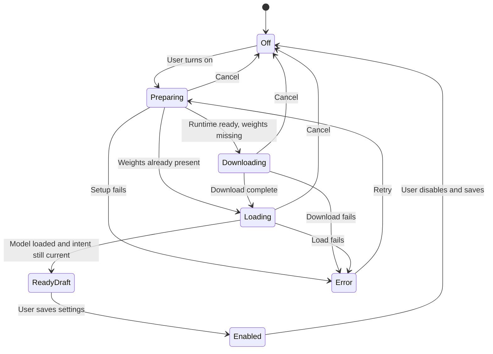

# Settings Experience and UI Performance Audit

- **Version:** 1.1
- **Date:** 2026-09-08
- **Status:** In Review

## Table of Contents

1. [Scope and evidence](#1-scope-and-evidence)
2. [Current experience](#2-current-experience)
3. [Performance and correctness findings](#3-performance-and-correctness-findings)
4. [Proposed settings structure](#4-proposed-settings-structure)
5. [Cleanup setup interaction](#5-cleanup-setup-interaction)
6. [Measurement plan](#6-measurement-plan)
7. [Review and acceptance plan](#7-review-and-acceptance-plan)
8. [Official guidance and reproducibility](#8-official-guidance-and-reproducibility)

## 1. Scope and evidence

This audit informed the approved vocabulary/settings/performance specification, which received the required three sequential reviews before implementation. The user requested a growing settings interface that remains understandable, more capable vocabulary support, responsive controls, and an AI toggle that performs setup automatically when needed. Five whole-app adversarial review rounds must each produce an evidenced improvement before the next round begins.

The baseline is the local 0.8.0 source after the prior reliability work. The user-provided screenshot shows a long cleanup explanation, model identity, link, download button, and setup instruction competing within one section. The disabled switch provides no action or explanation when clicked. No installed application state, personal history, or live model preference was changed during this research.

Sections 2–5 preserve the baseline observations and design input before implementation. Section 6 records the measured changes, and section 8 records the follow-up documentation review. Chromium measurements use synthetic fixtures and mocked IPC; they do not substitute for native WKWebView, Accessibility, microphone, or ASR timing.

## 2. Current experience

Settings starts as one approximately 1,000-line component with every section rendered in a scrolling 520×600 window (`settings-panel.svelte`; `tray/menu.rs`). The two main recording shortcuts are visible, while the configurable Cancel and Open Settings shortcuts exist in the backend but are absent from this editor. Model details and destructive model actions appear beside ordinary dictation preferences.

Settings has Save/Cancel, but controls appear before loading completes and no durable load-error state prevents editing fallback defaults. Errors from permission/status checks are logged rather than surfaced. The model toggle is intentionally disabled before download; the user's new instruction supersedes that earlier interaction choice while retaining the default-off setting.

| Surface | Current problem | Useful change |
| --- | --- | --- |
| Cleanup section | Long wrapped helper, implementation detail, separate prerequisite action, dead switch | One concise switch row; setup progress/error/retry below; model details behind a disclosure |
| Settings layout | All features share a growing vertical list | Four stable navigation sections with one active panel |
| Vocabulary | A pair editor requires guessing every misrecognition | Preferred-term interface with optional explicit aliases; recognition-time support must follow the separate ASR evidence |
| Loading/errors | Editable defaults before load; several console-only failures | Loading state, explicit retry, disable persistence until authoritative settings load |
| History | Empty state shown while loading, silent mutation failures, immediate Clear All | Distinct loading/error/empty states, truthful feedback, deliberate destructive actions |

## 3. Performance and correctness findings

### 3.1 Source-proven work that grows with use

| Finding | Evidence | Consequence / bounded remedy |
| --- | --- | --- |
| Unbounded audio-level array | `overlay-pill.svelte` appends with `audioLevels = [...audioLevels, level]` for every ~30 Hz event; `waveform.svelte` only reads the last value into its own fixed buffer | 27,000 retained values after 15 minutes and cumulative quadratic copying. Pass the latest sample or an explicit bounded frame batch, retaining one fixed ring buffer |
| Idle waveform animation | `Waveform` remains mounted whenever cleanup is inactive, including idle; its RAF loop redraws 50 bars and reads canvas client dimensions every frame | Stop rendering when recording/visibility is inactive; redraw only when samples or dimensions change |
| Timer updates per animation frame | `recording-timer.svelte` writes elapsed state and formats duration through RAF despite displaying whole seconds | Use a bounded timer based on elapsed wall time; keep timer handles nonreactive and clear them on teardown |
| All history rows mount | `history-view.svelte` renders every filtered item; backend supports up to 5,000 stored entries | Render a small recent page and expose more results explicitly; search full available history without mounting every row |
| Repeated search normalization | The history filter lowercases the same query inside each item iteration and lowercases transcript fields on each keystroke | Normalize the query once; measure before adding indexes or debouncing |
| Broad dirty comparison | Settings serializes the entire draft for dirty detection after changes, including every dictionary row | At current bounds this may be acceptable; measure 200-row input latency before adding incremental tracking |

Do **not** claim that collapsed history items eagerly compute their word diffs. Svelte's derived values recalculate when read, and the template reads `diffParts` inside the expanded Diff branch. The existing lazy computation should remain unless instrumentation proves otherwise. [Svelte derived-value documentation](https://svelte.dev/docs/svelte/$derived)

### 3.2 Races and avoidable work

| Finding | Evidence | Required direction |
| --- | --- | --- |
| Save can acknowledge a newer draft | `handleSave` awaits persistence, then snapshots the current mutable draft | Capture the submitted snapshot before awaiting. Edits made while saving must remain dirty afterward |
| Cancel/setup race | Async setup success currently has no request generation or draft identity | A cancelled or superseded setup cannot enable a later draft when its promise resolves |
| Load can replace user edits | Controls are available while `settingsStore.load()` is pending; failures become default settings with `loaded=true` | Distinguish loading, ready, and failed; do not allow fallback defaults to overwrite existing preferences |
| Every Save re-registers hotkeys | `handleSave` invokes `apply_shortcuts` for all saves | Apply shortcuts only when shortcut fields change; preserve/report backend registration errors |
| Listener teardown race | Settings/history/overlay register listeners through promises and only clean up already-resolved callbacks | Immediately unlisten when registration completes after teardown; prevent late callbacks from mutating disposed views |
| Permission polling overlap | Onboarding uses a fixed 1.5-second interval around an async permission check | Single-flight checks, stop on leave/destroy, and avoid duplicate intervals |
| Model status/update work | Settings fetches model status and automatically starts a remote update check whenever downloaded status refreshes | Keep initial model status local, avoid duplicate requests, and use the existing update state or a deliberate refresh |

Svelte documents synchronous lifecycle cleanup; Tauri's listener API returns an unlisten callback that must be called when the consumer ends. A disposed flag around asynchronous registration is sufficient here; a new event framework is unnecessary. [Svelte lifecycle hooks](https://svelte.dev/docs/svelte/lifecycle-hooks), [Tauri event API](https://v2.tauri.app/reference/javascript/api/namespaceevent/)

### 3.3 Native work and truthful controls

`commands/setup.rs` comments describe `spawn_blocking`, but `init_asr` and `complete_setup` directly call synchronous `engine.init()` inside async tasks. Startup and transcription paths similarly call blocking ASR functions on Tokio workers. This does not prove the webview itself blocks, but the mismatch merits one shared, tested blocking boundary. Permission checks already use `spawn_blocking`; they should not be rewritten on assumption alone.

Tauri explicitly recommends asynchronous commands for expensive work; merely marking a command async does not make a synchronous model call cooperative. Native window operations must keep their required main-thread behavior. [Tauri command execution](https://v2.tauri.app/develop/calling-rust/), [Tauri process model](https://v2.tauri.app/concept/process-model/)

`language` and `max_history` are persisted but have no runtime reads outside settings/model tests. The backend always caps history at 5,000, while the editor offers 10–10,000 and defaults to 500. Do not begin pruning existing history to 500 on upgrade. A display limit with pagination is a safe interpretation; actual retention needs an explicit, accurately labeled user action. Likewise, do not display a selectable transcription language unless the active ASR path actually honors it.

JSON history writes are non-atomic, deletion mutates memory before persistence succeeds, and transcription-add errors are logged without propagating. Root owns the persistence investigation and changes; this UI audit must not hide those failures with optimistic success feedback.

## 4. Proposed settings structure

Use a small navigation shell and focused panels, not a general routing framework. Keep one shared draft and one persistent Save/Cancel footer. A comfortable default width around 720–760 pixels supports a restrained sidebar; narrower windows can use a wrapping navigation row. Preserve usable controls at 520 pixels rather than requiring a wide window.

| Section | Primary content | Secondary details |
| --- | --- | --- |
| General | Recording shortcuts, Cancel/Open Settings shortcuts, launch at login | Update preference |
| Dictation | Paste behavior, clipboard restore, overlay, AI cleanup | ASR identity/readiness and supported language behavior |
| Vocabulary | Preferred terms, search/add/edit, optional aliases | Matching explanation and an explicit local preview if supported |
| Advanced | Permission health, history display policy, maintenance | Model identity/version/cache/delete and diagnostics |

Use native buttons in a labeled settings navigation region, an explicit selected state, labeled switches, visible keyboard focus, and headings tied to each panel. Avoid introducing ARIA tab semantics unless arrow-key and focus behavior are fully implemented. Keep input labels and error messages persistent; do not rely on hover tooltips. The switch label is the feature name, while model architecture/version/size belongs in details.

Suggested component boundaries are a thin settings shell, one draft controller, one cleanup setup control, and a vocabulary editor. General/Dictation/Advanced can remain small presentational components. Extract only boundaries that have distinct behavior or reduce the current component's responsibility.

## 5. Cleanup setup interaction

Turning on is explicit authorization to prepare the runtime and download the configured local model. Show the one-time download size near the control before activation, then concise stages such as Preparing, Downloading, and Loading. Use indeterminate progress unless the backend supplies real byte progress. Once ready, enable the current draft and expose its unsaved state through the existing footer.

Cancelling a draft or setup invalidates its intent token, so a late success never enables cleanup. Keep existing downloaded files; cancellation must not delete a shared cache. If true process cancellation is supported, terminate only the operation's owned process. If only activation is cancelled while a download finishes, say so accurately rather than reusing the current no-op cancellation command. Repeated clicks and multiple windows must share one setup operation or return a clear already-running status.

Default-off, explicit saved preferences, Save/Cancel consistency, and raw-transcript recovery remain intact. Loading errors leave the toggle off with a retry action and a concise reason; they must not silently discard the user's draft or erase a previously downloaded model.

## 6. Measurement plan

The original measurement harness was `/tmp/experiments/sotto-ui-2026-09-08/baseline.mjs`. Its portable successor is [benchmarks/ui/run.mjs](../../benchmarks/ui/run.mjs), with the self-contained [fixture generator](../../benchmarks/ui/fixture.mjs) and [reproduction instructions](../../benchmarks/ui/README.md). It uses an isolated headless Chromium process, a loopback Vite server, and synthetic settings/history with mocked Tauri IPC. All output remains local. Timed runs must be serialized with ASR and cleanup inference measurements to avoid hardware contention.

The original frontend is frozen under `/tmp/experiments/sotto-ui-2026-09-08/baseline-source` so later product edits cannot contaminate the baseline while hardware measurements are queued. `SOTTO_UI_SERVER` selects that snapshot's separate development server; `SOTTO_UI_LABEL` gives baseline and after-change outputs distinct names. The baseline ran against that frozen snapshot on port 14518 using Chromium 152.0.7977.77, after ASR timing finished and before the next cleanup sweep. Raw evidence: `/tmp/experiments/sotto-ui-2026-09-08/baseline.json`.

| Fixture | Measurements | Initial acceptance target |
| --- | --- | --- |
| Hidden/idle overlay for one second | RAF requests and canvas draw calls | Zero continuing waveform work after idle settles |
| Repeated audio levels | Per-batch callback time at increasing sample counts; retained buffer size | Bounded storage and approximately constant work per sample |
| History with 500 and 5,000 entries | Ready time, mounted row/node count, search-to-frame delay, long tasks | Bounded initial rows; preserve full search and access to older entries |
| Settings with 0 and 200 entries | Input-to-frame delay, node count, IPC count, screenshot | Immediate editing feedback; no duplicate startup/status work |
| Slow/failing IPC | Load/save/setup race fixtures | No lost edits, false success, duplicate setup, or late activation |
| Actual packaged macOS webview | Open-to-ready and observed interaction delay | Record separately from Chromium; no live settings mutation needed for read-only timing |

Browser timings include development-mode overhead and are comparative diagnostics, not release benchmarks. The same fixture and browser setup must be reused after changes. Do not repeatedly run full builds/tests to obtain timing data; a focused harness isolates the relevant work.

**Measured baseline (synthetic development build):**

| Surface | Evidence | Implication |
| --- | --- | --- |
| Settings, 0/200 replacement rows | 25–35 ms input to second frame; no long tasks | Layout and setup usability need improvement; this test does not show slow settings editing |
| History, 500 rows | 6,774 DOM nodes; search/clear 25–50 ms | Small histories remain responsive |
| History, 5,000 rows | 67,524 DOM nodes; clearing search 385–456 ms, long tasks 380–445 ms | Mounting all results causes visible stalls |
| Hidden idle overlay, one second | 61 RAF requests; 3,050 bar draws | The hidden waveform continuously consumes rendering work |
| Audio event bursts, 300 samples per batch | 33 ms for the first burst, rising to 283 ms at 3,000 retained samples | The copied growing array creates increasing callback cost |

These timings are one controlled baseline, not physical microphone or packaged WKWebView measurements. The burst fixture intentionally stresses callback cost and is not real-time audio capture. The improvements target demonstrated unbounded and idle work; after-change comparisons below use the same browser, fixtures, and isolated measurement process.

### After initial implementation

Raw evidence: `/tmp/experiments/sotto-ui-2026-09-08/after.json`; screenshots for all four sections and 200 replacements are alongside it. The same frozen-source baseline harness was adapted only for the new section navigation and bounded row count. No timing runs overlapped ASR/cleanup inference or Rust builds.

| Metric | Before | After |
| --- | --- | --- |
| Mounted history rows at 5,000 saved entries | 5,000 | 50 |
| DOM nodes for that history view | 67,524 | 707 |
| Clear-search to second frame, 5,000 entries | 385–456 ms | 32–34 ms |
| History long tasks in the fixture | 380–445 ms | None observed |
| Hidden overlay RAF / bar draws per second | 61 / 3,050 | 0 / 0 |
| 300-event audio callback batches | 33–283 ms, increasing | 0.1–1.3 ms, bounded |
| Settings edits, 0/200 replacements | 25–35 ms | 15–34 ms |

Settings were already responsive in this fixture; their main improvement is discoverable sections and automatic setup. The empty-settings fixture edits a vocabulary input after redesign rather than the removed inert history-limit input, so those numbers are not a strict same-control speed comparison. Cold page-ready times are also affected by Vite/browser caching and are not used for the performance claim. The history and idle/audio comparisons directly exercise the changed work.

The first visual review identified three follow-ups: put optional cleanup before paste options so its switch is visible without scrolling, increase muted text contrast, and reset history scrolling when changing pages/search. These belong to integrated review 1; root tracks their checked completion and subsequent review rounds.

## 7. Review and acceptance plan

The implementation specification must first receive assumption, completeness, and actionability review in sequence. The subsequent five whole-app adversarial rounds should use changed behavior, fixture results, and a concrete improvement record—not five relabelings of the same checklist.

Suggested round emphasis is: (1) settings/interaction correctness, (2) data safety and failure recovery, (3) bounded background work and long histories, (4) keyboard/accessibility and narrow-window visual behavior, and (5) integrated restart/migration/recording/setup paths. Each round must still inspect the whole application and record newly found cross-surface issues. Root owns the ordered round log and final implementation decisions.

This research document preserves the baseline and subsequent measurement evidence. Product implementation and the five sequential whole-app reviews are tracked in the [approved specification](../specs/2026-09-08-vocabulary-settings-performance.md) and root's audit record.

## 8. Official guidance and reproducibility

The following primary documentation was rechecked on 2026-09-08 after integrated review 2. The guidance supports the listed implementation choices; it does not replace measurements or constitute native accessibility certification. Some WebKit explanations are older publications describing established behavior, not new release announcements.

| Primary source | Guidance relevant to this app | Applied choice / remaining verification |
| --- | --- | --- |
| [Apple accessibility HIG](https://developer.apple.com/design/human-interface-guidelines/accessibility/) | Support legible enlarged text, sufficient contrast, and accessibility audits using Accessibility Inspector | Muted text was brightened; Settings was checked at 520×600 and 125% text enlargement. This is a layout test, not proof of system text sizing, VoiceOver, or all contrast pairs |
| [Apple focus and selection HIG](https://developer.apple.com/design/human-interface-guidelines/focus-and-selection/) | Keep focus visible and predictable; avoid moving it without a user action | Native buttons/inputs, visible focus outlines, intentional tab navigation, and scoped shortcut capture. Native NSPanel keyboard reachability still needs a packaged-app audit |
| [W3C tab pattern](https://www.w3.org/WAI/ARIA/apg/patterns/tabs/) | One active tab stop, horizontal Left/Right movement, optional Home/End, explicit tab/panel relationships; automatic activation is suitable when content appears promptly | Four local panels with roving `tabindex`, arrow/Home/End handling, `aria-selected`, and associated `tabpanel`. Switching panels requires no network round trip |
| [Svelte derived values](https://svelte.dev/docs/svelte/$derived) | Derived computation is deferred until the value is read | Preserve lazy history diff computation. Paginate mounted rows; do not add a redundant diff cache based on an incorrect eager-computation assumption |
| [Svelte lifecycle hooks](https://svelte.dev/docs/svelte/lifecycle-hooks) and [compiler warnings](https://svelte.dev/docs/svelte/compiler-warnings) | A synchronous mount callback may return cleanup; accessibility warnings identify missing labels and keyboard/focus semantics | Event scopes own asynchronously returned unlisten handles and ignore disposed callbacks. Clean compiler checks complement interaction tests; they do not prove full accessibility |
| [Tauri command execution](https://v2.tauri.app/develop/calling-rust/) | Heavy operations belong in asynchronous commands; event consumers must clean up listeners; async event callbacks may finish out of order | Blocking model/file work has explicit backend boundaries. UI setup/save/error completions use request identity, and listeners are disposed; no inference/audio payload is moved into the webview |
| [WebKit CPU timeline](https://webkit.org/blog/8993/cpu-timeline-in-web-inspector/) and [Timelines reference](https://webkit.org/web-inspector/timelines-tab/) | Background throttling does not eliminate costly idle work; script, rendering, CPU, and allocations need separate inspection | Stop continuing idle RAF and retain a bounded waveform buffer. Use the native inspector for energy/CPU claims; the Chrome harness measures callbacks and draws only |
| [WebKit Reduce Motion guidance](https://webkit.org/blog/7551/responsive-design-for-motion/) and [Svelte MediaQuery](https://svelte.dev/docs/svelte/svelte-reactivity#MediaQuery) | CSS exposes the system motion preference; Svelte's media query tracks changes and releases subscribers with its consumers | The idle-render fix alone was not Reduce Motion support. Review 3 adds static decorative CSS and a steady waveform baseline; elapsed time and status continue updating. Native preference/VoiceOver verification remains separate |

The portable harness separates `SOTTO_UI_LAYOUT` from the output label, accepts externally installed Playwright without changing app dependencies, fingerprints the actual served source, and fails on unknown IPC or page errors. It blocks external browser requests and writes only generated fixtures/results. The optional tool install and run commands use `npm`/`node`, never `npx`.

The successor adds a 100 ms initial overlay settling interval, a generic synthetic model name, and a versioned result schema. Its current-layout audio phase now uses the revisioned `overlay-state` snapshot protocol introduced during review 4; legacy mode preserves the original state event. These refinements are documented rather than retroactively attributed to the earlier raw numbers. New comparisons must run both source versions through the same successor harness and keep serving mode, browser, and hardware fixed.

The initial current-layout successor smoke passed on 2026-09-08 (`/tmp/sotto-ui-portable-smoke-final.txt`): no unknown IPC/page errors, 50 mounted history rows and 707 nodes with 5,000 entries, and zero idle RAF/draws. It preceded the revisioned snapshot change; portable legacy mode has not been rerun. The original before/after measurements above retain their original harness provenance.

Review 4 also ran [production-smoke.mjs](../../benchmarks/ui/production-smoke.mjs) against Vite's production output with the exact configured CSP header. Four Settings sections, default-off automatic setup/cancel/save, visible status/load errors, native-link routing, bounded full-history search, snapshot error recovery, Reduce Motion, and original elapsed recording time passed with no CSP violations or browser/IPC errors (`/tmp/sotto-ui-review4-production.txt`). This narrows the development-build blind spot while retaining the explicit native WebKit and actual IPC verification boundary.
