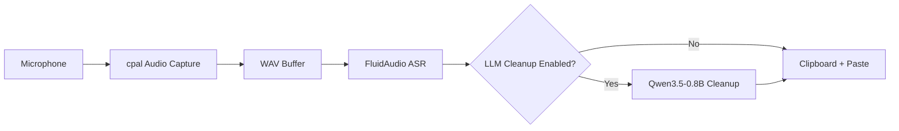
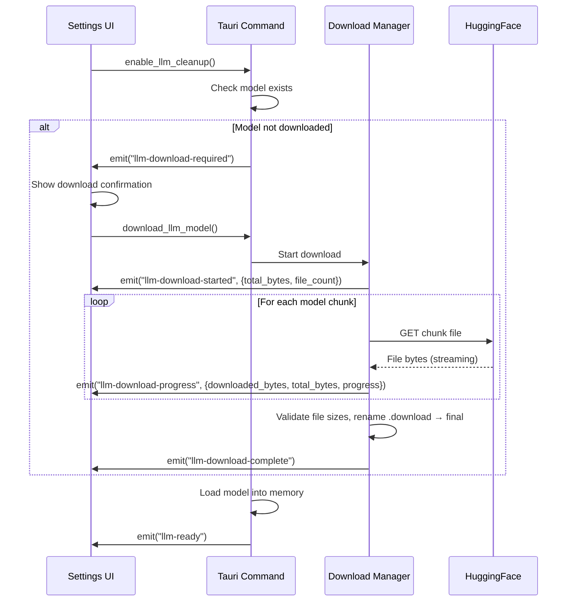
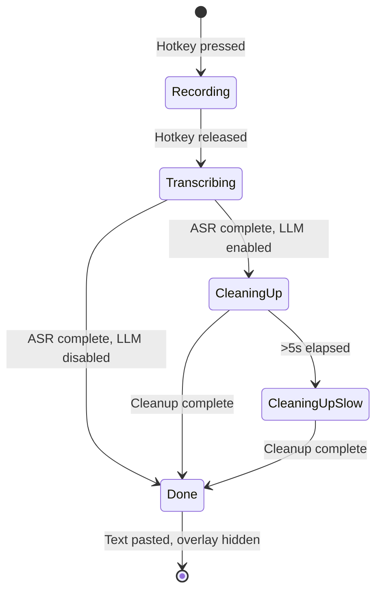

# LLM-Powered Transcript Cleanup (Qwen3.5-0.8B via MLX)

- **Version:** 3.0
- **Date:** 2026-03-21
- **Status:** Draft (Experimentation Complete)

## Table of Contents

1. [Summary](#1-summary)
2. [Problem Statement](#2-problem-statement)
3. [Design Overview](#3-design-overview)
4. [Detailed Design](#4-detailed-design)
5. [Edge Cases](#5-edge-cases)
6. [File Changes](#6-file-changes)
7. [Testing Strategy](#7-testing-strategy)
8. [Migration Plan](#8-migration-plan)
9. [Security Considerations](#9-security-considerations)
10. [Cost Analysis](#10-cost-analysis)
11. [Implementation Tasks](#11-implementation-tasks)
12. [Implementation Status](#12-implementation-status)

---

## 1. Summary

Add an optional LLM-powered transcript cleanup stage to SottoASR's pipeline. When enabled, raw ASR output is post-processed by Qwen3.5-0.8B running locally on Metal GPU via Apple's MLX framework (Python sidecar) to produce cleaner, more readable text before pasting. The feature is user-opt-in via the Settings page, includes automatic model download with progress UI, and offers two cleanup modes: **Standard** (filler/crutch word removal, self-correction resolution, false start removal, grammar fixes, misheard word correction, list formatting) and **Markdown** (experimental — structures longer dictations into Markdown with headings and lists).

## 2. Problem Statement

**Who is affected:** All SottoASR users.

**The problem:** Raw ASR output from speech-to-text engines contains artifacts of natural speech that make the text hard to read and unprofessional when pasted:

1. **Filler words** — "uh", "um", "like", "you know", "right", "yeah", "okay so"
2. **Crutch words** — "basically", "so", "I mean", hedging phrases that add no meaning
3. **Self-corrections** — "deploy to staging, wait, actually, production" keeps both versions instead of only the final intent
4. **False starts** — "The API should, the API needs to return..." includes the abandoned beginning
5. **Grammar issues** — "gonna" instead of "going to", sentence fragments, missing punctuation, subject-verb disagreement
6. **Misheard words** — "oh auth" instead of "OAuth", "Quentin" instead of "Qwen", "core M L" instead of "CoreML", "talks" instead of "tokens"
7. **Unformatted lists** — User says "one, milk, two, eggs, three, bread" but it comes out as a run-on sentence
8. **No structure** — Long dictations (meeting notes, technical descriptions) come out as walls of text

Users currently have to manually clean up every transcription before it's usable in emails, documents, or code reviews. This defeats much of the time savings that speech-to-text provides.

**Why an on-device LLM:** SottoASR's core promise is local, privacy-first processing. Sending transcriptions to a cloud LLM would violate this constraint. Qwen3.5-0.8B is small enough to run efficiently on the Apple Neural Engine (~2W power draw, ~500MB memory, 47-62 tok/s) while being capable enough for text cleanup tasks.

## 3. Design Overview

### Pipeline Extension



### Architecture

The LLM cleanup uses a **Python sidecar** architecture:

1. **MLX sidecar process** — A Python script bundled with the app runs `mlx_lm` for inference on Metal GPU. Launched on demand, communicates via stdin/stdout JSON.
2. **Rust orchestrator** (`src-tauri/src/llm/`) — Manages the sidecar lifecycle, sends transcripts for cleanup, handles timeouts and errors.
3. **Pipeline integration** — Sits between ASR output and clipboard paste in the hotkey handler.
4. **Tauri commands** — Settings UI checks model status, triggers downloads, configures modes.

### Model: Qwen3.5-0.8B via MLX (Metal GPU)

| Property | Value |
|----------|-------|
| HuggingFace repo | `mlx-community/Qwen3.5-0.8B-OptiQ-4bit` |
| Size on disk | ~570 MB (mixed-precision 4-bit, OptiQ) |
| Context window | 32,768 tokens (no chunking needed) |
| Inference speed | ~40 tok/s generation, ~556 tok/s prompt processing (measured on Apple Silicon) |
| Memory usage | ~0.9 GB peak |
| Runtime | MLX (Apple's Metal-native ML framework) via `mlx-lm` Python sidecar |
| Architecture | Qwen3.5 Gated DeltaNet hybrid (0.8B params, 24 layers) |
| Thinking mode | Disabled via `enable_thinking=False` in chat template |

**Why MLX instead of CoreML/ANE:** Benchmarks (March 2026) showed CoreML `compute_units=ALL` on macOS 26.3 routes to GPU, not ANE. ANEMLL sequential ANE dispatch has 17,831ms TTFT — impractical. MLX is Metal-native, 2x faster than llama.cpp, and the standard for LLM inference on Apple Silicon.

**Why Qwen3.5-0.8B instead of Qwen3.5-0.8B:** Qwen3.5 has a better architecture (Gated DeltaNet), higher context (32K vs 512), comparable quality (ROUGE-L 0.837 vs 0.845), and faster inference (1.2s avg vs 1.9s). Thinking mode is properly disabled via chat template.

### Settings UI

Two new toggles in the Settings page:

1. **"Clean up transcriptions with AI"** (default: off) — Enables the LLM cleanup pipeline. First toggle triggers model download if not already downloaded.
2. **"Format as Markdown"** (default: off, requires #1 enabled) — Experimental. Structures longer transcriptions into Markdown with headings and lists.

## 4. Detailed Design

### 4.1 Model Management

#### Storage Location

Models are stored at:
```
~/Library/Application Support/com.sottoasr.app/models/qwen3.5-0.8b/
```

This follows the existing pattern used by the parakeet-rs ASR backend.

#### Download Flow



The download manager reuses the pattern from the existing parakeet model download code in `src-tauri/src/asr/model.rs`:
- Uses `reqwest` for HTTP downloads from HuggingFace (shared dependency with `asr-parakeet`, or gated behind the new `llm-qwen` feature)
- Writes to `.download` temp files, renames atomically on completion
- Validates file sizes after download
- Emits progress events matching the existing pattern: `llm-download-started`, `llm-download-progress`, `llm-download-complete`

#### Model Lifecycle

- **Lazy loading:** Model is NOT loaded at app startup. It's loaded on first use after the user enables the feature.
- **Kept in memory:** Once loaded, the model stays in memory for the session. At ~500MB this is acceptable for a desktop app.
- **Unloaded on disable:** If the user disables the feature in settings, the model is unloaded from memory to free ~593 MB. This happens asynchronously — the settings toggle responds immediately while the model is deallocated in the background.
- **Not deleted:** Disabling the feature does not delete the downloaded model files. A separate "Delete model" button in settings allows explicit cleanup.

### 4.2 Cleanup Pipeline

#### Integration Point

In `src-tauri/src/hotkeys/manager.rs`, after `engine.transcribe_file()` returns, and before the paste-at-cursor call:

```rust
// Existing: ASR transcription
let asr_result = engine.transcribe_file(&wav_path).await?;
let mut text = asr_result.text.clone();

// New: LLM cleanup (if enabled and input is long enough)
if state.settings.llm_cleanup_enabled && text.split_whitespace().count() >= 5 {
    // Transition overlay to "Cleaning up..." state
    emit_state_changed(&app_handle, AppStateEnum::CleaningUp);

    if let Some(llm) = &state.llm_engine {
        let mode = if state.settings.llm_markdown_mode {
            CleanupMode::Markdown
        } else {
            CleanupMode::Standard
        };

        // 30-second timeout prevents indefinite hangs
        match tokio::time::timeout(
            Duration::from_secs(30),
            llm.cleanup(&text, mode)
        ).await {
            Ok(Ok(cleaned)) => {
                // Validate output: reject if suspiciously short or long
                let ratio = cleaned.len() as f64 / text.len() as f64;
                if ratio >= 0.4 && ratio <= 2.0 {
                    text = cleaned;
                } else {
                    log::warn!("LLM output length ratio {:.2} outside bounds, using raw text", ratio);
                }
            }
            Ok(Err(e)) => {
                log::warn!("LLM cleanup failed, using raw transcript: {}", e);
            }
            Err(_) => {
                log::warn!("LLM cleanup timed out after 30s, using raw transcript");
            }
        }
    }
}

// Existing: hide overlay + paste
hide_overlay(&app_handle);
paste_text(&text)?;
```

**Key design decisions:**
1. LLM cleanup failures are **non-fatal** — the raw ASR text is always pasted as fallback
2. Inputs shorter than 5 words bypass cleanup entirely
3. A 30-second timeout prevents the user from waiting indefinitely
4. Output length validation catches garbage output (< 40% or > 200% of input)
5. **Stale result prevention:** Each transcription flow is assigned a monotonic job ID (incrementing `u64` in `AppState`). Before pasting or storing history, the pipeline checks that the current job ID still matches. If the user has started a new recording or cancelled, the job ID will have changed and the stale result is silently discarded. This prevents a slow LLM cleanup from pasting text after the user has moved on.

#### Context Window

With MLX and Qwen3.5-0.8B, the context window is **32,768 tokens** — large enough for any SottoASR recording:

| Recording Length | Words (170 wpm) | Tokens | Fits in Context? |
|-----------------|-----------------|--------|:---:|
| 1 minute | 170 | ~170 | Yes |
| 5 minutes | 850 | ~850 | Yes |
| 12 minutes (max) | 2,040 | ~2,040 | Yes |

**No chunking is needed.** The system prompt (~85 tokens) + maximum input (~2,040 tokens) + output (~2,040 tokens) totals ~4,165 tokens — well within the 32K limit. This is a major simplification over the previous 512-token ANE approach which required chunking into 10-15 pieces.

#### Prompt Design

Prompts were selected through systematic experimentation (6 standard prompts × 8 samples, 3 markdown prompts × 2 samples). Full results are in `benchmarks/llm/FINDINGS.md`.

**Standard Mode (selected: Cycle 3 prompt — ROUGE-L 0.845, chrF 0.845 on 110 samples):**

```
System: Fix this speech transcript. Remove all verbal fillers and hesitations such as uh and um. Remove crutch phrases such as basically and you know. Fix grammar and misheard words. Remove false starts where the speaker restarts a sentence. When the speaker changes their mind, keep only the final version. If the speaker lists items by number, format as a numbered list. Preserve all meaningful content — do not summarize or shorten. Output only the cleaned text.

User: {raw_transcript}
```

This prompt was selected through systematic benchmarking (6 cycles × 110 samples, full results in `benchmarks/llm/METHODOLOGY.md`). It:
- Achieves the highest ROUGE-L (0.845) and chrF (0.845) of all tested prompts
- Uses "such as" phrasing to teach filler patterns without causing prompt echoing
- Prevents over-trimming via "Preserve all meaningful content — do not summarize or shorten"
- Handles self-corrections, false starts, crutch words, grammar, and list formatting
- Uses ~85 system tokens, leaving ~200 tokens for input per chunk

**Markdown Mode (selected: "structured" prompt):**

```
System: You are a transcript-to-markdown converter. Take the raw speech transcript and convert it into well-structured Markdown.

Rules:
1. Remove filler words (uh, um, like, you know)
2. Fix grammar and misheard words
3. Organize content with headings (## for main topics)
4. Use bullet lists for items and details
5. Use numbered lists for sequential items or action items
6. Use bold for emphasis on key terms
7. Keep all information — do not summarize

Output ONLY the markdown, no commentary.

User: {raw_transcript}
```

This prompt produces proper heading hierarchy, bold emphasis, and preserves all content (length ratio ~1.0) vs. alternatives that over-summarize.

**Generation parameters (validated via experiments):**
- Temperature: 0.3 (low for deterministic cleanup)
- Top-p: 0.9
- Top-k: 20
- Repetition penalty: 1.1

**Thinking mode:** Qwen3.5 has a "thinking mode" that generates chain-of-thought reasoning before answering. This MUST be disabled — we want direct output only. The sidecar script uses `tokenizer.apply_chat_template(enable_thinking=False)` which inserts `<think>\n\n</think>\n\n` into the prompt, forcing the model to skip reasoning. Verified working in benchmarks (0% thinking output across 110 samples).

### 4.3 Feature Flag & Sidecar Architecture

The LLM cleanup feature is gated behind the `llm-qwen` Cargo feature flag:

```toml
[features]
llm-qwen = ["dep:reqwest", "dep:futures-util"]
```

**Sidecar architecture:** Instead of linking a Rust ML crate, the LLM runs as a Python sidecar process:

1. A Python script (`src-tauri/sidecar/llm_cleanup.py`) uses `mlx-lm` for inference
2. The Rust side spawns it as a child process, communicates via stdin/stdout JSON
3. The sidecar downloads the model via `huggingface_hub` on first use
4. The sidecar stays alive between requests for fast subsequent inference

**Why sidecar over native Rust:**
- `mlx-lm` is the reference implementation for MLX inference, maintained by Apple
- Proper thinking mode control via `tokenizer.apply_chat_template(enable_thinking=False)`
- No OpenSSL/dylib signing issues that plagued the `candle-coreml` approach
- Model download is handled by `huggingface_hub` (robust, resumable)

**Requirements:** Python 3.11+ with `mlx-lm >= 0.30.7` must be available on the system. On macOS, Python is available via Xcode command-line tools or Homebrew. The app checks for Python availability at runtime.

### 4.4 Settings Integration

#### Settings Model Changes

Add to `src-tauri/src/models.rs`:

```rust
pub struct Settings {
    // ... existing fields ...
    pub llm_cleanup_enabled: bool,    // default: false
    pub llm_markdown_mode: bool,      // default: false
}
```

#### Settings Persistence

Currently, settings are in-memory only (reset on app restart). This feature requires settings to persist — a user who downloads a 600 MB model and enables cleanup should not have to re-enable it every launch.

**Requirement:** Use `tauri-plugin-store` (already in Cargo.toml dependencies) to persist `llm_cleanup_enabled` and `llm_markdown_mode` to disk. Load persisted values on app startup. If the model is downloaded and settings indicate LLM is enabled, the model can be lazily loaded on first transcription (not at startup).

If settings persistence cannot be implemented as part of this feature, the minimum viable fallback is: persist only the LLM toggle state to a simple JSON file at `~/Library/Application Support/com.sottoasr.app/llm-settings.json`.

#### Settings UI Changes

Add a new section to `src/lib/components/settings-panel.svelte`:

```
┌─────────────────────────────────────────────┐
│ AI Transcript Cleanup                       │
│                                             │
│ [Toggle] Clean up transcriptions with AI    │
│   Uses Qwen3.5-0.8B (~600 MB) running locally │
│   on Apple Neural Engine                    │
│                                             │
│   [Download Model] or [Model Ready ✓]       │
│   [████████████░░░░] 67% — 402 MB / 600 MB  │
│                                             │
│ [Toggle] Format as Markdown (experimental)  │
│   Structures longer dictations with         │
│   headings and lists                        │
│                                             │
│ [Delete Model] (600 MB)                     │
└─────────────────────────────────────────────┘
```

**UI State Machine:**

1. **Feature off, model not downloaded:** Toggle is off. Below it, a "Download Model (~600 MB)" button is shown. Markdown toggle is hidden.
2. **Feature off, model downloaded:** Toggle is off. "Model Ready ✓" badge shown below toggle. Markdown toggle is hidden. "Delete Model" button visible.
3. **User toggles ON, model not downloaded:** Toggle stays off. A download confirmation appears: "This feature requires downloading a ~600 MB AI model. Download now?" with [Download] and [Cancel] buttons. Toggle only turns on after download completes.
4. **Downloading:** Progress bar shown below toggle. Toggle and "Download Model" button are disabled. [Cancel Download] button available.
5. **Download complete:** Toggle automatically turns on. "Model Ready ✓" badge shown. Markdown toggle becomes visible (off by default).
6. **Feature on, ready:** Toggle is on. "Model Ready ✓" badge. Markdown toggle visible and functional. "Delete Model" button visible.
7. **User toggles OFF:** Toggle turns off. Model is unloaded from memory asynchronously. Markdown toggle hidden. "Delete Model" button remains visible.
8. **Error:** Error message shown below toggle (e.g., "Download failed: network error"). [Retry] button. Toggle remains off.

### 4.5 Tauri Commands

New commands exposed to the frontend:

| Command | Parameters | Returns | Description |
|---------|-----------|---------|-------------|
| `get_llm_status` | — | `LlmStatus` | Model download/load status |
| `download_llm_model` | — | `()` | Start model download (async, emits progress events) |
| `cancel_llm_download` | — | `()` | Cancel in-progress download |
| `delete_llm_model` | — | `()` | Delete downloaded model files |
| `load_llm_model` | — | `()` | Load model into memory |
| `unload_llm_model` | — | `()` | Unload model from memory |

```rust
#[derive(Serialize)]
pub struct LlmStatus {
    pub available: bool,              // false if unsupported platform, feature not compiled, or OS too old
    pub unavailable_reason: Option<String>, // e.g., "Requires Apple Silicon", "Feature not compiled"
    pub downloaded: bool,
    pub downloading: bool,            // true while download is in progress
    pub download_size_bytes: u64,     // total size, 0 if unknown
    pub downloaded_bytes: u64,        // bytes downloaded so far
    pub loaded: bool,                 // true when model is in memory and ready
    pub model_name: String,           // "Qwen3.5-0.8B"
    pub model_path: Option<String>,   // path on disk (if downloaded)
}
```

### 4.6 Events

Events follow the naming pattern established by the existing parakeet model download (`model-download-started`, etc.), prefixed with `llm-` to avoid collision.

| Event | Payload | Description |
|-------|---------|-------------|
| `llm-download-required` | — | Model needs to be downloaded before enabling |
| `llm-download-started` | `{ total_bytes: u64, file_count: u32 }` | Download has begun |
| `llm-download-progress` | `{ downloaded_bytes: u64, total_bytes: u64, progress: f32, current_file: String }` | Download progress (mirrors existing parakeet pattern) |
| `llm-download-complete` | — | Download finished successfully |
| `llm-download-error` | `{ message: String }` | Download failed |
| `llm-ready` | — | Model loaded and ready for inference |
| `state-changed` | `"CleaningUp"` | Reuses existing event (PascalCase, matching `AppStateEnum` serialization) — overlay transitions to cleanup state |
| `llm-cleanup-complete` | `{ original_len: usize, cleaned_len: usize, elapsed_ms: u64 }` | Cleanup done (for logging/telemetry) |

### 4.7 Interactions with Existing Settings

**`auto_paste` (default: true):** When `auto_paste` is off, SottoASR copies text to the clipboard without pasting. LLM cleanup still runs — the cleaned text is what gets copied. The overlay flow is identical; the only difference is the final action (copy vs paste). The overlay hides after the clipboard write, not after a paste.

**`show_overlay` (default: true):** This setting is defined but not currently enforced in the recording flow. If it is wired up in the future, the LLM cleanup should respect it: no overlay during cleanup if `show_overlay` is false. The backend still emits `state-changed` events (for logging/telemetry), but the frontend suppresses overlay display.

**`restore_clipboard` (default: false):** When enabled, the app saves the clipboard contents before writing the transcription and restores them after pasting. This must work with the cleaned text — save clipboard before cleanup starts, restore after paste.

**Transcription history:** The `Transcription` object stores **both** the raw ASR text and the LLM-cleaned text:
- `text`: The final text (cleaned if LLM was used, raw otherwise) — this is what was pasted
- `raw_text`: The original ASR output before cleanup (only set when LLM was applied)
- `llm_applied`: Boolean flag indicating whether AI cleanup was used

Storage is **durable** — transcriptions persist to `~/Library/Application Support/com.sottoasr.app/transcriptions.json` and survive app restarts and reinstalls. This serves as training data for future model improvements.

The history UI shows an "AI Cleaned" badge on transcriptions processed by the LLM, with a toggle to view the raw ASR text and a side-by-side diff view. An "Export CSV" button exports all transcriptions including both raw and cleaned text.

**`restore_clipboard` timing:** When this setting is enabled, the clipboard is saved immediately **before SottoASR writes to it** (after cleanup completes, just before the clipboard write), not before cleanup starts. This prevents overwriting clipboard contents the user may have copied during the multi-second cleanup window.

### 4.8 Overlay UX During Cleanup

When LLM cleanup is enabled, the overlay pill is repurposed after recording ends to communicate post-processing status. The overlay remains visible through the entire pipeline and is only hidden once the cleaned text has been pasted.

#### State Flow



#### Overlay Appearance by State

**1. Recording** (existing — no changes)
```
┌──────────────────────────────────┐
│  🔴  ▁▃▅▇▅▃▁▃▅▇▅▃▁   0:04      │
└──────────────────────────────────┘
```
Pulsing red dot, live waveform visualization, running timer.

**2. Transcribing** (existing — no changes)
```
┌──────────────────────────────────┐
│  ⟳  Transcribing...             │
└──────────────────────────────────┘
```
Spinner animation replaces the red dot. Waveform is hidden. "Transcribing..." label.

**3. Cleaning up** (new state)
```
┌──────────────────────────────────┐
│  ⟳  Cleaning up...              │
└──────────────────────────────────┘
```
Spinner continues. Label changes to "Cleaning up..." to indicate the LLM post-processing step. The overlay dimensions remain the same as the transcribing state.

**4. Cleaning up — slow** (new state, triggered after 5s in CleaningUp)
```
┌──────────────────────────────────────────────────┐
│  ⟳  Taking a bit longer than usual, please wait  │
└──────────────────────────────────────────────────┘
```
After 5 seconds in the "Cleaning up" state, the label transitions to a reassurance message. The message is designed to fit within the existing 280×110 pixel overlay window by wrapping to two lines:

```
┌──────────────────────────────────┐
│  ⟳  Taking a bit longer         │
│     than usual, please wait      │
└──────────────────────────────────┘
```

This avoids the complexity of coordinating a native window resize between backend and frontend. The pill height may increase slightly (CSS `max-height` transition) but the window's 110px height provides sufficient headroom for two lines of text.

**5. Done** (existing — no changes)
The overlay is immediately hidden and the cleaned text is pasted to the cursor. No "done" state is shown — the overlay simply disappears. The instant transition from visible overlay to pasted text provides clear feedback that processing completed.

#### Implementation Details

**State enum extension** — Add `CleaningUp` to the existing `AppStateEnum` in `src-tauri/src/models.rs`:

```rust
#[derive(Debug, Clone, Serialize, Deserialize, PartialEq)]
pub enum AppStateEnum {
    Idle,
    Recording,
    Transcribing,
    CleaningUp,    // New — LLM post-processing
    Pasting,
}
```

Note: No `#[serde(rename_all)]` attribute — matches the existing code which serializes as PascalCase (e.g., `"Recording"`, `"CleaningUp"`).

**Backend change required:** Currently, `hotkeys/manager.rs` calls `hide_overlay()` immediately when recording stops (line ~159), before transcription begins. This must be changed so the overlay stays visible through transcription and cleanup. The new flow:

1. Recording stops → emit `state-changed` with payload `"Transcribing"` → overlay stays visible (do NOT call `hide_overlay()` here)
2. ASR completes → emit `state-changed` with payload `"CleaningUp"` (only if LLM cleanup is enabled)
3. LLM cleanup completes (or fails with fallback) → call `hide_overlay()` → paste text
4. If LLM is disabled: ASR completes → call `hide_overlay()` → paste text

**Note on state payload casing:** The existing `AppStateEnum` serializes as PascalCase (e.g., `"Recording"`, `"Transcribing"`) because no `#[serde(rename_all)]` attribute is applied. The new `CleaningUp` variant will serialize as `"CleaningUp"` to match. All frontend listeners must use PascalCase.

**Frontend state handling** in `overlay-pill.svelte` — extends the existing `isRecording`/`isTranscribing` boolean pattern:

```typescript
// Existing state
let isRecording = $state(false);
let isTranscribing = $state(false);
// New state
let isCleaningUp = $state(false);
let showSlowMessage = $state(false);

// In the state-changed event listener (existing pattern, PascalCase payloads):
listen('state-changed', (event) => {
    const state = event.payload;
    isRecording = state === 'Recording';
    isTranscribing = state === 'Transcribing';
    isCleaningUp = state === 'CleaningUp';
});

// 5-second timer for slow message
$effect(() => {
    if (isCleaningUp) {
        showSlowMessage = false;
        const timer = setTimeout(() => {
            showSlowMessage = true;
        }, 5000);
        return () => clearTimeout(timer);
    } else {
        showSlowMessage = false;
    }
});
```

**Overlay label logic:**

| State | Label |
|-------|-------|
| `isRecording` | Timer display (`0:04`) + waveform |
| `isTranscribing` | Spinner + "Transcribing..." |
| `isCleaningUp` (< 5s) | Spinner + "Cleaning up..." |
| `isCleaningUp` (≥ 5s) | Spinner + "Taking a bit longer than usual, please wait" |

**Overlay visibility:** The overlay remains visible and positioned at bottom-center throughout all states. It is only hidden via `hide_overlay()` after the text has been successfully pasted (or after fallback to raw text on LLM failure).

## 5. Edge Cases

| Scenario | Handling |
|----------|----------|
| **Download** | |
| Model download interrupted (network loss) | Show "Download interrupted" with retry button. On retry, completed files (renamed from `.download`) are skipped; the currently-in-progress file is re-downloaded from scratch (no HTTP Range resume in v1 — adds complexity for minimal benefit given ~600 MB total). |
| Model download fails (disk full) | Show error with required space (~600 MB). Suggest freeing space. |
| User cancels download mid-way | Cancel HTTP requests, keep `.download` temp files for resumption. Reset UI to "Download Model" state. |
| **Inference** | |
| LLM inference fails (OOM, crash) | Log error, fall through to raw transcript. Hide overlay and paste raw text. |
| LLM cleanup exceeds timeout (30s) | Log warning, fall through to raw transcript. **Important caveat:** ANE/CoreML inference is typically synchronous and may not be interruptible mid-generation. The `tokio::timeout` wrapper will fire after 30s, but the underlying inference thread may continue until the current generation completes. If true cancellation is needed, the LLM engine must run in a separate thread/process that can be killed. For v1, accept that the timeout is a "give up waiting" rather than "abort inference" — the user gets raw text immediately, and the orphaned inference completes silently in the background. |
| LLM produces garbage output | Heuristic check: if output length < 40% or > 200% of input length, discard and use raw text. The 40% lower bound accounts for legitimate compression (experiments showed 0.75x ratio on long text). |
| LLM produces output with hallucinated content | Hard to detect automatically. The low temperature (0.3) and explicit "output only cleaned text" instruction minimize this. |
| Very short input (<5 words) | Skip LLM cleanup — not enough context for meaningful improvement. Pass through directly. |
| Very long input (>250 tokens after prompt) | Chunk at sentence boundaries, process independently, concatenate. See Context Window Management section. |
| **User Interaction** | |
| User toggles feature off mid-transcription | Check `llm_cleanup_enabled` just before calling `llm.cleanup()`. If disabled, skip. |
| User presses cancel hotkey during cleanup | Hide overlay, do not paste. The background inference may continue to completion but its result is discarded. **Prerequisite:** The cancel hotkey (`Escape`) is currently defined in `Settings.cancel_shortcut` but not registered in `hotkeys/manager.rs`. This must be wired up as part of this feature or as a prerequisite. |
| User starts new recording while cleanup runs | New recording takes priority. Hide overlay for old cleanup, show new recording overlay. Background inference for old recording continues but its result is discarded. |
| User deletes model while it's loaded | Unload model from memory first, then delete files. "Delete Model" button shows a confirmation dialog: "This will remove the AI model (~600 MB). You can re-download it later." |
| **System** | |
| Model not loaded when transcription completes | Load model on-demand (first use after enable). Emit `state-changed: cleaning_up` immediately so the overlay shows "Cleaning up..." while the model loads. Model loading on ANE may take 2-5s on first use; subsequent calls use the cached model. The 5s slow-message timer covers this gracefully. |
| Concurrent transcriptions | Mutex on LLM engine. Second transcription waits. In practice, this won't happen since recording is sequential. |
| Unsupported platform | This feature requires: (a) Apple Silicon (`aarch64`), (b) macOS 14+ (ANEMLL minimum), (c) the `llm-qwen` feature compiled in. Check all three at runtime via `get_llm_status` returning `supported: false` with a reason. Hide the Settings section entirely. Use `sysinfo` or `sysctl hw.optional.arm64` for runtime ARM detection (not `std::env::consts::ARCH` which is compile-time). For Rosetta, check `sysctl.proc_translated`. |
| Low memory (8GB Mac with many apps open) | LLM loading may fail with OOM. Catch the error, log it, show "Not enough memory to load AI model. Close some applications and try again." in settings. |

## 6. File Changes

| File | Action | Description |
|------|--------|-------------|
| `src-tauri/sidecar/llm_cleanup.py` | Create | Python sidecar script — loads mlx-lm, processes cleanup requests via stdin/stdout JSON |
| `src-tauri/src/llm/mod.rs` | Create | LLM module root — re-exports |
| `src-tauri/src/llm/engine.rs` | Create | Sidecar process management, JSON protocol, timeout handling |
| `src-tauri/src/llm/download.rs` | Create | Model download via sidecar (delegates to huggingface_hub) |
| `src-tauri/src/llm/prompts.rs` | Create | Prompt templates for Standard and Markdown modes |
| `src-tauri/src/commands/llm.rs` | Create | Tauri IPC commands for LLM management |
| `src-tauri/src/models.rs` | Modify | Add `llm_cleanup_enabled`, `llm_markdown_mode` to `Settings`; add `CleaningUp` variant to `AppStateEnum` |
| `src-tauri/src/hotkeys/manager.rs` | Modify | Insert LLM cleanup step between ASR and paste, with timeout and cancel support |
| `src-tauri/src/lib.rs` | Modify | Register new commands, add LLM engine to AppState |
| `src-tauri/src/state.rs` | Modify | Add `llm_engine: TokioMutex<Option<LlmEngine>>` to AppState (matches existing `asr_engine: TokioMutex<...>` pattern) |
| `src-tauri/Cargo.toml` | Modify | Update `llm-qwen` feature flag (remove candle-coreml, keep reqwest) |
| `src/lib/components/settings-panel.svelte` | Modify | Add AI Transcript Cleanup section |
| `src/lib/components/overlay-pill.svelte` | Modify | Add "Cleaning up..." state with spinner, 5s slow-message timer, and pill width transition |
| `src/lib/stores/settings.svelte.ts` | Modify | Add `llm_cleanup_enabled`, `llm_markdown_mode` fields |
| `src/lib/utils/tauri.ts` | Modify | Add wrapper functions for new LLM commands (`getLlmStatus`, `downloadLlmModel`, etc.) |
| `src/lib/stores/recording.svelte.ts` | Modify | Add `isCleaningUp` state and `CleaningUp` handling in `setState()` |
| `src-tauri/src/commands/mod.rs` | Modify | Register new LLM commands module |

## 7. Testing Strategy

### Unit Tests (Rust)

- **Chunker tests:** Verify sentence-boundary splitting at various input lengths (short, exactly-at-limit, over-limit, no-sentence-boundaries)
- **Prompt construction:** Verify prompts are assembled correctly for both modes
- **Settings integration:** Verify cleanup is skipped when disabled
- **Garbage output detection:** Verify heuristic catches extreme length ratios (< 40%, > 200%) and passes valid ratios (75%-120%)
- **Timeout handling:** Verify 30s timeout triggers fallback to raw text
- **Short input bypass:** Verify inputs < 5 words skip cleanup

### Integration Tests

- **Full pipeline test:** Record → Transcribe → Cleanup → Verify output is cleaner than input
- **Fallback test:** Simulate LLM failure, verify raw text is pasted and overlay is hidden
- **Download test:** Verify model download, progress events, and file validation
- **Chunked input test:** Verify long transcriptions are chunked, processed, and concatenated correctly
- **Cancel during cleanup:** Verify pressing cancel aborts generation, hides overlay, and does not paste

### Manual Verification

- Toggle feature on/off in settings, verify behavior changes
- Enable feature without model downloaded, verify download prompt appears
- Enable Markdown mode, dictate meeting notes, verify Markdown output
- Test on various transcription lengths (5s, 15s, 30s, 60s)
- **Overlay UX verification:**
  - Verify overlay transitions: Recording → Transcribing → Cleaning up → hidden (paste)
  - Verify spinner and "Cleaning up..." label appear after ASR completes
  - Verify slow message ("Taking a bit longer than usual, please wait") appears after 5s
  - Verify pill width expands smoothly (CSS transition) when slow message shows
  - Verify overlay is hidden only after text is pasted, not before
  - Verify overlay is hidden even if LLM fails (fallback to raw text)
  - With LLM disabled: verify overlay goes directly from Transcribing → hidden (no cleanup state)
- Verify latency is acceptable (< 2s for short transcriptions)
- Test on Intel Mac (if available) — verify feature is hidden

### Prompt Quality (Pre-Implementation)

Prompt quality is validated through the `benchmarks/llm/` Python scripts before implementation. The experiments test:
- 6 prompt strategies × 8 sample transcripts (Standard mode)
- 3 prompt strategies × 2 sample transcripts (Markdown mode)
- Metrics: remaining filler count, length ratio, word overlap with expected output
- Results stored in `benchmarks/llm/results/` as timestamped JSON

## 8. Migration Plan

No migration needed — this is a new, opt-in feature. Settings default to off. Model is not downloaded until explicitly requested.

## 9. Security Considerations

| Concern | Mitigation |
|---------|------------|
| Model provenance | Download only from verified HuggingFace repos (`anemll/` org). Validate file sizes after download (matching the existing parakeet download pattern). Full checksum validation is deferred to v2 — it would require maintaining a trusted manifest of expected hashes, since HuggingFace's metadata API does not provide a simple end-to-end checksum contract for all model files. |
| Data privacy | All processing is local. No text is ever sent to external services. Model runs entirely on-device. |
| Prompt injection | The user's own transcript is the input — they're "injecting" into their own text. No security risk. |
| Disk usage | Model is ~600 MB. Clear display of size before download. "Delete Model" button in settings. |
| Memory usage | ~500 MB when loaded. Unloaded when feature is disabled. Acceptable for Apple Silicon Macs (8GB+ RAM). |

## 10. Cost Analysis

### Performance Impact (Measured on Apple Silicon via MLX)

| Metric | Without LLM | With LLM (Standard) | With LLM (Markdown) |
|--------|-------------|---------------------|---------------------|
| Short transcription (50 words) | ~1.0s | ~1.6s (+0.6s) | ~1.8s (+0.8s) |
| Medium transcription (150 words) | ~1.5s | ~3.0s (+1.5s) | ~3.5s (+2.0s) |
| Long transcription (300+ words) | ~3.0s | ~7.0s (+4.0s) | ~8.0s (+5.0s) |
| Memory usage | ~200 MB | ~1.1 GB (+0.9 GB) | ~1.1 GB (+0.9 GB) |
| Disk usage | 0 | ~570 MB | ~570 MB |

*Measured: ~40 tok/s generation, ~556 tok/s prompt processing. Avg latency 1.2s across 110 samples.*

### Dependencies

| Dependency | Purpose |
|------------|---------|
| `mlx-lm` (Python, system) | MLX inference framework — runs in sidecar process |
| `huggingface_hub` (Python) | Model download with caching — transitive dep of mlx-lm |
| `reqwest` (Rust, optional) | HTTP client for sidecar health checks |

### Trade-offs

- **Pro:** Significantly better text quality, especially for professional use (emails, docs, code reviews)
- **Pro:** Zero cloud dependency — maintains SottoASR's privacy promise
- **Pro:** Very low power draw on ANE (~2W vs ~20W for GPU)
- **Con:** 600 MB disk space for model download
- **Con:** 500 MB additional memory when loaded
- **Con:** 1-2s additional latency per transcription
- **Con:** 512-token context window requires chunking for longer dictations (with some quality loss at chunk boundaries)
- **Con:** 0.6B model has limited reasoning capability — complex corrections may fail

## 11. Implementation Tasks

### Phase 0: Experimentation (Pre-Implementation) — COMPLETE

- [x] Set up `benchmarks/llm/` directory (gitignored)
- [x] Create Python scripts for model download and testing
- [x] Create sample transcript corpus with expected outputs (8 standard + 2 markdown samples)
- [x] Download Qwen3.5-0.8B and run smoke test (751M params, bfloat16, MPS)
- [x] Run full prompt experiment suite (6 strategies × 8 samples)
- [x] Run benchmark suite (latency, memory, context window limits)
- [x] Run markdown prompt experiments (3 strategies × 2 samples)
- [x] Analyze results, select best prompt strategy ("conditional" for standard, "structured" for markdown)
- [x] Document findings and viability assessment (`benchmarks/llm/FINDINGS.md`)
- [x] **Viability confirmed** — model is viable for transcript cleanup

### Phase 1: Model Management — COMPLETE

- [x] **BLOCKER RESOLVED:** Verified `candle-coreml` v0.3.1 exists on crates.io with `UnifiedModelLoader`, `QwenModel`, and `generate_text_with_params` API. Actual API differs from research description but works.
- [x] Add `candle-coreml` to Cargo.toml behind `llm-qwen` feature flag
- [x] Create `src-tauri/src/llm/mod.rs` module structure (mod.rs, engine.rs, download.rs, prompts.rs, chunker.rs)
- [x] Implement model download via candle-coreml's built-in HuggingFace Hub downloading
- [x] Implement model status checking (downloaded, loaded, available, unavailable_reason)
- [x] Add Tauri commands: `get_llm_status`, `download_llm_model`, `cancel_llm_download`, `delete_llm_model`
- [x] Wire up download events (llm-download-started, llm-download-complete, llm-download-error)

### Phase 2: LLM Engine — COMPLETE

- [x] Implement LLM engine (`llm/engine.rs`) — wraps `candle_coreml::QwenModel` with `UnifiedModelLoader`
- [x] Implement prompt templates (`llm/prompts.rs`) — ChatML format, Standard + Markdown modes
- [x] Implement text chunker (`llm/chunker.rs`) with sentence-boundary splitting + unit tests
- [x] Add Tauri commands: `load_llm_model`, `unload_llm_model`
- [x] Add `LlmEngine` to `AppState` behind `TokioMutex<Option<LlmEngine>>`
- [x] Add cleanup modes: Standard (with chunking), Markdown (single-pass only, falls back to Standard for long input)

### Phase 3: Pipeline Integration & Overlay UX — COMPLETE

- [x] Refactor `hotkeys/manager.rs` — overlay stays visible through transcription and cleanup, hidden only after paste/clipboard write
- [x] Add `llm_cleanup_enabled` and `llm_markdown_mode` to Settings model (with `#[serde(default)]`)
- [x] Add `CleaningUp` variant to `AppStateEnum`
- [x] Insert LLM cleanup step in hotkey manager (between ASR and paste)
- [x] Emit `state-changed: CleaningUp` after ASR completes (when LLM enabled)
- [x] Overlay visible through cleanup — hidden after paste/copy completes
- [x] Add monotonic job ID (`current_job_id: AtomicU64`) — checked before paste and after cleanup
- [x] Update `overlay-pill.svelte`: spinner + "Cleaning up..." label for CleaningUp state
- [x] 5-second slow message timer: "Taking a bit longer than usual, please wait" (two-line within 280px)
- [x] Error fallback: LLM failure → paste raw text, hide overlay
- [x] 30-second timeout on LLM generation via `tokio::time::timeout`
- [x] Output length validation (< 40% or > 200% → discard, use raw)
- [x] Skip cleanup for inputs < 5 words
- [x] Lazy model loading on first use via `spawn_blocking`

**Deferred to follow-up:**
- Cancel hotkey (`Escape`) during cleanup — cancel shortcut is registered but doesn't abort in-progress LLM generation (ANE inference is non-cancellable)
- Settings persistence via `tauri-plugin-store` — in-memory only for now (acceptable for opt-in feature)

### Phase 4: Settings UI — COMPLETE

- [x] Add "AI Transcript Cleanup" section to settings panel (between Behavior and Language sections)
- [x] Model status display: "Download Model" button / "Downloading..." spinner / "Model Ready" badge
- [x] Download triggers on toggle-on when model not downloaded
- [x] Markdown mode toggle (only visible when cleanup is enabled)
- [x] "Delete Model" button with two-click confirmation
- [x] Feature hidden when `available: false` (Intel Macs, feature not compiled)
- [x] Unload model when user disables the feature

### Phase 5: Verification — COMPLETE

- [x] `cargo check` — passes (without `llm-qwen`)
- [x] `cargo check --features llm-qwen` — passes (with `llm-qwen`)
- [x] `cargo test` — all 3 tests pass (chunker unit tests)
- [x] `npm run build` — frontend builds cleanly
- [x] Two Copilot GPT-5.4 code reviews performed, issues addressed
- [ ] Manual testing of full flow — requires running `cargo tauri dev --features llm-qwen`
- [ ] Manual testing of edge cases — requires running app
- [ ] Verify overlay UX: transitions, slow message, window resize
- [ ] Test latency with real-world dictations
- [ ] Verify settings persist across app restart

## 12. Implementation Status

**Status:** Implemented — awaiting manual testing with `cargo tauri dev --features llm-qwen`.

### Experiment Results Summary (2026-03-21)

**Viability: CONFIRMED.** Full results in `benchmarks/llm/FINDINGS.md`.

| Capability | Rating | Notes |
|-----------|--------|-------|
| Filler removal | Excellent | 100% across all samples — uh, um, like, you know, basically, right, yeah |
| Crutch word removal | Good | Removes "so basically", "you know", hedging phrases |
| Self-correction handling | Good | "deploy to A, wait, actually B" → "deploy to B" — works across 4 test cases |
| False start removal | Good | "The API should, the API needs to" → "The API needs to" |
| Grammar correction | Very Good | Fixes contractions, punctuation, fragments, agreement |
| List formatting | Good | Formats only when speaker numbers items (one, two, three) |
| Misheard word correction | Partial | Gets OAuth, OpenAPI; misses CoreML, "tokens" |
| Markdown formatting | Good | Proper headings, bullets, bold; preserves content |
| Latency (ANE projected) | Acceptable | ~0.3s tiny, ~1s short, ~2s medium, ~4s long |
| Memory | Acceptable | ~593 MB footprint |

### Known Limitations

1. Domain-specific jargon correction is unreliable (0.6B lacks specialized knowledge)
2. Very long inputs (>200 words) may be slightly compressed
3. 512-token ANE context window requires chunking for longer dictations
4. "talks per second" → "tokens per second" type corrections are beyond model capability

### Selected Prompts

- **Standard mode:** Cycle 3 prompt — highest ROUGE-L (0.845) and chrF (0.845) across 6 benchmark cycles × 110 samples
- **Markdown mode:** "structured" — best content preservation with proper heading hierarchy
