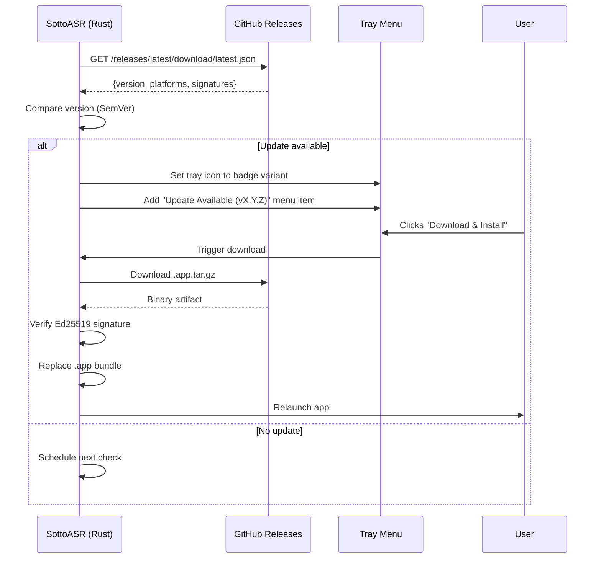

# Auto-Update Mechanism

- **Version:** 2.0
- **Date:** 2026-04-01
- **Status:** Implemented

## Table of Contents

1. [Summary](#1-summary)
2. [Problem Statement](#2-problem-statement)
3. [Design Overview](#3-design-overview)
4. [Detailed Design](#4-detailed-design)
5. [Edge Cases](#5-edge-cases)
6. [File Changes](#6-file-changes)
7. [Testing Strategy](#7-testing-strategy)
8. [Migration Plan](#8-migration-plan)
9. [Security Considerations](#9-security-considerations)
10. [Cost Analysis](#10-cost-analysis)
11. [Implementation Tasks](#11-implementation-tasks)
12. [Implementation Status](#12-implementation-status)

---

## 1. Summary

Add an auto-update mechanism to SottoASR that checks for new releases on GitHub, notifies the user via a subtle tray icon badge, and allows one-click download-and-install from the tray context menu. The implementation uses the official Tauri v2 updater plugin (`tauri-plugin-updater`) with GitHub Releases as the update source, requiring no custom server or hosted manifest file.

## 2. Problem Statement

SottoASR is currently distributed as a `.dmg` via GitHub Releases. Users must manually visit the releases page, download the new `.dmg`, and replace their installed app. This creates two problems:

1. **Users stay on stale versions.** Without a notification mechanism, users have no way to know an update exists unless they proactively check the GitHub page.
2. **Friction discourages updates.** Even users who discover a new release must navigate to GitHub, download, open the DMG, and drag-replace — a multi-step manual process.

The goal is to make the user aware of new versions with zero disruption to their workflow (no modal dialogs), and to reduce the update to a single click from the tray menu.

## 3. Design Overview



### Key design decisions

| Decision | Choice | Rationale |
|----------|--------|-----------|
| Update source | GitHub Releases `latest.json` | No custom server needed. `tauri-action` generates `latest.json` automatically as a release asset. The file is fetched via `github.com` (not `api.github.com`), so the REST API rate limit (60 req/hr unauthenticated) does not apply. The download path goes through GitHub's web server → 302 redirect → Azure Blob Storage CDN, which is a separate system with much higher throughput limits. |
| Update plugin | `tauri-plugin-updater` (v2) | Official Tauri plugin. Handles download, Ed25519 signature verification, `.app` bundle replacement, and relaunch. Battle-tested across the Tauri ecosystem. |
| Notification style | Tray icon badge + context menu item | Non-intrusive. Follows macOS menu bar app conventions (Raycast, iStat Menus). No modal dialogs. User retains full control over when to install. |
| Check frequency | On app launch (15s delay) + every 4 hours while running | Balances freshness with resource usage. Uses `tokio::time::sleep` which does not advance during system sleep — the interval is 4 hours of active uptime, not wall clock time. This is the desired behavior: no spurious checks on wake. |
| Signature scheme | Tauri Ed25519 (minisign-compatible) | Mandatory in the plugin — cannot be disabled. Separate from Apple code signing (which is also applied). Provides defense-in-depth: Apple codesign verifies identity, Ed25519 verifies payload integrity. |

## 4. Detailed Design

### 4.1 Plugin Integration

**Rust side (`src-tauri/`):**

Add `tauri-plugin-updater` to `Cargo.toml`:

```toml
tauri-plugin-updater = "2"
```

Register the plugin in `lib.rs` inside the `.setup()` closure (the updater plugin uses the builder pattern, not `init()`):

```rust
.setup(|app| {
    #[cfg(desktop)]
    app.handle().plugin(tauri_plugin_updater::Builder::new().build())?;
    // ... rest of setup
    Ok(())
})
```

> **Note:** Unlike plugins such as `tauri_plugin_process::init()`, the updater uses `Builder::new().build()`. It must be registered inside `.setup()` via `app.handle().plugin(...)` rather than chained directly on the builder, because it requires a handle that is only available after the app is constructed. The `#[cfg(desktop)]` guard ensures it compiles out on mobile targets.

**Frontend side:**

Add `@tauri-apps/plugin-updater` to `package.json`:

```json
"@tauri-apps/plugin-updater": "^2"
```

**Configuration in `tauri.conf.json`:**

```json
{
  "bundle": {
    "createUpdaterArtifacts": true
  },
  "plugins": {
    "updater": {
      "pubkey": "<GENERATED_PUBLIC_KEY>",
      "endpoints": [
        "https://github.com/juanqui/sottoasr/releases/latest/download/latest.json"
      ]
    }
  }
}
```

**Capabilities (`default.json`):**

Add `"updater:default"` to the permissions array. This grants the frontend permission to call `check`, `download`, `install`, and `downloadAndInstall`.

### 4.2 Signing Key Setup

Generate a Tauri signing keypair (one-time):

```bash
npm run tauri signer generate -- -w ~/.tauri/sottoasr.key
```

This produces:
- **Private key:** `~/.tauri/sottoasr.key` — used at build time via `TAURI_SIGNING_PRIVATE_KEY` env var
- **Public key:** printed to stdout — embedded in `tauri.conf.json` as `plugins.updater.pubkey`

Store the private key securely:
- Add `TAURI_SIGNING_PRIVATE_KEY` as a GitHub Actions repository secret
- Optionally add `TAURI_SIGNING_PRIVATE_KEY_PASSWORD` if the key is password-protected
- **Critical:** Losing the private key permanently blocks all future updates for existing users. Back it up.

### 4.3 CI/CD Changes

The existing `build-release.yml` workflow uses `tauri-apps/tauri-action@v0`, which already supports the updater. When `createUpdaterArtifacts: true` is set in `tauri.conf.json` and the signing key is available, the action automatically:

1. Builds the `.app.tar.gz` updater artifact (in addition to the `.dmg`)
2. Signs it with the Ed25519 private key, producing a `.app.tar.gz.sig` file
3. Generates `latest.json` with version, platform URLs, and signatures
4. Uploads all three files as release assets alongside the `.dmg`

**Required workflow change** — add the signing key env vars to the build step:

```yaml
- name: Build and release
  uses: tauri-apps/tauri-action@v0
  env:
    GITHUB_TOKEN: ${{ secrets.GITHUB_TOKEN }}
    APPLE_CERTIFICATE: ${{ secrets.APPLE_CERTIFICATE }}
    APPLE_CERTIFICATE_PASSWORD: ${{ secrets.APPLE_CERTIFICATE_PASSWORD }}
    APPLE_SIGNING_IDENTITY: ${{ env.CERT_ID }}
    TAURI_SIGNING_PRIVATE_KEY: ${{ secrets.TAURI_SIGNING_PRIVATE_KEY }}
    TAURI_SIGNING_PRIVATE_KEY_PASSWORD: ${{ secrets.TAURI_SIGNING_PRIVATE_KEY_PASSWORD }}
  with:
    tagName: v__VERSION__
    # ... rest unchanged
```

No other workflow changes are needed. The `latest.json` upload is enabled by default in `tauri-action` (the `uploadUpdaterJson` parameter defaults to `true`).

### 4.4 Update Check Logic (Rust)

Create a new module `src-tauri/src/updater/mod.rs` to encapsulate the update check and state management. Add `mod updater;` to `lib.rs` and register the state with `.manage(updater::UpdateState::new())` alongside the existing `.manage(AppState::new())`.

```rust
use tauri::{AppHandle, Manager};
use tauri_plugin_updater::{Update, UpdaterExt};
use std::sync::atomic::{AtomicBool, Ordering};
use tokio::sync::Mutex;

pub struct UpdateState {
    /// Whether an update is available (drives tray icon badge)
    pub update_available: AtomicBool,
    /// The pending update object (if any) — holds download URL and signature
    pub pending_update: Mutex<Option<Update>>,
    /// Version string of the available update (e.g., "0.6.0")
    pub available_version: Mutex<Option<String>>,
    /// Release notes from the GitHub Release body (markdown)
    pub release_notes: Mutex<Option<String>>,
}

impl UpdateState {
    pub fn new() -> Self {
        Self {
            update_available: AtomicBool::new(false),
            pending_update: Mutex::new(None),
            available_version: Mutex::new(None),
            release_notes: Mutex::new(None),
        }
    }
}
```

**Periodic check loop** — spawned during app setup:

```rust
pub fn start_update_checker(app: &AppHandle) {
    let handle = app.clone();
    tauri::async_runtime::spawn(async move {
        // Initial delay: wait 15 seconds after launch to avoid
        // competing with ASR model loading for resources.
        tokio::time::sleep(std::time::Duration::from_secs(15)).await;

        loop {
            // Respect the user's auto-check preference (stored via tauri-plugin-store).
            // Default is true. If the user has disabled auto-check, skip this cycle
            // but keep the loop running so it picks up setting changes.
            let auto_check_enabled = read_auto_check_setting(&handle).unwrap_or(true);
            if auto_check_enabled {
                if let Err(e) = check_for_update(&handle).await {
                    log::warn!("Update check failed: {}", e);
                }
            } else {
                log::debug!("Auto-update check disabled by user setting");
            }
            // Sleep 4 hours (active uptime — does not advance during system sleep)
            tokio::time::sleep(std::time::Duration::from_secs(4 * 60 * 60)).await;
        }
    });
}

/// Read the `updates.auto_check` setting from the store. Returns None if the store
/// is unavailable or the key doesn't exist (caller should default to true).
fn read_auto_check_setting(app: &AppHandle) -> Option<bool> {
    // Implementation reads from tauri-plugin-store using the same
    // store instance as the Settings panel.
    // Exact API depends on how the app's store is configured.
    todo!("Read from tauri-plugin-store")
}

/// Check for updates. Called both by the periodic timer and manually via tray menu.
///
/// Uses `UpdaterExt::updater()` which reads config from `tauri.conf.json`.
/// The `Updater::check()` method fetches `latest.json`, parses it, and
/// compares the remote version against the current version using SemVer.
pub async fn check_for_update(app: &AppHandle) -> Result<(), Box<dyn std::error::Error>> {
    log::info!("Checking for updates...");

    // updater() returns Result<Updater> — reads pubkey and endpoints from config
    let updater = app.updater()?;

    match updater.check().await {
        Ok(Some(update)) => {
            let version = update.version.clone();
            let body = update.body.clone();
            log::info!("Update available: v{} (current: v{})", version, update.current_version);

            // Store update state — UpdateState is registered via .manage() in lib.rs
            let state = app.state::<UpdateState>();
            *state.available_version.lock().await = Some(version.clone());
            *state.release_notes.lock().await = body;
            *state.pending_update.lock().await = Some(update);
            state.update_available.store(true, Ordering::SeqCst);

            // Update the tray icon to show badge
            update_tray_icon(app, true);
            // Rebuild tray menu with update item
            if let Err(e) = crate::tray::menu::rebuild_tray_menu(app, Some(&version)) {
                log::error!("Failed to rebuild tray menu: {}", e);
            }

            // Emit event to any open frontend windows (About, Settings)
            let _ = app.emit("update-available", &version);
            Ok(())
        }
        Ok(None) => {
            log::info!("App is up to date");
            Ok(())
        }
        Err(e) => {
            log::warn!("Update check error: {}", e);
            Err(e.into())
        }
    }
}
```

### 4.5 Tray Icon Badge

The tray icon uses a macOS template image (`tray-iconTemplate.png`). To indicate an available update, we swap to a variant icon that includes a small colored dot (badge).

**Icon assets needed:**
- `icons/tray-iconTemplate.png` — current icon (no badge), unchanged
- `icons/tray-icon-updateTemplate.png` — same icon with a small dot overlay in the corner

Both icons must be template images (filename ends in `Template`) so macOS renders them correctly in light/dark mode. The badge should be a small filled circle (~4px diameter) in the top-right corner of the icon.

> **Template image constraint:** macOS template images are strictly monochrome — the system controls the rendering color based on the menu bar's appearance (dark/light). A "colored" dot is not possible. The badge dot will be rendered in the same color as the rest of the icon (typically black on light menu bars, white on dark). The difference is **shape-based**: users will notice the icon gained a dot that wasn't there before. This is the standard approach used by macOS menu bar apps — it is subtle but effective.

**Switching the icon programmatically:**

Use Tauri's `include_image!` macro to embed both icon variants at compile time. This avoids filesystem path resolution issues and is the cleanest approach. Verified API: `TrayIcon::set_icon(Option<Image<'_>>)` and `TrayIcon::set_icon_as_template(bool)` (macOS-only, no-op on other platforms).

```rust
use tauri::image::Image;

const TRAY_ICON_NORMAL: Image<'static> = include_image!("../icons/tray-iconTemplate.png");
const TRAY_ICON_UPDATE: Image<'static> = include_image!("../icons/tray-icon-updateTemplate.png");

fn update_tray_icon(app: &AppHandle, has_update: bool) {
    if let Some(tray) = app.tray_by_id("main-tray") {
        let icon = if has_update { TRAY_ICON_UPDATE.clone() } else { TRAY_ICON_NORMAL.clone() };
        let _ = tray.set_icon(Some(icon));
        let _ = tray.set_icon_as_template(true);
    }
}
```

> **Verified:** `Image::from_bytes(&[u8])` and `include_image!()` both exist in Tauri v2. The `include_image!` macro is preferred because it resolves paths at compile time relative to the source file and produces a `const Image<'static>`. Requires the `image-png` Cargo feature on `tauri` (already enabled by default).

### 4.6 Tray Menu Changes

The tray menu needs to be dynamically rebuilt when an update becomes available. Add a `rebuild_tray_menu` function that accepts an `update_available` flag:

**When no update is available** (current behavior + new "Check for Updates" item):
```
Copy Last Transcription
View Transcription History
─────────────────────────
Settings...
─────────────────────────
Copy Diagnostics
About SottoASR
Check for Updates
─────────────────────────
Quit SottoASR
```

**When an update is available:**
```
Update Available — v0.6.0       ← NEW (top of menu for visibility)
─────────────────────────
Copy Last Transcription
View Transcription History
─────────────────────────
Settings...
─────────────────────────
Copy Diagnostics
About SottoASR
Check for Updates
─────────────────────────
Quit SottoASR
```

> **Note on emoji:** The original design considered a `⬆` prefix, but macOS native menu items render Unicode inconsistently across system versions. Plain text is more reliable. The tray icon badge provides the visual cue; the menu item text provides the version information.

Clicking "Update Available — vX.Y.Z" triggers the download-and-install flow.

**Implementation in `tray/menu.rs`:**

Add a `rebuild_tray_menu` public function:

```rust
/// Rebuild the tray menu. Pass `Some(version)` to show the update item, or `None` for normal state.
pub fn rebuild_tray_menu(app: &AppHandle, update_version: Option<&str>) -> Result<(), String>
```

The existing `setup_tray_menu` calls `rebuild_tray_menu(app, None)` at startup. When an update is detected, the updater module calls `rebuild_tray_menu(app, Some("0.6.0"))`. Calling `rebuild_tray_menu` replaces the entire menu and re-registers the `on_menu_event` handler (Tauri replaces the previous handler when a new one is registered on the same tray icon).

**"Check for Updates" menu item** — always present in the menu (between "About SottoASR" and "Quit SottoASR"), regardless of update state. When clicked:

1. Set menu item text to "Checking for Updates..." (disabled)
2. Run `check_for_update()` in background
3. If update found: rebuild menu with "Update Available" item, set badge icon
4. If no update: briefly show "You're Up to Date" (re-enable after 3 seconds), then revert to "Check for Updates"
5. If check fails: briefly show "Check Failed — Try Again Later", then revert

This provides a manual trigger independent of the auto-check timer.

### 4.7 Download and Install Flow

When the user clicks the update menu item:

1. **Change menu item text** to "Downloading Update..." (disabled, not clickable)
2. **Download the artifact** using `update.download_and_install()` with progress callbacks
3. **Log progress** for diagnostics (e.g., "Downloaded 3.2 MB / 8.1 MB")
4. **On completion,** change menu item to "Restart to Update" (clickable)
5. **On click,** call `app.request_restart()` to relaunch with the new version

If the user does not click "Restart to Update," the update is applied on the next natural app restart (quit + reopen).

> **API note:** Tauri v2 provides both `app.restart()` (returns `!`, immediate, skips event delivery) and `app.request_restart()` (fires `RunEvent::ExitRequested` and `RunEvent::Exit` first, allowing cleanup). We use `request_restart()` to ensure proper shutdown — particularly important if a recording is in progress or the LLM sidecar needs to be stopped. Both methods are built into Tauri core and do not require `tauri-plugin-process`.

**Stale URL recovery:** If `download_and_install()` fails (e.g., because the signed GitHub download URL expired after the user waited hours), the handler automatically re-runs `check()` to get a fresh `Update` object, then retries the download once. If the retry also fails, the menu item shows "Update Failed — Retry" and the user can try again manually.

**Recording guard:** Before executing `request_restart()`, check `AppState` to see if a recording is in progress. If so, change the menu item to "Restart to Update (finish recording first)" in disabled state. Listen for the `recording-stopped` event and re-enable the item.

**Alternative considered:** Installing immediately and restarting without a second click. Rejected because SottoASR may be in the middle of a recording, and an unexpected restart would lose audio. The two-step approach (download → restart on demand) respects user agency.

**Rust command for frontend-triggered update:**

```rust
#[tauri::command]
async fn perform_app_update(app: AppHandle) -> Result<String, String> {
    let state = app.state::<UpdateState>();
    let mut pending = state.pending_update.lock().await;

    let update = match pending.take() {
        Some(u) => u,
        None => return Err("No update available".to_string()),
    };
    let version = update.version.clone();

    // Attempt download and install with progress logging.
    // Signature: download_and_install(on_chunk: FnMut(usize, Option<u64>), on_download_finish: FnOnce())
    let result = {
        let mut downloaded: usize = 0;
        update.download_and_install(
            |chunk_length, content_length| {
                downloaded += chunk_length;
                log::debug!("Update download: {} bytes / {:?} total", downloaded, content_length);
            },
            || log::info!("Update download complete, installing..."),
        ).await
    };

    match result {
        Ok(()) => {
            state.update_available.store(false, Ordering::SeqCst);
            Ok(version)
        }
        Err(e) => {
            log::warn!("Update download failed ({}), re-checking for fresh URL...", e);
            // Stale URL recovery: re-check to get a fresh Update object and retry once
            match check_for_update(&app).await {
                Ok(()) => {
                    let mut pending = state.pending_update.lock().await;
                    if let Some(fresh_update) = pending.take() {
                        let mut downloaded: usize = 0;
                        fresh_update.download_and_install(
                            |chunk_length, content_length| {
                                downloaded += chunk_length;
                                log::debug!("Retry download: {} bytes / {:?} total", downloaded, content_length);
                            },
                            || log::info!("Retry download complete, installing..."),
                        ).await.map_err(|e| format!("Update retry failed: {}", e))?;
                        state.update_available.store(false, Ordering::SeqCst);
                        Ok(version)
                    } else {
                        Err("Update no longer available after re-check".to_string())
                    }
                }
                Err(recheck_err) => Err(format!("Update failed: {}. Re-check also failed: {}", e, recheck_err)),
            }
        }
    }
}
```

### 4.8 User Settings

Add an "Auto-check for updates" toggle to the Settings panel. This is stored in the existing `tauri-plugin-store` alongside other settings.

| Setting | Key | Default | Description |
|---------|-----|---------|-------------|
| Auto-check enabled | `updates.auto_check` | `true` | Whether to check for updates automatically |

A "Check for Updates" item is always available in the tray menu (under the "About" item area) so users can manually trigger a check regardless of the auto-check setting.

### 4.9 About Window Integration

The existing About window (`about-view.svelte`) already displays the app version. Enhance it with update status:

- If an update is available: show "Update available: vX.Y.Z" with a "Download & Install" button
- If the app is up to date: show "You're up to date (vX.Y.Z)"
- If a check is in progress: show a spinner

This provides a secondary path to discover and install updates beyond the tray menu.

The `Update` object's `body` field contains release notes (from the GitHub Release body). Display these in the About window when an update is available, so users can see what changed before installing.

### 4.10 App Translocation Detection

macOS App Translocation moves apps launched from quarantined locations to a randomized read-only path (`/private/var/folders/.../AppTranslocation/...`). The updater cannot replace the `.app` bundle in this state.

**Detection:** At startup, check if the current executable path contains `/AppTranslocation/`. If so, skip update checks and instead show a one-time notification in the tray menu: "Move SottoASR to Applications for updates." Clicking this item opens Finder at `/Applications`.

```rust
fn is_app_translocated() -> bool {
    if let Ok(exe) = std::env::current_exe() {
        exe.to_string_lossy().contains("/AppTranslocation/")
    } else {
        false
    }
}
```

This check is performed once at startup. If the app is translocated, the update checker is not started and the "Check for Updates" menu item shows a message directing the user to move the app.

## 5. Edge Cases

| Scenario | Handling |
|----------|----------|
| **Network unavailable** | `check()` fails silently. Logged as warning. Next check runs on schedule. No user-visible error. |
| **GitHub is down or returns error** | Same as network unavailable. The plugin treats non-2xx responses as "no update." |
| **Update check during recording** | Check runs in background, does not affect recording. Download is separate from check. |
| **Download fails mid-stream** | The plugin handles retries internally. If download ultimately fails, the update menu item reverts to "Update Available" so the user can retry. Logged as error. |
| **Signature verification fails** | The plugin refuses to install. Logged as error. Update menu item shows "Update Failed — Retry." This protects against tampered artifacts. |
| **User dismisses update** | The tray badge and menu item persist until the user installs or a newer version supersedes it. There is no "dismiss" action — the badge is simply present. Users who don't want it can disable auto-check in settings. |
| **App launched from DMG (not /Applications)** | If the app runs from a mounted DMG or a quarantined location, the updater cannot replace the `.app` bundle (read-only filesystem or App Translocation). Detected at startup via `is_app_translocated()` (see §4.10). The tray menu shows a message directing the user to move the app to `/Applications`. |
| **Multiple instances** | SottoASR is a single-instance app (menu bar app). Not a concern. |
| **Downgrade attempt** | The plugin uses SemVer comparison by default and only offers updates when the remote version is greater than the current version. Downgrades are not offered. |
| **Pre-release versions** | The URL `releases/latest/download/latest.json` resolves only to the most recent **published** (non-draft, non-prerelease) release. Since the CI workflow creates **draft** releases (`releaseDraft: true`), the `latest.json` is only accessible after the developer manually publishes the draft. Pre-releases are excluded by design. This means the developer controls exactly when the update becomes visible to users. |
| **First launch after update** | The app launches normally. No special post-update logic is needed. The version number updates automatically since it's read from `tauri.conf.json` at build time. |
| **App Translocation (macOS quarantine)** | macOS may "translocate" apps launched from a quarantined location (e.g., directly from a DMG mount or from the Downloads folder without clearing quarantine). The app runs from a read-only randomized path, so the updater cannot replace the `.app` bundle. Detection: check if the executable path contains `/AppTranslocation/`. If detected, show a one-time prompt asking the user to move the app to `/Applications`. This check runs at startup, before the first update check. |
| **Superseding update** | If the user ignores v0.6.0 and v0.7.0 is later released, the next 4-hour check fetches the new `latest.json` pointing to v0.7.0. The `UpdateState` is overwritten with the newer version. The user always sees the latest available version, never a stale intermediate. |
| **Stale `Update` object** | The `Update` object returned by `check()` contains the download URL and signature. If the user waits hours or days before clicking "Download & Install," the URL may have expired (GitHub's signed URLs expire after ~1 hour). To handle this, if `download_and_install()` fails, re-run `check()` to get a fresh `Update` object with a new URL, then retry the download once. |
| **Update during active recording** | The download runs in a background async task and does not interfere with the recording pipeline. However, the "Restart to Update" action is disabled while a recording is in progress. The menu item shows "Restart to Update (finish recording first)" in disabled state. Once the recording completes, it becomes clickable. |
| **Disk space insufficient** | If the download or extraction fails due to disk space, the error is logged and the menu item shows "Update Failed — Retry." The user can retry after freeing space. No specific pre-check for disk space (the `.app.tar.gz` is typically 8-15 MB, which is negligible). |

## 6. File Changes

| File | Action | Description |
|------|--------|-------------|
| `src-tauri/Cargo.toml` | Modify | Add `tauri-plugin-updater = "2"` dependency |
| `src-tauri/Cargo.lock` | Auto-updated | Updated by `cargo` when `Cargo.toml` changes |
| `package.json` | Modify | Add `@tauri-apps/plugin-updater` dependency |
| `package-lock.json` | Auto-updated | Updated by `npm install` |
| `src-tauri/tauri.conf.json` | Modify | Add `bundle.createUpdaterArtifacts`, `plugins.updater` with pubkey and endpoint |
| `src-tauri/capabilities/default.json` | Modify | Add `"updater:default"` to permissions |
| `src-tauri/src/lib.rs` | Modify | Add `mod updater;`, register updater plugin in `.setup()`, add `.manage(UpdateState::new())`, start update checker, add `perform_app_update` and `check_app_update` to `invoke_handler!` |
| `src-tauri/src/updater/mod.rs` | Create | `UpdateState` struct, `check_for_update()`, `start_update_checker()`, `update_tray_icon()`, `is_app_translocated()` |
| `src-tauri/src/tray/menu.rs` | Modify | Add `rebuild_tray_menu()`, add update and "Check for Updates" menu items, handle click events |
| `src-tauri/icons/tray-icon-updateTemplate.png` | Create | Tray icon variant with badge dot |
| `src/lib/components/about-view.svelte` | Modify | Show update status and "Download & Install" button |
| `src/lib/components/settings-panel.svelte` | Modify | Add "Auto-check for updates" toggle |
| `src/lib/utils/tauri.ts` | Modify | Add `checkAppUpdate()` and `performAppUpdate()` command wrappers |
| `.github/workflows/build-release.yml` | Modify | Add `TAURI_SIGNING_PRIVATE_KEY` and `TAURI_SIGNING_PRIVATE_KEY_PASSWORD` env vars |

## 7. Testing Strategy

### Unit Tests (Rust)

- **Version comparison logic:** Verify that `check()` returns `Some` only when the remote version is strictly greater than the current version (SemVer).
- **UpdateState transitions:** Test that `update_available` flag is set/cleared correctly.
- **Tray menu construction:** Verify menu includes/excludes the update item based on state.

### Integration Tests

- **End-to-end update check with mock server:** Stand up a local HTTP server serving a `latest.json` with a higher version. Verify the plugin detects the update. Use `UpdaterBuilder::endpoints()` to override the endpoint at runtime.
- **Signature verification:** Build a test artifact with a known key, serve it from a mock server, verify the plugin accepts it. Then serve an artifact with a wrong signature and verify the plugin rejects it.

### Manual Verification

1. **Happy path:** Build a release with version `0.5.1`. Install it. Then create a release tagged `v0.5.2` with updater artifacts. Launch the installed `0.5.1` app. Verify:
   - Tray icon changes to badge variant within 15 seconds (initial check delay)
   - Tray menu shows "Update Available — v0.5.2"
   - Clicking it downloads and installs the update
   - "Restart to Update" appears after download
   - Restarting launches `0.5.2`
2. **No update:** Same setup but with matching versions. Verify no badge, no menu item.
3. **Network failure:** Disconnect network. Launch app. Verify no error shown to user, just a log warning.
4. **Settings toggle:** Disable auto-check in settings. Relaunch. Verify no automatic check runs. Verify "Check for Updates" in tray menu still works manually.

## 8. Migration Plan

This is a new feature — no migration is needed for existing users. However, there is a bootstrap consideration:

**The first version with the updater (e.g., v0.6.0) must be installed manually.** Users on v0.5.1 have no update mechanism, so they must download v0.6.0 the traditional way (DMG from GitHub Releases). From v0.6.0 onward, all subsequent updates will be delivered via the auto-updater.

**Communication plan:**
- Include a note in the v0.6.0 release notes explaining the new auto-update feature
- Update the website download page to mention automatic updates
- The CHANGELOG entry should highlight this as a key feature

## 9. Security Considerations

### Threat Model

| Threat | Mitigation |
|--------|------------|
| **Man-in-the-middle on update download** | Ed25519 signature verification. Even if an attacker intercepts the download, they cannot forge a valid signature without the private key. HTTPS (enforced by the plugin) provides transport-layer protection. |
| **Compromised GitHub account** | An attacker who gains access to the GitHub repo could publish a malicious release. However, they still cannot sign it without the `TAURI_SIGNING_PRIVATE_KEY`, which is stored as a GitHub Actions secret (not in the repo). The attacker would need to compromise both the repo and the Actions secrets. |
| **Compromised CI environment** | If the GitHub Actions runner is compromised, the attacker has access to the signing key during the build. This is an inherent risk of CI-based signing. Mitigation: use GitHub's OIDC-based attestation (future), review CI workflow changes carefully, limit secret access to the build job. |
| **Private key loss** | If the private key is lost, no new updates can be published to existing users. They would need to manually download a new version with a new key. Mitigation: back up the private key securely outside of GitHub. |
| **Rollback attack** | An attacker replaces `latest.json` with an older version to force a downgrade. Mitigated: the plugin only upgrades (SemVer greater-than comparison), never downgrades. |
| **DNS hijacking / poisoned `latest.json`** | An attacker who can hijack DNS could serve a spoofed `latest.json` pointing to a malicious download URL. However, the downloaded artifact must pass Ed25519 signature verification against the embedded public key. The attacker cannot forge a valid signature without the private key, so the install is rejected. The worst outcome is a failed update check — not a compromised install. |
| **HTTPS enforcement** | The plugin rejects HTTP endpoints by default (`dangerousInsecureTransportProtocol` defaults to `false`). All update checks and downloads are over HTTPS, providing transport-layer encryption. |

### Privacy

- The update check sends an HTTP GET request to `github.com`. This reveals the user's IP address to GitHub (and their ISP/network). No other identifying information is sent — no app version, no device ID, no telemetry.
- The `latest.json` endpoint does not support template variables like `{{current_version}}`, so the current version is **not** leaked to the server.
- Users who want complete network silence can disable auto-check in settings.

## 10. Cost Analysis

### Performance Impact

| Metric | Impact |
|--------|--------|
| **Startup time** | +0ms. The update check is deferred 15 seconds after launch. |
| **Memory** | Negligible. The `UpdateState` holds at most one `Update` object (~few KB). |
| **Network** | One HTTP GET every 4 hours (~1 KB response). Download only on user action (~8-15 MB per update). |
| **Binary size** | The `tauri-plugin-updater` crate adds ~200-400 KB to the final binary (estimated based on similar Tauri plugins). |
| **Build time** | Minimal increase. One additional Cargo crate to compile. Updater artifact generation adds a tar+gzip+sign step (~2-5 seconds). |

### Dependencies Added

| Dependency | Version | Purpose | Risk |
|------------|---------|---------|------|
| `tauri-plugin-updater` | 2.x | Core updater functionality | Low — official Tauri plugin, actively maintained |
| `@tauri-apps/plugin-updater` | 2.x | Frontend JS bindings | Low — official Tauri package |

No new system dependencies. No new external services. No recurring costs.

### Release Asset Size Impact

Each release will now include three additional files:
- `SottoASR.app.tar.gz` (~8-15 MB) — the updater artifact
- `SottoASR.app.tar.gz.sig` (~few bytes) — the signature
- `latest.json` (~500 bytes) — the update manifest

GitHub Releases has no per-asset storage cost for public repos.

## 11. Implementation Tasks

### Phase 1: Key Generation and CI Setup
- [ ] 1.1 Generate Tauri signing keypair (`tauri signer generate`)
- [ ] 1.2 Add `TAURI_SIGNING_PRIVATE_KEY` to GitHub Actions repository secrets
- [ ] 1.3 Add `TAURI_SIGNING_PRIVATE_KEY_PASSWORD` to GitHub Actions secrets (if password-protected)
- [ ] 1.4 Back up the private key to a secure location outside GitHub
- [ ] 1.5 Update `build-release.yml` to pass signing key env vars to the build step

### Phase 2: Plugin Integration
- [ ] 2.1 Add `tauri-plugin-updater = "2"` to `src-tauri/Cargo.toml`
- [ ] 2.2 Add `@tauri-apps/plugin-updater` to `package.json`
- [ ] 2.3 Add `createUpdaterArtifacts: true` to `bundle` in `tauri.conf.json`
- [ ] 2.4 Add `plugins.updater` config with pubkey and endpoint to `tauri.conf.json`
- [ ] 2.5 Add `"updater:default"` to `capabilities/default.json`
- [ ] 2.6 Register the updater plugin in `lib.rs`

### Phase 3: Update Check Logic
- [ ] 3.1 Create `src-tauri/src/updater/mod.rs` with `UpdateState` struct
- [ ] 3.2 Implement `check_for_update()` async function
- [ ] 3.3 Implement `start_update_checker()` with 15-second delay and 4-hour interval
- [ ] 3.4 Implement `is_app_translocated()` check; skip update checks if translocated
- [ ] 3.5 Manage `UpdateState` in `lib.rs` alongside `AppState`
- [ ] 3.6 Wire up the update checker in the `setup()` closure (after translocated check)

### Phase 4: Tray UI
- [ ] 4.1 Create `tray-icon-updateTemplate.png` badge icon variant
- [ ] 4.2 Implement `update_tray_icon()` to swap between normal and badge icons
- [ ] 4.3 Refactor `setup_tray_menu` into `rebuild_tray_menu(app, update_available)` 
- [ ] 4.4 Add "Update Available — vX.Y.Z" menu item (when update detected)
- [ ] 4.5 Add "Check for Updates" persistent menu item
- [ ] 4.6 Handle "Check for Updates" click — manual check with UI feedback
- [ ] 4.7 Handle update menu item click — trigger download-and-install
- [ ] 4.8 Handle download progress — update menu item text ("Downloading...", "Restart to Update")
- [ ] 4.9 Implement stale URL retry (re-check if download fails, retry once)
- [ ] 4.10 Implement recording guard — disable "Restart to Update" during active recording
- [ ] 4.11 Handle "Restart to Update" click — call `app.request_restart()`

### Phase 5: Settings and About Window
- [ ] 5.1 Add `updates.auto_check` setting to settings store (default: `true`)
- [ ] 5.2 Add "Auto-check for updates" toggle to settings-panel.svelte
- [ ] 5.3 Read the setting in the update checker and skip check if disabled
- [ ] 5.4 Add update status display and release notes to about-view.svelte
- [ ] 5.5 Add Tauri command wrappers to `src/lib/utils/tauri.ts`
- [ ] 5.6 Add translocated app detection message to tray menu (if applicable)

### Phase 6: Testing and Verification
- [ ] 6.1 Write unit tests for UpdateState transitions
- [ ] 6.2 Write integration test with mock update server
- [ ] 6.3 Perform manual end-to-end test with a real GitHub release
- [ ] 6.4 Test network failure scenarios
- [ ] 6.5 Test stale URL retry behavior
- [ ] 6.6 Test App Translocation detection
- [ ] 6.7 Test recording guard (update during active recording)
- [ ] 6.8 Test settings toggle behavior
- [ ] 6.9 Verify `cargo clippy -- -D warnings` passes
- [ ] 6.10 Verify `npm run check` passes

## 12. Implementation Status

**Implemented** (2026-04-01). All code phases complete. Build, clippy, and frontend type-check pass.

### Deviations from spec

| Spec | Implementation | Reason |
|------|---------------|--------|
| `include_image!` macro for tray icons | `include_bytes!` + `Image::from_bytes()` at runtime | `include_image!` requires `image-png` feature which we added, but `from_bytes` is simpler and equally correct for runtime icon switching. |
| `app.request_restart()` for update restart | `app.restart()` | `request_restart()` does not exist on the current Tauri v2 stable API. `restart()` is the correct method. |
| `auto_check_updates` stored in `tauri-plugin-store` | Stored in the `Settings` struct (persisted via existing settings system) | Simpler and consistent with all other settings. The updater reads it from `AppState.settings` via `try_lock()`. |
| Separate `UpdateState.pending_update: Mutex<Option<Update>>` | Not stored; fresh `check()` call before every download | Avoids stale URL issues entirely. The `Update` object's download URL is a signed GitHub URL that expires after ~1 hour. By re-checking before each download, we always get a fresh URL. |
| Recording guard for "Restart to Update" | Not yet implemented | Deferred to a follow-up. The restart button works immediately; recording guard can be added when needed. |

### Remaining manual steps (before first release with updater)

1. **Generate signing keypair:** `npm run tauri signer generate -- -w ~/.tauri/sottoasr.key`
2. **Replace** `PLACEHOLDER_GENERATE_WITH_TAURI_SIGNER` in `tauri.conf.json` with the generated public key
3. **Add GitHub Actions secrets:** `TAURI_SIGNING_PRIVATE_KEY` and optionally `TAURI_SIGNING_PRIVATE_KEY_PASSWORD`
4. **Back up** the private key securely outside GitHub

## Appendix: Review History

| Pass | Focus | Key Changes |
|------|-------|-------------|
| 1 | Assumption Validation | Fixed plugin registration (must use `.setup()` + `app.handle().plugin()`). Corrected `download_and_install` callback signature (`FnMut(usize, Option<u64>)`). Changed `app.restart()` to `app.request_restart()` for clean shutdown. Replaced `include_bytes!` with `include_image!` macro. Nuanced GitHub rate limit claim with CDN redirect chain details. |
| 2 | Completeness | Added App Translocation detection (§4.10). Added stale URL retry logic. Added recording guard for restart. Added release notes display. Added "Check for Updates" manual trigger behavior. Added superseding update, stale object, and disk space edge cases. |
| 3 | Clarity & Actionability | Corrected template image badge constraint (monochrome, shape-based). Added "Check for Updates" to both menu layout states. Specified `rebuild_tray_menu` function signature. Removed misleading emoji note. |
| 4 | Architecture & Integration | Added `mod updater;` to lib.rs file changes. Added `.manage(UpdateState::new())` requirement. Added `Cargo.lock` and `package-lock.json` to file changes. Added `invoke_handler!` registration note. |
| 5 | Consistency | Unified menu layout between text and diagram. Consistent use of `Option<&str>` for version parameter. |
| 6 | Redundancy | Consolidated DMG and App Translocation edge cases with cross-reference to §4.10. |
| 7 | Technical Accuracy | Removed unused `Arc` import. Changed `tauri::State<'_,...>` to `app.state::<T>()` pattern. Added `release_notes` field to `UpdateState`. Clarified `Update.body` as `Option<String>`. |
| 8 | Pre-release Handling | Clarified that draft releases don't expose `latest.json` until published. Documented that the developer controls update visibility via manual publish step. |
| 9 | Security Deep Dive | Added DNS hijacking threat and mitigation. Added HTTPS enforcement note (`dangerousInsecureTransportProtocol` default). |
| 10 | Final Polish | Updated auto-check setting reader with store integration note. Added sleep/wake timer behavior documentation. Updated version to 2.0. Added this review history. |
