# Phase 1 — Rust Unit Tests

- **Version:** 1.0
- **Date:** 2026-04-04
- **Status:** Approved

## Table of Contents

1. [Summary](#1-summary)
2. [Problem Statement](#2-problem-statement)
3. [Design Overview](#3-design-overview)
4. [Detailed Design](#4-detailed-design)
5. [Edge Cases](#5-edge-cases)
6. [File Changes](#6-file-changes)
7. [Testing Strategy](#7-testing-strategy)
8. [Security Considerations](#8-security-considerations)
9. [Cost Analysis](#9-cost-analysis)
10. [Implementation Tasks](#10-implementation-tasks)

---

## 1. Summary

SottoASR currently has zero automated tests. This spec covers adding unit tests for all pure Rust logic that can run without system dependencies — no microphone, no Accessibility APIs, no ASR models, no Tauri runtime. The goal is to establish a test foundation that catches regressions in core logic before they reach production, and to integrate `cargo test` into the CI pipeline so that broken logic blocks releases.

This is Phase 1 of a 5-phase testing initiative. It focuses exclusively on functions whose correctness can be verified with `#[test]` and no external hardware or OS services.

## 2. Problem Statement

SottoASR ships to users via auto-update. A regression in settings validation, transcription storage, audio math, or CSV export would reach every user with no safety net. Today, the only verification is manual testing before tagging a release.

The codebase contains several modules with pure, deterministic logic that is straightforward to test:

- **Settings validation** (`models.rs`) — boundary checks, conflict detection
- **Settings persistence** (`commands/settings.rs`) — JSON file I/O with fallback to defaults
- **Transcription storage** (`commands/transcription.rs`) — insert, delete, truncation, CSV export
- **Audio RMS calculation** (`audio/capture.rs`) — floating-point math
- **Audio resampling** (`audio/resample.rs`) — sample rate conversion via `rubato`
- **App state machine** (`models.rs` + `state.rs`) — state transitions, job ID monotonicity
- **LLM protocol types** (`llm/engine.rs`) — job IDs, constants, feature flag

All of these are testable today or after minor refactoring (making private functions `pub(crate)`, extracting a struct from a `static LazyLock`).

Without tests, every change to these modules requires manual verification, which is both slow and error-prone. Adding unit tests will:

1. Catch regressions automatically on every `cargo test` invocation.
2. Gate releases via CI — tests must pass before a `.dmg` is built.
3. Serve as executable documentation of expected behavior.
4. Enable confident refactoring for future phases (trait boundaries, integration tests).

## 3. Design Overview

All tests use Rust's built-in `#[test]` framework with inline `#[cfg(test)] mod tests` blocks in each source file. No external test runner or framework is needed.

```
src-tauri/src/
├── models.rs              ← add #[cfg(test)] mod tests { ... }
├── state.rs               ← (not directly testable — depends on AudioCapture, AsrEngine)
├── audio/
│   ├── capture.rs         ← make calculate_rms pub(crate), add tests
│   └── resample.rs        ← add tests (function is already pub)
├── commands/
│   ├── settings.rs        ← extract path-parameterized helpers, add tests with tempfile
│   └── transcription.rs   ← extract TranscriptionStore struct, add tests with tempfile
└── llm/
    └── engine.rs          ← add tests for next_job_id, constants, is_feature_compiled
```

**Key design decisions:**

- **Inline test modules** (`#[cfg(test)] mod tests`) rather than a separate `tests/` directory. This keeps tests co-located with the code they verify and gives them access to `pub(crate)` items.
- **`tempfile` crate** for filesystem tests. Settings and transcription persistence need isolated directories. `tempfile::TempDir` provides automatic cleanup.
- **`TranscriptionStore` extraction** is the only structural refactoring required. The current `static TRANSCRIPTIONS: LazyLock<...>` makes unit testing impossible because state leaks between tests and the storage path is hardcoded. Extracting a struct that takes a `PathBuf` makes the logic testable while keeping the existing API unchanged (the static simply wraps a `TranscriptionStore`).
- **No mocking framework.** All testable code is pure logic or file I/O against `tempfile` directories. No traits need mocking in Phase 1.

```mermaid
graph TD
    A[cargo test] --> B[models::tests]
    A --> C[audio::capture::tests]
    A --> D[audio::resample::tests]
    A --> E[commands::settings::tests]
    A --> F[commands::transcription::tests]
    A --> G[llm::engine::tests]
    B --> B1[Settings validation]
    B --> B2[Settings defaults]
    B --> B3[Settings serde]
    B --> B4[AppStateEnum serde]
    C --> C1[calculate_rms]
    D --> D1[resample_to_16khz]
    E --> E1[Round-trip persist/load]
    E --> E2[Missing file → defaults]
    E --> E3[Corrupt JSON → defaults]
    F --> F1[TranscriptionStore CRUD]
    F --> F2[Truncation at 5000]
    F --> F3[CSV export format]
    G --> G1[next_job_id monotonicity]
    G --> G2[ModelConfig constants]
    G --> G3[is_feature_compiled]
```

- **`TranscriptionStore` is a concrete struct, not a trait.** Phase 2 integration tests that need to verify transcription behavior will assert on `state.last_transcription` (which is already a `Mutex<Option<Transcription>>` on `AppState`) rather than mocking the store. There is no need to make `TranscriptionStore` a trait for testability — the struct is directly constructable with `new_empty` for unit tests, and integration tests use the app state's `last_transcription` field.



## 4. Detailed Design

### 4.1 Settings Validation Tests (`src-tauri/src/models.rs`)

The `Settings` struct has a `validate()` method with 6 checks. Each check produces a distinct error message. Tests verify both the happy path (valid settings pass) and each individual rejection.

#### Test functions

```rust
#[cfg(test)]
mod tests {
    use super::*;

    // --- Settings::default() ---

    #[test]
    fn test_settings_default_values() {
        let s = Settings::default();
        assert_eq!(s.push_to_talk_shortcut, "CommandOrControl+Shift+Space");
        assert_eq!(s.toggle_shortcut, "CommandOrControl+Shift+D");
        assert_eq!(s.cancel_shortcut, "Escape");
        assert_eq!(s.open_settings_shortcut, "CommandOrControl+Shift+Comma");
        assert!(s.show_overlay);
        assert!(s.auto_paste);
        assert!(s.restore_clipboard);
        assert!(s.restore_focus_before_paste);
        assert_eq!(s.model_path, "");
        assert_eq!(s.language, "auto");
        assert_eq!(s.max_history, 500);
        assert!(!s.launch_at_login);
        assert!(!s.llm_cleanup_enabled);
        assert!(s.auto_check_updates);
        assert!(s.push_to_talk_shortcut_alt.is_none());
        assert!(s.toggle_shortcut_alt.is_none());
        assert!(s.cancel_shortcut_alt.is_none());
    }

    #[test]
    fn test_settings_default_passes_validation() {
        let s = Settings::default();
        assert!(s.validate().is_ok());
    }

    // --- Settings::validate() ---

    #[test]
    fn test_validate_empty_push_to_talk() {
        let mut s = Settings::default();
        s.push_to_talk_shortcut = "".into();
        let err = s.validate().unwrap_err();
        assert!(err.contains("Push-to-talk shortcut cannot be empty"));
    }

    #[test]
    fn test_validate_whitespace_push_to_talk() {
        let mut s = Settings::default();
        s.push_to_talk_shortcut = "   ".into();
        let err = s.validate().unwrap_err();
        assert!(err.contains("Push-to-talk shortcut cannot be empty"));
    }

    #[test]
    fn test_validate_empty_toggle() {
        let mut s = Settings::default();
        s.toggle_shortcut = "".into();
        let err = s.validate().unwrap_err();
        assert!(err.contains("Toggle shortcut cannot be empty"));
    }

    #[test]
    fn test_validate_empty_cancel() {
        let mut s = Settings::default();
        s.cancel_shortcut = "".into();
        let err = s.validate().unwrap_err();
        assert!(err.contains("Cancel shortcut cannot be empty"));
    }

    #[test]
    fn test_validate_max_history_too_low() {
        let mut s = Settings::default();
        s.max_history = 9;
        let err = s.validate().unwrap_err();
        assert!(err.contains("max_history must be between 10 and 10,000"));
    }

    #[test]
    fn test_validate_max_history_too_high() {
        let mut s = Settings::default();
        s.max_history = 10_001;
        let err = s.validate().unwrap_err();
        assert!(err.contains("max_history must be between 10 and 10,000"));
    }

    #[test]
    fn test_validate_max_history_boundary_low() {
        let mut s = Settings::default();
        s.max_history = 10;
        assert!(s.validate().is_ok());
    }

    #[test]
    fn test_validate_max_history_boundary_high() {
        let mut s = Settings::default();
        s.max_history = 10_000;
        assert!(s.validate().is_ok());
    }

    #[test]
    fn test_validate_ptt_equals_toggle() {
        let mut s = Settings::default();
        s.push_to_talk_shortcut = "CommandOrControl+Shift+X".into();
        s.toggle_shortcut = "CommandOrControl+Shift+X".into();
        let err = s.validate().unwrap_err();
        assert!(err.contains("Push-to-talk and toggle shortcuts cannot be the same"));
    }

    #[test]
    fn test_validate_ptt_equals_cancel() {
        let mut s = Settings::default();
        s.push_to_talk_shortcut = "Escape".into();
        let err = s.validate().unwrap_err();
        assert!(err.contains("Push-to-talk and cancel shortcuts cannot be the same"));
    }

    #[test]
    fn test_validate_toggle_equals_cancel() {
        let mut s = Settings::default();
        s.toggle_shortcut = "Escape".into();
        let err = s.validate().unwrap_err();
        assert!(err.contains("Toggle and cancel shortcuts cannot be the same"));
    }

    #[test]
    fn test_validate_alt_shortcuts_not_checked_for_conflicts() {
        // Alt shortcuts intentionally bypass conflict checks in validate().
        // This test documents the gap: even if alt shortcuts duplicate primary ones,
        // validation still passes. If conflict checking is added for alt shortcuts
        // in the future, this test should be updated accordingly.
        let mut s = Settings::default();
        s.push_to_talk_shortcut_alt = Some(s.toggle_shortcut.clone());
        s.toggle_shortcut_alt = Some(s.cancel_shortcut.clone());
        assert!(s.validate().is_ok());
    }

    // --- Serde round-trip ---

    #[test]
    fn test_settings_serde_round_trip() {
        let original = Settings::default();
        let json = serde_json::to_string(&original).unwrap();
        let deserialized: Settings = serde_json::from_str(&json).unwrap();
        assert_eq!(original.push_to_talk_shortcut, deserialized.push_to_talk_shortcut);
        assert_eq!(original.toggle_shortcut, deserialized.toggle_shortcut);
        assert_eq!(original.cancel_shortcut, deserialized.cancel_shortcut);
        assert_eq!(original.max_history, deserialized.max_history);
        assert_eq!(original.language, deserialized.language);
        assert_eq!(original.llm_cleanup_enabled, deserialized.llm_cleanup_enabled);
        assert_eq!(original.auto_check_updates, deserialized.auto_check_updates);
    }

    #[test]
    fn test_settings_serde_with_optional_fields() {
        let mut s = Settings::default();
        s.push_to_talk_shortcut_alt = Some("F5".into());
        s.toggle_shortcut_alt = Some("F6".into());
        s.cancel_shortcut_alt = Some("F7".into());
        let json = serde_json::to_string(&s).unwrap();
        let d: Settings = serde_json::from_str(&json).unwrap();
        assert_eq!(d.push_to_talk_shortcut_alt, Some("F5".into()));
        assert_eq!(d.toggle_shortcut_alt, Some("F6".into()));
        assert_eq!(d.cancel_shortcut_alt, Some("F7".into()));
    }

    #[test]
    fn test_settings_missing_optional_fields_default_to_none() {
        // JSON without any alt shortcut fields — they should default to None
        let json = r#"{
            "push_to_talk_shortcut": "CmdOrCtrl+Shift+Space",
            "toggle_shortcut": "CmdOrCtrl+Shift+D",
            "cancel_shortcut": "Escape",
            "show_overlay": true,
            "auto_paste": true,
            "restore_clipboard": true,
            "model_path": "",
            "language": "auto",
            "max_history": 500,
            "launch_at_login": false
        }"#;
        let s: Settings = serde_json::from_str(json).unwrap();
        assert!(s.push_to_talk_shortcut_alt.is_none());
        assert!(s.toggle_shortcut_alt.is_none());
        assert!(s.cancel_shortcut_alt.is_none());
        // Fields with #[serde(default)] should get their defaults
        assert!(!s.llm_cleanup_enabled);
        assert!(s.auto_check_updates); // default_true
        assert!(s.restore_focus_before_paste); // default_true
        assert_eq!(s.open_settings_shortcut, "CommandOrControl+Shift+Comma");
    }

    #[test]
    fn test_settings_skip_serializing_none_optionals() {
        let s = Settings::default();
        let json = serde_json::to_string(&s).unwrap();
        assert!(!json.contains("push_to_talk_shortcut_alt"));
        assert!(!json.contains("toggle_shortcut_alt"));
        assert!(!json.contains("cancel_shortcut_alt"));
    }

    // --- AppStateEnum serde ---

    #[test]
    fn test_app_state_enum_serde_round_trip() {
        let states = vec![
            AppStateEnum::Idle,
            AppStateEnum::Recording,
            AppStateEnum::Transcribing,
            AppStateEnum::CleaningUp,
            AppStateEnum::Pasting,
        ];
        for state in states {
            let json = serde_json::to_string(&state).unwrap();
            let back: AppStateEnum = serde_json::from_str(&json).unwrap();
            assert_eq!(state, back);
        }
    }

    // --- Transcription serde ---

    #[test]
    fn test_transcription_serde_round_trip() {
        let t = Transcription {
            id: "abc-123".into(),
            text: "Hello world".into(),
            duration_ms: 1500,
            created_at: chrono::Utc::now(),
            word_count: 2,
            cancelled: false,
            raw_text: Some("hello world uh".into()),
            llm_applied: true,
        };
        let json = serde_json::to_string(&t).unwrap();
        let back: Transcription = serde_json::from_str(&json).unwrap();
        assert_eq!(t.id, back.id);
        assert_eq!(t.text, back.text);
        assert_eq!(t.duration_ms, back.duration_ms);
        assert_eq!(t.word_count, back.word_count);
        assert_eq!(t.cancelled, back.cancelled);
        assert_eq!(t.raw_text, back.raw_text);
        assert_eq!(t.llm_applied, back.llm_applied);
    }

    #[test]
    fn test_transcription_missing_optional_fields() {
        // Older JSON without raw_text, llm_applied, cancelled fields
        let json = r#"{
            "id": "old-123",
            "text": "Hello",
            "duration_ms": 1000,
            "created_at": "2025-01-01T00:00:00Z",
            "word_count": 1
        }"#;
        let t: Transcription = serde_json::from_str(json).unwrap();
        assert!(!t.cancelled);
        assert!(t.raw_text.is_none());
        assert!(!t.llm_applied);
    }
}
```

### 4.2 Settings Persistence Tests (`src-tauri/src/commands/settings.rs`)

The current `load_persisted_settings()` and `persist_settings()` use a hardcoded path via `settings_path()`. To make them testable, we extract two path-parameterized helper functions while keeping the public API unchanged.

#### Refactoring

Add two new functions that accept a `&Path` argument:

```rust
/// Load settings from a specific file path (testable helper).
fn load_settings_from(path: &std::path::Path) -> Settings {
    if !path.exists() {
        return Settings::default();
    }
    match std::fs::read_to_string(path) {
        Ok(data) => match serde_json::from_str::<Settings>(&data) {
            Ok(settings) => {
                log::info!("Loaded settings from {:?}", path);
                settings
            }
            Err(e) => {
                log::warn!("Failed to parse settings file, using defaults: {}", e);
                Settings::default()
            }
        },
        Err(e) => {
            log::warn!("Failed to read settings file, using defaults: {}", e);
            Settings::default()
        }
    }
}

/// Save settings to a specific file path (testable helper).
fn persist_settings_to(settings: &Settings, path: &std::path::Path) -> Result<(), String> {
    let data = serde_json::to_string_pretty(settings)
        .map_err(|e| format!("Failed to serialize settings: {}", e))?;
    std::fs::write(path, data)
        .map_err(|e| format!("Failed to write settings file: {}", e))?;
    Ok(())
}
```

The success log lives inside `load_settings_from` on the parse-success path, so `load_persisted_settings()` does not need to log anything — each outcome is already handled:
- File exists and parses: `load_settings_from` logs `"Loaded settings from /path"`.
- File exists but corrupt: `load_settings_from` logs a warning and returns defaults.
- File doesn't exist / path error: returns defaults silently.

```rust
pub fn load_persisted_settings() -> Settings {
    match settings_path() {
        Ok(path) => load_settings_from(&path),
        _ => Settings::default(),
    }
}

fn persist_settings(settings: &Settings) -> Result<(), String> {
    let path = settings_path()?;
    persist_settings_to(settings, &path)?;
    log::info!("Settings persisted to {:?}", path);
    Ok(())
}
```

#### Test functions

```rust
#[cfg(test)]
mod tests {
    use super::*;
    use tempfile::TempDir;

    #[test]
    fn test_load_from_nonexistent_returns_defaults() {
        let dir = TempDir::new().unwrap();
        let path = dir.path().join("settings.json");
        let settings = load_settings_from(&path);
        assert_eq!(settings.push_to_talk_shortcut, "CommandOrControl+Shift+Space");
        assert_eq!(settings.max_history, 500);
    }

    #[test]
    fn test_persist_and_load_round_trip() {
        let dir = TempDir::new().unwrap();
        let path = dir.path().join("settings.json");
        let mut original = Settings::default();
        original.max_history = 42;
        original.language = "en".into();
        persist_settings_to(&original, &path).unwrap();
        let loaded = load_settings_from(&path);
        assert_eq!(loaded.max_history, 42);
        assert_eq!(loaded.language, "en");
    }

    #[test]
    fn test_load_corrupt_json_returns_defaults() {
        let dir = TempDir::new().unwrap();
        let path = dir.path().join("settings.json");
        std::fs::write(&path, "NOT VALID JSON {{{").unwrap();
        let settings = load_settings_from(&path);
        // Should fall back to defaults, not panic
        assert_eq!(settings.push_to_talk_shortcut, "CommandOrControl+Shift+Space");
    }

    #[test]
    fn test_load_partial_json_uses_defaults_for_missing() {
        let dir = TempDir::new().unwrap();
        let path = dir.path().join("settings.json");
        // Valid JSON but missing many fields — serde(default) should fill them
        let json = r#"{
            "push_to_talk_shortcut": "F9",
            "toggle_shortcut": "F10",
            "cancel_shortcut": "F11",
            "show_overlay": false,
            "auto_paste": false,
            "restore_clipboard": false,
            "model_path": "",
            "language": "fr",
            "max_history": 100,
            "launch_at_login": true
        }"#;
        std::fs::write(&path, json).unwrap();
        let settings = load_settings_from(&path);
        assert_eq!(settings.push_to_talk_shortcut, "F9");
        assert_eq!(settings.language, "fr");
        assert_eq!(settings.max_history, 100);
        // Missing fields should get defaults
        assert!(!settings.llm_cleanup_enabled); // #[serde(default)]
        assert!(settings.auto_check_updates);   // #[serde(default = "default_true")]
        assert!(settings.restore_focus_before_paste); // #[serde(default = "default_true")]
        assert_eq!(settings.open_settings_shortcut, "CommandOrControl+Shift+Comma");
    }

    #[test]
    fn test_persist_creates_file() {
        let dir = TempDir::new().unwrap();
        let path = dir.path().join("settings.json");
        assert!(!path.exists());
        persist_settings_to(&Settings::default(), &path).unwrap();
        assert!(path.exists());
    }

    #[test]
    fn test_persist_overwrites_existing() {
        let dir = TempDir::new().unwrap();
        let path = dir.path().join("settings.json");
        let mut s1 = Settings::default();
        s1.max_history = 100;
        persist_settings_to(&s1, &path).unwrap();
        let mut s2 = Settings::default();
        s2.max_history = 200;
        persist_settings_to(&s2, &path).unwrap();
        let loaded = load_settings_from(&path);
        assert_eq!(loaded.max_history, 200);
    }
}
```

### 4.3 Transcription Storage Tests (`src-tauri/src/commands/transcription.rs`)

#### Refactoring: Extract `TranscriptionStore`

The current code uses a `static TRANSCRIPTIONS: LazyLock<Mutex<Vec<Transcription>>>` with a hardcoded path. This makes testing impossible because:

1. State leaks between test runs (the `LazyLock` is initialized once per process).
2. The storage path points to the real app data directory.
3. The `save_to_disk` / `load_from_disk` functions are tightly coupled to the global path.

**Solution:** Extract a `TranscriptionStore` struct that encapsulates the `Vec<Transcription>` and its persistence path. The existing `static TRANSCRIPTIONS` becomes a `LazyLock<Mutex<TranscriptionStore>>`.

```rust
/// A testable container for transcription storage with file persistence.
pub(crate) struct TranscriptionStore {
    items: Vec<Transcription>,
    path: PathBuf,
}

impl TranscriptionStore {
    /// Create a new store backed by the given file path.
    /// Loads existing items from disk if the file exists.
    pub fn new(path: PathBuf) -> Self {
        let items = Self::load_from_file(&path).unwrap_or_default();
        Self { items, path }
    }

    /// Create an empty in-memory store (for testing).
    #[cfg(test)]
    pub fn new_empty(path: PathBuf) -> Self {
        Self { items: Vec::new(), path }
    }

    pub fn items(&self) -> &[Transcription] {
        &self.items
    }

    pub fn add(&mut self, transcription: Transcription) {
        self.items.insert(0, transcription);
        if self.items.len() > 5000 {
            self.items.truncate(5000);
        }
    }

    pub fn delete(&mut self, id: &str) {
        self.items.retain(|t| t.id != id);
    }

    pub fn clear(&mut self) {
        self.items.clear();
    }

    pub fn save(&self) -> Result<(), String> {
        let data = serde_json::to_string_pretty(&self.items)
            .map_err(|e| format!("Failed to serialize transcriptions: {}", e))?;
        std::fs::write(&self.path, data)
            .map_err(|e| format!("Failed to write transcriptions file: {}", e))?;
        Ok(())
    }

    pub fn export_csv(&self) -> String {
        let mut csv = String::from(
            "id,created_at,duration_ms,word_count,llm_applied,text,raw_text\n"
        );
        for t in &self.items {
            let text_escaped = t.text.replace('"', "\"\"").replace('\n', " ").replace('\r', "");
            let raw_escaped = t.raw_text.as_deref().unwrap_or("")
                .replace('"', "\"\"").replace('\n', " ").replace('\r', "");
            csv.push_str(&format!(
                "{},{},{},{},{},\"{}\",\"{}\"\n",
                t.id, t.created_at, t.duration_ms, t.word_count, t.llm_applied,
                text_escaped, raw_escaped,
            ));
        }
        csv
    }

    fn load_from_file(path: &std::path::Path) -> Result<Vec<Transcription>, String> {
        if !path.exists() {
            return Ok(Vec::new());
        }
        let data = std::fs::read_to_string(path)
            .map_err(|e| format!("Failed to read transcriptions file: {}", e))?;
        serde_json::from_str(&data)
            .map_err(|e| format!("Failed to parse transcriptions file: {}", e))
    }
}
```

The existing `static TRANSCRIPTIONS`, the `#[tauri::command]` functions, and `pub async fn add_transcription()` are updated to delegate to `TranscriptionStore` methods. Their public signatures do not change. The `storage_path()` function remains as-is and is used only by the static initialization.

**Sync/async note:** The proposed `TranscriptionStore::save()` is synchronous (it uses `std::fs::write`), matching the body of the current `save_to_disk` which is `async` in signature but fully synchronous in body (no `.await` inside). When migrating callers, remove the `.await` from `save_to_disk(&store).await` calls and replace with `store.save()`. For example:

```rust
// Before (async wrapper around sync body):
save_to_disk(&store).await?;

// After (direct sync call — no .await needed):
store.save()?;
```

This is a safe change because the original `save_to_disk` never actually yielded to the async runtime — it was sync I/O masquerading as async.

#### Test functions

The `make_transcription` helper is defined inside the `#[cfg(test)] mod tests` block (not as a standalone function) so it compiles only during tests and avoids duplication:

```rust
#[cfg(test)]
mod tests {
    use super::*;
    use tempfile::TempDir;

    fn make_transcription(id: &str, text: &str) -> Transcription {
        Transcription {
            id: id.into(),
            text: text.into(),
            duration_ms: 1000,
            created_at: chrono::Utc::now(),
            word_count: text.split_whitespace().count(),
            cancelled: false,
            raw_text: None,
            llm_applied: false,
        }
    }

    // --- add / items ---

    #[test]
    fn test_add_inserts_at_front() {
        let dir = TempDir::new().unwrap();
        let mut store = TranscriptionStore::new_empty(dir.path().join("t.json"));
        store.add(make_transcription("1", "first"));
        store.add(make_transcription("2", "second"));
        assert_eq!(store.items()[0].id, "2");
        assert_eq!(store.items()[1].id, "1");
    }

    #[test]
    fn test_add_truncates_at_5000() {
        let dir = TempDir::new().unwrap();
        let mut store = TranscriptionStore::new_empty(dir.path().join("t.json"));
        for i in 0..5001 {
            store.add(make_transcription(&i.to_string(), "text"));
        }
        assert_eq!(store.items().len(), 5000);
        // Most recent should be first
        assert_eq!(store.items()[0].id, "5000");
        // Oldest (id "0") should have been truncated
        assert!(store.items().iter().all(|t| t.id != "0"));
    }

    // --- delete ---

    #[test]
    fn test_delete_by_id() {
        let dir = TempDir::new().unwrap();
        let mut store = TranscriptionStore::new_empty(dir.path().join("t.json"));
        store.add(make_transcription("a", "hello"));
        store.add(make_transcription("b", "world"));
        store.delete("a");
        assert_eq!(store.items().len(), 1);
        assert_eq!(store.items()[0].id, "b");
    }

    #[test]
    fn test_delete_nonexistent_id_is_noop() {
        let dir = TempDir::new().unwrap();
        let mut store = TranscriptionStore::new_empty(dir.path().join("t.json"));
        store.add(make_transcription("a", "hello"));
        store.delete("nonexistent");
        assert_eq!(store.items().len(), 1);
    }

    // --- clear ---

    #[test]
    fn test_clear() {
        let dir = TempDir::new().unwrap();
        let mut store = TranscriptionStore::new_empty(dir.path().join("t.json"));
        store.add(make_transcription("a", "hello"));
        store.add(make_transcription("b", "world"));
        store.clear();
        assert!(store.items().is_empty());
    }

    // --- persistence ---

    #[test]
    fn test_save_and_load_round_trip() {
        let dir = TempDir::new().unwrap();
        let path = dir.path().join("t.json");
        let mut store = TranscriptionStore::new_empty(path.clone());
        store.add(make_transcription("x", "persisted"));
        store.save().unwrap();
        let loaded = TranscriptionStore::new(path);
        assert_eq!(loaded.items().len(), 1);
        assert_eq!(loaded.items()[0].id, "x");
        assert_eq!(loaded.items()[0].text, "persisted");
    }

    #[test]
    fn test_load_missing_file_is_empty() {
        let dir = TempDir::new().unwrap();
        let store = TranscriptionStore::new(dir.path().join("nonexistent.json"));
        assert!(store.items().is_empty());
    }

    #[test]
    fn test_load_corrupt_file_is_empty() {
        let dir = TempDir::new().unwrap();
        let path = dir.path().join("t.json");
        std::fs::write(&path, "NOT JSON {{{{").unwrap();
        let store = TranscriptionStore::new(path);
        assert!(store.items().is_empty());
    }

    // --- CSV export ---

    #[test]
    fn test_csv_export_header_only_when_empty() {
        let dir = TempDir::new().unwrap();
        let store = TranscriptionStore::new_empty(dir.path().join("t.json"));
        let csv = store.export_csv();
        assert_eq!(csv, "id,created_at,duration_ms,word_count,llm_applied,text,raw_text\n");
    }

    #[test]
    fn test_csv_export_basic_row() {
        let dir = TempDir::new().unwrap();
        let mut store = TranscriptionStore::new_empty(dir.path().join("t.json"));
        store.add(make_transcription("row1", "Hello world"));
        let csv = store.export_csv();
        let lines: Vec<&str> = csv.lines().collect();
        assert_eq!(lines.len(), 2);
        assert_eq!(lines[0], "id,created_at,duration_ms,word_count,llm_applied,text,raw_text");
        // Verify full row structure: id, timestamp, duration, word_count, llm_applied, text, raw_text
        let row = lines[1];
        let fields: Vec<&str> = row.splitn(7, ',').collect();
        assert_eq!(fields.len(), 7, "CSV row should have 7 fields");
        assert_eq!(fields[0], "row1");                  // id
        // fields[1] is created_at timestamp — just verify it's non-empty
        assert!(!fields[1].is_empty(), "created_at should not be empty");
        assert_eq!(fields[2], "1000");                  // duration_ms
        assert_eq!(fields[3], "2");                     // word_count ("Hello world")
        assert_eq!(fields[4], "false");                 // llm_applied
        assert_eq!(fields[5], "\"Hello world\"");       // text (quoted)
        assert_eq!(fields[6], "\"\"");                  // raw_text (None → empty quoted)
    }

    #[test]
    fn test_csv_export_escapes_quotes() {
        let dir = TempDir::new().unwrap();
        let mut store = TranscriptionStore::new_empty(dir.path().join("t.json"));
        let mut t = make_transcription("q1", "He said \"hello\"");
        t.raw_text = Some("He said \"hello\" um".into());
        store.add(t);
        let csv = store.export_csv();
        // Quotes inside text should be doubled
        assert!(csv.contains("He said \"\"hello\"\""));
    }

    #[test]
    fn test_csv_export_replaces_newlines() {
        let dir = TempDir::new().unwrap();
        let mut store = TranscriptionStore::new_empty(dir.path().join("t.json"));
        store.add(make_transcription("nl1", "line one\nline two"));
        let csv = store.export_csv();
        // Newlines should be replaced with spaces
        assert!(csv.contains("line one line two"));
        assert!(!csv.contains("line one\nline two"));
    }

    #[test]
    fn test_csv_export_with_raw_text() {
        let dir = TempDir::new().unwrap();
        let mut store = TranscriptionStore::new_empty(dir.path().join("t.json"));
        let mut t = make_transcription("r1", "cleaned text");
        t.raw_text = Some("raw uh text".into());
        t.llm_applied = true;
        store.add(t);
        let csv = store.export_csv();
        assert!(csv.contains("\"cleaned text\""));
        assert!(csv.contains("\"raw uh text\""));
        assert!(csv.contains("true"));
    }

    #[test]
    fn test_csv_export_none_raw_text() {
        let dir = TempDir::new().unwrap();
        let mut store = TranscriptionStore::new_empty(dir.path().join("t.json"));
        store.add(make_transcription("nr1", "no raw"));
        let csv = store.export_csv();
        // raw_text is None → should be empty string in quotes
        assert!(csv.contains(",\"\""));
    }
}
```

### 4.4 Audio RMS Calculation Tests (`src-tauri/src/audio/capture.rs`)

The `calculate_rms` function is currently `fn calculate_rms(samples: &[f32]) -> f32` (private). To test it, change visibility to `pub(crate)`.

#### Visibility change

```rust
// Before:
fn calculate_rms(samples: &[f32]) -> f32 {

// After:
pub(crate) fn calculate_rms(samples: &[f32]) -> f32 {
```

#### Test functions

```rust
#[cfg(test)]
mod tests {
    use super::*;

    #[test]
    fn test_rms_empty_samples() {
        assert_eq!(calculate_rms(&[]), 0.0);
    }

    #[test]
    fn test_rms_all_zeros() {
        assert_eq!(calculate_rms(&[0.0; 100]), 0.0);
    }

    #[test]
    fn test_rms_all_ones() {
        // RMS of all 1.0 = sqrt(1.0) = 1.0, clamped to min(1.0, 1.0) = 1.0
        let result = calculate_rms(&[1.0; 100]);
        assert!((result - 1.0).abs() < f32::EPSILON);
    }

    #[test]
    fn test_rms_known_value() {
        // RMS of [0.5, 0.5, 0.5, 0.5] = sqrt(0.25) = 0.5
        let result = calculate_rms(&[0.5, 0.5, 0.5, 0.5]);
        assert!((result - 0.5).abs() < 1e-6);
    }

    #[test]
    fn test_rms_negative_values() {
        // RMS treats negative values the same as positive (squaring eliminates sign)
        let pos = calculate_rms(&[0.5, 0.5, 0.5, 0.5]);
        let neg = calculate_rms(&[-0.5, -0.5, -0.5, -0.5]);
        assert!((pos - neg).abs() < f32::EPSILON);
    }

    #[test]
    fn test_rms_mixed_values() {
        // [1.0, -1.0] → sum of squares = 2.0, mean = 1.0, sqrt = 1.0
        let result = calculate_rms(&[1.0, -1.0]);
        assert!((result - 1.0).abs() < f32::EPSILON);
    }

    #[test]
    fn test_rms_clamped_to_one() {
        // Values > 1.0 would produce RMS > 1.0, but min(result, 1.0) clamps it
        let result = calculate_rms(&[2.0, 2.0, 2.0]);
        assert!((result - 1.0).abs() < f32::EPSILON);
    }

    #[test]
    fn test_rms_single_sample() {
        let result = calculate_rms(&[0.3]);
        assert!((result - 0.3).abs() < 1e-6);
    }

    #[test]
    fn test_rms_typical_audio_range() {
        // Typical speech audio levels are in the range 0.01-0.1
        let samples: Vec<f32> = (0..1600)
            .map(|i| 0.05 * (i as f32 * 0.01).sin())
            .collect();
        let result = calculate_rms(&samples);
        assert!(result > 0.0);
        assert!(result < 1.0);
    }
}
```

### 4.5 Audio Resampling Tests (`src-tauri/src/audio/resample.rs`)

The `resample_to_16khz` function is `pub` and has no system dependencies — it uses `rubato` for pure-math resampling. The function is currently `#[allow(dead_code)]` but is kept for future use.

#### Test functions

```rust
#[cfg(test)]
mod tests {
    use super::*;

    #[test]
    fn test_16khz_passthrough() {
        let input: Vec<f32> = vec![0.1, 0.2, 0.3, 0.4, 0.5];
        let output = resample_to_16khz(&input, 16000).unwrap();
        assert_eq!(input, output);
    }

    #[test]
    fn test_48khz_to_16khz_output_length() {
        // 48000 → 16000 is a 3:1 ratio
        // Need at least 1024 samples (one chunk) for rubato
        let input: Vec<f32> = vec![0.0; 48000]; // 1 second at 48kHz
        let output = resample_to_16khz(&input, 48000).unwrap();
        // Output should be approximately 16000 samples (1 second at 16kHz)
        // Allow 5% tolerance for resampler edge effects
        let expected = 16000;
        let tolerance = expected / 20; // 5%
        assert!(
            (output.len() as i64 - expected as i64).unsigned_abs() < tolerance as u64,
            "Expected ~{} samples, got {}",
            expected,
            output.len()
        );
    }

    #[test]
    fn test_44100_to_16khz_output_length() {
        let input: Vec<f32> = vec![0.0; 44100]; // 1 second at 44.1kHz
        let output = resample_to_16khz(&input, 44100).unwrap();
        let expected = 16000;
        let tolerance = expected / 20; // 5%
        assert!(
            (output.len() as i64 - expected as i64).unsigned_abs() < tolerance as u64,
            "Expected ~{} samples, got {}",
            expected,
            output.len()
        );
    }

    #[test]
    fn test_resample_empty_input() {
        // Empty input: no chunks to process, should return empty
        let output = resample_to_16khz(&[], 48000).unwrap();
        assert!(output.is_empty());
    }

    #[test]
    fn test_resample_short_input() {
        // Input shorter than chunk_size (1024) — handled by remainder logic
        let input: Vec<f32> = vec![0.1; 500];
        let output = resample_to_16khz(&input, 48000).unwrap();
        // 500 samples at 48kHz ≈ 167 at 16kHz
        let expected = (500.0 * 16000.0 / 48000.0) as usize;
        let tolerance = 20;
        assert!(
            (output.len() as i64 - expected as i64).unsigned_abs() < tolerance as u64,
            "Expected ~{} samples, got {}",
            expected,
            output.len()
        );
    }

    #[test]
    fn test_resample_preserves_silence() {
        // All-zero input should produce all-zero output (within float tolerance)
        let input: Vec<f32> = vec![0.0; 2048];
        let output = resample_to_16khz(&input, 48000).unwrap();
        for (i, &sample) in output.iter().enumerate() {
            assert!(
                sample.abs() < 1e-6,
                "Sample {} was {} (expected ~0.0)",
                i,
                sample
            );
        }
    }
}
```

### 4.6 LLM Engine Tests (`src-tauri/src/llm/engine.rs`)

The `next_job_id()` function, `ModelConfig` constants, and `is_feature_compiled()` are all testable without spawning a Python process.

**Note:** The `NEXT_JOB_ID` static `AtomicU64` is shared across all tests in the process. Since `next_job_id()` uses `fetch_add`, tests that call it will see monotonically increasing values even across tests. The tests must account for this by capturing a baseline before asserting.

#### Test functions

```rust
#[cfg(test)]
mod tests {
    use super::*;

    #[test]
    fn test_next_job_id_monotonically_increasing() {
        let id1 = next_job_id();
        let id2 = next_job_id();
        let id3 = next_job_id();
        assert!(id2 > id1, "id2 ({}) should be greater than id1 ({})", id2, id1);
        assert!(id3 > id2, "id3 ({}) should be greater than id2 ({})", id3, id2);
    }

    #[test]
    fn test_next_job_id_increments_by_one() {
        // Note: NEXT_JOB_ID is a global AtomicU64 shared across all tests in the
        // process. When tests run in parallel (the default), other tests may call
        // next_job_id() between our two calls, making the difference > 1. We only
        // assert monotonic increase (id2 > id1), not exact +1 spacing.
        let id1 = next_job_id();
        let id2 = next_job_id();
        assert!(id2 > id1, "id2 ({}) should be greater than id1 ({})", id2, id1);
    }

    #[test]
    fn test_next_job_id_nonzero() {
        // Initial value is 1 and only goes up
        let id = next_job_id();
        assert!(id > 0);
    }

    #[test]
    fn test_model_config_constants() {
        assert_eq!(SOTTO_MODEL.id, "juanquivilla/sotto-cleanup-lfm25-350m-mlx-5bit");
        assert_eq!(SOTTO_MODEL.display_name, "SottoASR Cleanup");
        assert_eq!(SOTTO_MODEL.download_size_mb, 233);
    }

    #[test]
    fn test_model_config_accessor() {
        let config = model_config();
        assert_eq!(config.id, SOTTO_MODEL.id);
    }

    #[test]
    fn test_is_feature_compiled() {
        // When compiled with default features (which include llm-cleanup),
        // this should return true. If compiled without, false.
        // We test that the function runs without panicking and returns a bool.
        let result = is_feature_compiled();
        // Under default features, llm-cleanup is enabled
        if cfg!(feature = "llm-cleanup") {
            assert!(result);
        } else {
            assert!(!result);
        }
    }
}
```

### 4.7 CI Integration

Add a `cargo test` step to `.github/workflows/build-release.yml` between the existing "Audit npm dependencies" step and the "Import Apple Developer Certificate" step. Tests must pass before the certificate import and build — a test failure should abort the release.

**Important:** The default features include `asr-fluidaudio`, which depends on CoreML/Swift toolchain. The CI runner (macOS) has this available, but to keep tests decoupled from the ASR backend and avoid compilation issues if the runner environment changes, CI should run tests with only the features that the test modules actually need:

```yaml
      - name: Run Rust tests
        working-directory: src-tauri
        run: cargo test --no-default-features --features custom-protocol,llm-cleanup 2>&1 | tee /tmp/cargo-test-output.txt
```

This compiles the test binary without `asr-fluidaudio` (which pulls in CoreML/Swift dependencies) while keeping `custom-protocol` and `llm-cleanup` (needed for LLM engine tests). All Phase 1 test modules — `models`, `audio::capture`, `audio::resample`, `commands::settings`, `commands::transcription`, `llm::engine` — compile and run under this feature set.

**Constraint on test placement:** Tests must only be added to modules that compile without `asr-fluidaudio`. Modules that import FluidAudio types (e.g., `asr/fluidaudio.rs`) cannot have Phase 1 tests. This is already the case for all modules listed in this spec.

This step runs after `npm ci` and Rust cache setup, so dependencies are already installed. It runs before certificate import and build, so a test failure prevents any artifact from being produced.

## 5. Edge Cases

### 5.1 Settings Validation Edge Cases

| Case | Input | Expected |
|------|-------|----------|
| Whitespace-only shortcut | `push_to_talk_shortcut = "   "` | `Err("...cannot be empty")` |
| `max_history` at boundary (10) | `max_history = 10` | `Ok(())` |
| `max_history` at boundary (10000) | `max_history = 10000` | `Ok(())` |
| `max_history` at 0 | `max_history = 0` | `Err(...)` |
| All three shortcuts identical | PTT = toggle = cancel = "X" | First conflict check triggers |
| Alt shortcuts are not checked for conflicts | PTT_alt == toggle | `Ok(())` — `validate()` does not check alt shortcuts |

### 5.2 Settings Persistence Edge Cases

| Case | Behavior |
|------|----------|
| File does not exist | Return `Settings::default()` |
| File is empty string `""` | Corrupt JSON → return `Settings::default()` |
| File is valid JSON but wrong shape (e.g., an array) | serde fails → return `Settings::default()` |
| File has extra unknown fields | `serde(deny_unknown_fields)` is NOT set, so unknown fields are silently ignored |
| File permissions prevent reading | `read_to_string` fails → return `Settings::default()` |

### 5.3 Transcription Storage Edge Cases

| Case | Behavior |
|------|----------|
| Add to empty store | Item at index 0, length becomes 1 |
| Add when at capacity (5000) | New item inserted at 0, oldest dropped, length stays 5000 |
| Delete nonexistent ID | No change, no error |
| Clear empty store | No-op |
| Load from corrupt JSON file | `load_from_file` returns `Err`, `new()` falls back to empty `Vec` |
| CSV text with commas | Currently NOT escaped — commas in text will break CSV parsing. This is a known limitation documented in the spec but not fixed in Phase 1. |

### 5.4 Audio RMS Edge Cases

| Case | Behavior |
|------|----------|
| Empty input | Returns 0.0 |
| Single sample | Returns `abs(sample).min(1.0)` |
| Values exceeding 1.0 | RMS clamped to 1.0 via `.min(1.0)` |
| NaN samples | Not guarded — `f32::NAN * f32::NAN` is NaN, `NaN.sqrt()` is NaN. Not tested because cpal does not produce NaN. |
| Very large buffer (1M samples) | Works but not worth testing — pure arithmetic scales linearly |

### 5.5 Resampling Edge Cases

| Case | Behavior |
|------|----------|
| 16kHz passthrough | Returns `samples.to_vec()` (clone) |
| Empty input | Returns `Ok(vec![])` — no chunks to process |
| Input shorter than chunk_size (1024) | Handled by remainder logic (zero-padded) |
| Non-standard sample rate (22050 Hz) | Works — rubato handles arbitrary ratios |

### 5.6 Job ID Edge Cases

| Case | Behavior |
|------|----------|
| Concurrent calls from multiple threads | `fetch_add(SeqCst)` guarantees uniqueness — no duplicates |
| Shared static across test threads | Tests must not assume specific starting values — only assert relative ordering |
| Overflow at `u64::MAX` | Wraps to 0 (standard `AtomicU64` behavior) — acceptable, as 2^64 recordings would take billions of years |

## 6. File Changes

| File | Action | Description |
|------|--------|-------------|
| `src-tauri/Cargo.toml` | Modify | Create `[dev-dependencies]` section (does not exist yet) and add `tempfile = "3"` |
| `src-tauri/src/models.rs` | Modify | Add `#[cfg(test)] mod tests` block with 21 test functions for Settings validation (13), defaults (1), serde (4), AppStateEnum serde (1), Transcription serde (2) |
| `src-tauri/src/audio/capture.rs` | Modify | Change `fn calculate_rms` to `pub(crate) fn calculate_rms`. Add `#[cfg(test)] mod tests` block with 9 test functions |
| `src-tauri/src/audio/resample.rs` | Modify | Add `#[cfg(test)] mod tests` block with 6 test functions |
| `src-tauri/src/commands/settings.rs` | Modify | Extract `load_settings_from(&Path)` and `persist_settings_to(&Settings, &Path)` helper functions. Update `load_persisted_settings()` and `persist_settings()` to delegate. Add `#[cfg(test)] mod tests` block with 6 test functions |
| `src-tauri/src/commands/transcription.rs` | Modify | Extract `TranscriptionStore` struct with `new`, `new_empty`, `add`, `delete`, `clear`, `save`, `export_csv`, `items` methods. Update static `TRANSCRIPTIONS` and all `#[tauri::command]` functions to delegate. Add `#[cfg(test)] mod tests` block with 14 test functions |
| `src-tauri/src/llm/engine.rs` | Modify | Add `#[cfg(test)] mod tests` block with 6 test functions |
| `.github/workflows/build-release.yml` | Modify | Add `cargo test` step before certificate import |

**Total: 8 files modified, 0 files created (outside of test modules).**

## 7. Testing Strategy

### 7.1 Running Tests

All tests run via:

```bash
cd src-tauri && cargo test 2>&1 | tee /tmp/cargo-test.txt
```

No special environment variables or runtime setup required. Locally, `cargo test` with default features works fine (macOS with Xcode). In CI, use `--no-default-features --features custom-protocol,llm-cleanup` to avoid the FluidAudio/CoreML dependency (see section 4.7).

### 7.2 Test Categories

| Category | Module | Test Count | Needs `tempfile` | Needs Refactoring |
|----------|--------|------------|-------------------|-------------------|
| Settings validation | `models.rs` | 13 | No | No |
| Settings defaults | `models.rs` | 1 | No | No |
| Settings serde | `models.rs` | 4 | No | No |
| AppStateEnum serde | `models.rs` | 1 | No | No |
| Transcription serde | `models.rs` | 2 | No | No |
| Settings persistence | `commands/settings.rs` | 6 | Yes | Minor (extract helpers) |
| Transcription storage | `commands/transcription.rs` | 14 | Yes | Major (extract `TranscriptionStore`) |
| Audio RMS | `audio/capture.rs` | 9 | No | Minor (`pub(crate)`) |
| Audio resampling | `audio/resample.rs` | 6 | No | No |
| LLM engine | `llm/engine.rs` | 6 | No | No |
| **Total** | | **62** | | |

### 7.3 What Is NOT Tested in Phase 1

These require system dependencies or a Tauri runtime and are deferred to later phases:

- **Audio capture** (`AudioCapture::start/stop`) — requires a microphone
- **Hotkey registration** — requires Tauri runtime + `global-shortcut` plugin
- **Paste-at-cursor** — requires Accessibility permission + CGEvent
- **ASR inference** — requires FluidAudio models or parakeet-rs ONNX runtime
- **LLM sidecar** — requires Python venv with mlx-lm installed
- **Tray menu** — requires Tauri runtime
- **Window management** — requires Tauri runtime
- **Tauri commands** (`#[tauri::command]` functions) — require `State<AppState>` injection
- **`AppState::new()`** — creates `AudioCapture`, ASR engine, etc.

### 7.4 CI Integration

The `cargo test` step in CI runs on `macos-latest` (the same runner used for builds). This ensures tests execute on the target platform. Since all Phase 1 tests are pure logic or tempfile I/O, they will pass on any macOS runner without special hardware.

### 7.5 Verification Procedure

After implementation, run:

```bash
cd src-tauri

# All tests pass
cargo test 2>&1 | tee /tmp/verify-test.txt

# Build still succeeds (refactoring didn't break anything)
cargo build 2>&1 | tee /tmp/verify-build.txt

# Clippy still clean
cargo clippy -- -D warnings 2>&1 | tee /tmp/verify-clippy.txt
```

## 8. Security Considerations

- **No secrets in tests.** No API keys, tokens, or real user data appear in test code.
- **`tempfile` cleanup.** `TempDir` auto-deletes on drop, so no test data persists on disk.
- **No network access.** All tests are offline — no HTTP requests, no model downloads.
- **Test code is `#[cfg(test)]` only.** It does not compile into the production binary.
- **The `TranscriptionStore` refactoring** does not change security properties — data is still stored in the same location with the same permissions. The only change is that the logic is now accessible to test code.

## 9. Cost Analysis

### 9.1 Build Time Impact

- **`tempfile` crate** is small and has minimal transitive dependencies. Expected impact: < 1 second on incremental builds.
- **Test compilation** happens only when running `cargo test`, not during `cargo build` or release builds.

### 9.2 CI Time Impact

- `cargo test` on the current codebase (with no tests) takes ~2 seconds.
- With 62 unit tests (pure logic + file I/O), expected runtime: ~5-10 seconds.
- This is added before the build step, so total CI time increases by ~10 seconds.

### 9.3 Maintenance Cost

- Tests are co-located with the code they test — when the code changes, the relevant tests are immediately visible.
- The `TranscriptionStore` extraction adds one level of indirection but simplifies the module overall. The `static TRANSCRIPTIONS` becomes a thin wrapper.

### 9.4 Dependencies Added

| Crate | Version | Purpose | Size |
|-------|---------|---------|------|
| `tempfile` | 3.x | Create isolated temporary directories for file I/O tests | ~30 KB |

No runtime dependencies are added. `tempfile` is `[dev-dependencies]` only.

## 10. Implementation Tasks

Tasks are ordered by dependency — each task can be committed independently, and later tasks may depend on earlier ones.

- [ ] **Task 1: Add `tempfile` to dev-dependencies**
  - `src-tauri/Cargo.toml` does not currently have a `[dev-dependencies]` section. Create the section and add `tempfile = "3"` under it. Place it after the `[dependencies]` section and before `[features]`.
  - Run `cargo check` to verify dependency resolution.

- [ ] **Task 2: Add Settings and model tests to `models.rs`**
  - Add `#[cfg(test)] mod tests` to `src-tauri/src/models.rs`.
  - Implement 18 tests: `test_settings_default_values`, `test_settings_default_passes_validation`, `test_validate_empty_push_to_talk`, `test_validate_whitespace_push_to_talk`, `test_validate_empty_toggle`, `test_validate_empty_cancel`, `test_validate_max_history_too_low`, `test_validate_max_history_too_high`, `test_validate_max_history_boundary_low`, `test_validate_max_history_boundary_high`, `test_validate_ptt_equals_toggle`, `test_validate_ptt_equals_cancel`, `test_validate_toggle_equals_cancel`, `test_validate_alt_shortcuts_not_checked_for_conflicts`, `test_settings_serde_round_trip`, `test_settings_serde_with_optional_fields`, `test_settings_missing_optional_fields_default_to_none`, `test_settings_skip_serializing_none_optionals`.
  - Add 1 test: `test_app_state_enum_serde_round_trip`.
  - Add 2 tests: `test_transcription_serde_round_trip`, `test_transcription_missing_optional_fields`.
  - Run `cargo test -p sottoasr -- models::tests` to verify.

- [ ] **Task 3: Make `calculate_rms` pub(crate) and add tests to `audio/capture.rs`**
  - Change `fn calculate_rms(...)` to `pub(crate) fn calculate_rms(...)`.
  - Add `#[cfg(test)] mod tests` block with 9 tests: `test_rms_empty_samples`, `test_rms_all_zeros`, `test_rms_all_ones`, `test_rms_known_value`, `test_rms_negative_values`, `test_rms_mixed_values`, `test_rms_clamped_to_one`, `test_rms_single_sample`, `test_rms_typical_audio_range`.
  - Run `cargo test -p sottoasr -- audio::capture::tests` to verify.

- [ ] **Task 4: Add resampling tests to `audio/resample.rs`**
  - Add `#[cfg(test)] mod tests` block with 6 tests: `test_16khz_passthrough`, `test_48khz_to_16khz_output_length`, `test_44100_to_16khz_output_length`, `test_resample_empty_input`, `test_resample_short_input`, `test_resample_preserves_silence`.
  - Run `cargo test -p sottoasr -- audio::resample::tests` to verify.

- [ ] **Task 5: Extract path-parameterized helpers in `commands/settings.rs` and add tests**
  - Add `load_settings_from(&Path) -> Settings` and `persist_settings_to(&Settings, &Path) -> Result<(), String>`.
  - Refactor `load_persisted_settings()` and `persist_settings()` to delegate.
  - Add `#[cfg(test)] mod tests` block with 6 tests: `test_load_from_nonexistent_returns_defaults`, `test_persist_and_load_round_trip`, `test_load_corrupt_json_returns_defaults`, `test_load_partial_json_uses_defaults_for_missing`, `test_persist_creates_file`, `test_persist_overwrites_existing`.
  - Run `cargo test -p sottoasr -- commands::settings::tests` to verify.
  - Run `cargo build` to verify refactoring did not break the production code path.

- [ ] **Task 6: Extract `TranscriptionStore` from `commands/transcription.rs` and add tests**
  - Create `pub(crate) struct TranscriptionStore` with `new`, `new_empty` (cfg(test)), `add`, `delete`, `clear`, `save`, `export_csv`, `items` methods.
  - Update `static TRANSCRIPTIONS` to wrap a `TranscriptionStore` instead of raw `Vec<Transcription>`.
  - Update all `#[tauri::command]` functions and `add_transcription()` to delegate to store methods.
  - Add `#[cfg(test)] mod tests` block with 14 tests: `test_add_inserts_at_front`, `test_add_truncates_at_5000`, `test_delete_by_id`, `test_delete_nonexistent_id_is_noop`, `test_clear`, `test_save_and_load_round_trip`, `test_load_missing_file_is_empty`, `test_load_corrupt_file_is_empty`, `test_csv_export_header_only_when_empty`, `test_csv_export_basic_row`, `test_csv_export_escapes_quotes`, `test_csv_export_replaces_newlines`, `test_csv_export_with_raw_text`, `test_csv_export_none_raw_text`.
  - Run `cargo test -p sottoasr -- commands::transcription::tests` to verify.
  - Run `cargo build` to verify refactoring did not break the production code path.

- [ ] **Task 7: Add LLM engine tests to `llm/engine.rs`**
  - Add `#[cfg(test)] mod tests` block with 6 tests: `test_next_job_id_monotonically_increasing`, `test_next_job_id_increments_by_one`, `test_next_job_id_nonzero`, `test_model_config_constants`, `test_model_config_accessor`, `test_is_feature_compiled`.
  - Run `cargo test -p sottoasr -- llm::engine::tests` to verify.

- [ ] **Task 8: Add `cargo test` step to CI workflow**
  - Add a "Run Rust tests" step to `.github/workflows/build-release.yml` after "Audit npm dependencies" and before "Import Apple Developer Certificate".
  - Step configuration: `working-directory: src-tauri`, `run: cargo test --no-default-features --features custom-protocol,llm-cleanup 2>&1 | tee /tmp/cargo-test-output.txt`.
  - See section 4.7 for rationale on excluding `asr-fluidaudio` from the CI test compilation.

- [ ] **Task 9: Full verification**
  - Run `cargo test` — all 62 tests pass.
  - Run `cargo build` — production build succeeds.
  - Run `cargo clippy -- -D warnings` — no warnings.
  - Run `npm run build` — frontend build unaffected.
  - Verify `cargo test` exits with code 0 (for CI gate correctness).
