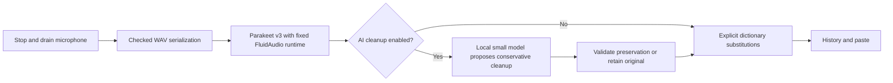

# Dictation Reliability, Conservative Cleanup, and Personal Dictionary

- **Version:** 1.0
- **Date:** 2026-09-07
- **Status:** Implemented

## Table of Contents

1. [Summary](#1-summary)
2. [Problem Statement](#2-problem-statement)
3. [Design Overview](#3-design-overview)
4. [Detailed Design](#4-detailed-design)
5. [Edge Cases](#5-edge-cases)
6. [File Changes](#6-file-changes)
7. [Testing Strategy](#7-testing-strategy)
8. [Migration Plan](#8-migration-plan)
9. [Security Considerations](#9-security-considerations)
10. [Cost Analysis](#10-cost-analysis)
11. [Implementation Tasks](#11-implementation-tasks)
12. [Implementation Status](#12-implementation-status)

## 1. Summary

Keep local Parakeet TDT v3, repair the ASR runtime's final-window loss, make optional cleanup conservative, and add explicit personal dictionary substitutions. The user's cleanup contract is: **remove clear fillers and accidental repeats; preserve wording, facts, and order**. No rewriting, summarization, inferred self-corrections, or automatic terminology guessing.

AI cleanup remains off by default. The tray occlusion notification is already removed and will remain absent. No release, commit, push, live settings overwrite, or installed-app replacement is part of this implementation.

## 2. Problem Statement

| Request | Verified current evidence | Action |
| --- | --- | --- |
| Latest Parakeet / VoiceInk parity | `asr/fluidaudio_backend.rs`, optional `asr/model.rs`, locked bridge Swift implementation use TDT 0.6B v3; [VoiceInk recommendations](https://tryvoiceink.com/docs/recommended-models) recommend Parakeet V3 | Retain model; distinguish model version from runtime version |
| False tray warning on lock | Commit `82bee06` removed the entire monitor in 0.7.5; installed app reports 0.7.6 | Verify absence; no replacement polling heuristic |
| AI defaults off | `Settings::default`, serde default, and frontend defaults are false; local persisted flag also false | Preserve opt-in; test first launch, old settings, downloads, and reload behavior |
| Poor cleanup | Sidecar accepts arbitrary generated text and does not check finish reason; Rust accepts any successful response | Prompt conservative edits and enforce output preservation with raw fallback |
| Missing recording ending | Locked FluidAudio 0.12.6 predates [quiet final-window bug #747](https://github.com/FluidInference/FluidAudio/issues/747) and [fix #800](https://github.com/FluidInference/FluidAudio/pull/800); production ignores WAV sample/finalize errors | Integrate fixed upstream runtime; propagate WAV errors; test actual audio tails |
| Technical vocabulary | No dictionary setting or deterministic substitution stage exists | Local explicit alias table, independent of cleanup |

[NVIDIA's model card](https://huggingface.co/nvidia/parakeet-tdt-0.6b-v3) identifies v3 as the current model in this family. A larger/different ASR model being newer does not establish better accuracy, latency, or macOS integration for this app. This work makes no universal best-model claim.

## 3. Design Overview

Keep changes at existing seams rather than replacing the application pipeline. Shared helpers must be used by production hotkeys and the testable pipeline so tests exercise the relevant behavior. Original ASR text must remain available whenever postprocessing changes the result.

## 4. Detailed Design

### 4.1 ASR runtime and audio integrity

The project locks `fluidaudio-rs` 0.12.6 (commit `569c7cff`), whose Swift package pins FluidAudio 0.12.6. The newer bridge currently still pins an SDK predating the final-window fix. Integrate a minimal, license-preserving ASR-only bridge with exact FluidAudio 0.15.6, documenting upstream provenance and the local delta. Retain only the Rust interface Sotto uses; use `AsrManager.loadModels` and a fresh `TdtDecoderState` per transcription. Explicitly request `.v3` with the supported `.int8` encoder, whose artifact remains `Encoder.mlmodelc`. Keep the existing `~/Library/Application Support/FluidAudio/Models/parakeet-tdt-0.6b-v3-coreml/` cache. The updated SDK requires `JointDecisionv3.mlmodelc`; its supported downloader may add this missing artifact alongside the existing cache, without deleting or relocating prior models. Link the SDK's checksum-pinned `NemoTextProcessing` binary dependency when producing the native bridge. Do not confuse the batch `AsrManager` path with the separate streaming manager.

Preserve drop-stream-before-drain ordering. Extract checked WAV serialization for both recording paths; every sample write, silence write, and finalize must return an error to the caller instead of transcribing a partial file. Keep the existing 750 ms padding until actual runtime evidence justifies a change. Derive history duration and diagnostics from captured sample count divided by the actual sample rate, excluding appended silence. The old runtime returns zero duration for multi-window results, so its duration field is not authoritative. Do not claim that sample preservation guarantees perfect ASR recognition.

### 4.2 Conservative AI cleanup

The selected model is the official stock instruction-tuned **LiquidAI/LFM2.5-350M-MLX-4bit**, replacing our custom fine-tune. In the 25-case synthetic regression holdout, stock LFM with the constrained protocol achieved 24 exact outputs, Qwen3.5-0.8B achieved 20, and the original fine-tune/pipeline achieved 8. All 16 preservation-only cases remained exact on the new path. This is task-specific evidence, not a broad model ranking. Qwen's March 2 release predates the specific March 31 LFM2.5-350M base; no newer sub-1B family with better measured behavior was verified. Full methodology, snapshots, latency, and limitations are in the [cleanup experiment journal](../journals/2026-09-08-conservative-cleanup.md).

Freeform generation failed the fidelity gate. Rust now enumerates narrow deletion candidates; the model selects JSON integer IDs using its actual chat template, one positive example, non-thinking greedy decoding, and bounded output. Rust reconstructs the result from the original bytes. The sidecar cannot introduce or reorder generated wording. Eligible fillers are lowercase comma-terminated `um,`, `uh,`, `uhm,`, and `erm,`; eligible adjacent repeat tokens are `I`, `i`, `the`, `a`, `an`, `to`, `we`, `it`, `and`, and `of`. Both repeats must be on the same line. Quoted/backtick text, negations, numbers, content-word emphasis, self-corrections, capitalized names, and final tokens are protected. Horizontal separator space may be removed with a token; paragraph boundaries survive.

Inputs under five words, over 16,000 characters, with over 128 candidates, or without candidates bypass inference. Reject duplicate/out-of-range IDs, malformed output, token-limit termination, and failures; retain the original with a truthful outcome. No-ops return `NoChanges`, not `Applied`. Conservative false negatives are preferable to changed meaning, though an unquoted eligible word can still be ambiguous to the model. No agent framework, fine-tuning pipeline, cloud inference, or arbitrary user prompts are added.

Serialize resident sidecar ownership across cleanup, preload, load, unload, download, update, and deletion. Keep PID ownership consistent while blocking inference owns the handle so timeout recovery cannot kill a different loaded process. Update checks use a separate unloaded sidecar. Packaged apps require their bundled Python script to prevent protocol mismatch with a development checkout; malformed output is never logged verbatim. Runtime inference loads complete local snapshots only. Runtime installation and model downloads require the existing explicit Settings action and preserve old caches/environments.

All new installs and missing-field settings use `llm_cleanup_enabled=false`. Explicit saved preferences survive. Downloading or checking model status must not enable correction. If a new model is promoted, existing downloaded weights remain intact and the new download is explicit; no background model migration or deletion.

### 4.3 Personal dictionary

Add `dictionary: Vec<DictionaryEntry>` with fields `heard` and `replacement`, defaulting to empty. Settings offers Heard / Write instead rows, add/remove, and existing Save/Cancel semantics. Explain that aliases match recognized words, with an example `Quen` → `Qwen`. Do not ship an automatic `queen` replacement; ordinary words must only change on explicit user instruction.

Match literal phrases case-insensitively, on Unicode-safe word boundaries (alphanumeric and underscore), with longest match first and a single pass over the original input. Replacements do not cascade, and untouched punctuation/whitespace remains intact. A word alias need not match inside a versioned token; users can enter the full misrecognized name. Avoid rewriting URL/email/code spans. Limit to 200 entries and 120 characters per field; reject empty/untrimmed fields and duplicate heard aliases with a clear validation error.

Use ASCII case-insensitive comparison for Latin technical names and preserve all non-ASCII input exactly; do not apply Unicode normalization or infer spellings. Reject control characters and aliases without any alphanumeric character. Match phrase whitespace literally. Protect backtick-delimited code, URL tokens with a scheme or `www.`, and email tokens containing `@`; an unclosed backtick span remains protected through the end of input. Do not replace a partial dotted/path/identifier token (for example, `Quen` inside `quen.com`, `my_quen`, or `Quen3.8`), while allowing an explicitly configured full versioned name. These deterministic restrictions should be covered by tests rather than expanded into a general language parser.

Save validation errors must leave the stored settings unchanged and keep the user's edits visible for correction. Cancel restores all dictionary rows with the rest of settings. New rows contain no active alias until the user supplies and saves both fields. Adding or removing rows must not modify the default empty array shared by future settings loads.

Apply dictionary after optional cleanup in both processing paths, including with AI disabled/unavailable. Preserve original ASR in `raw_text` whenever final text differs; keep `llm_applied` specific to accepted AI edits. History Raw/Diff availability depends on `raw_text`, not AI status.

## 5. Edge Cases

| Case | Required behavior |
| --- | --- |
| Quiet final speech, final partial ASR window, one-minute recording | Fixed upstream end-aligned window; test speech near boundaries and quiet tail |
| Multiple capture chunks, final chunk sent during stop | Stop completes before receiver drain; all samples reach WAV in order |
| WAV write/finalize failure | Visible transcription error, no partial transcription/paste |
| Token cap, summary, prompt echo, hallucinated suffix | Original text retained; failed/rejected status |
| Clean text, short input, technical names, prices, negations | Preserve exact substantive content and ending |
| Ambiguous repetition or filler in quotation/code | Keep it rather than guessing |
| Old settings and empty dictionary | Load without migration; behavior unchanged |
| Overlapping dictionary phrases | Longest match at each position; no cascade |
| Alias embedded in Unicode words, domain/path, or code | No partial-token substitution; protected spans remain exact |
| Invalid/duplicate alias or failed settings save | Show error; preserve persisted settings and editable draft |
| Dictionary-only edit | Correct paste/history and accessible Raw/Diff; no AI badge |
| Rejected cleanup plus dictionary edit | Apply explicit aliases to the preserved original; retain failure reason and Raw/Diff |
| Lock, sleep, hidden icon | No occlusion polling or notification code exists |

## 6. File Changes

| Files | Purpose |
| --- | --- |
| `src-tauri/vendor/fluidaudio-rs/**`, `Cargo.toml`, `Cargo.lock` | Minimal bridge vendor and fixed exact Swift runtime |
| `src-tauri/src/audio/*`, `asr/fluidaudio_backend.rs`, `hotkeys/manager.rs`, `pipeline.rs`, `test_support.rs` | Checked audio serialization, fixed runtime integration, tail tests |
| `src-tauri/src/llm/*`, `sidecar/llm_cleanup.py`, sidecar tests | Conservative prompt, finish checks, shared acceptance guard, candidate config only if verified |
| `src-tauri/src/dictionary.rs`, `models.rs`, `lib.rs`, `commands/settings.rs` tests | Alias data, validation, deterministic matching, backwards compatibility |
| `src/lib/components/dictionary-settings.svelte`, `settings-panel.svelte`, `history-item.svelte` | Dictionary editor, truthful cleanup description, raw/diff visibility |
| `src/lib/utils/tauri.ts`, settings store and test fixtures | Matching types/defaults |
| `benchmarks/llm/*`, `docs/research/2026-09-07-dictation-models.md` | Reproducible fidelity benchmark and model decision |
| This spec, current README/architecture only as needed | Tasks, verification, user-facing behavior and maintenance notes |

## 7. Testing Strategy

Run focused meaningful regression tests for: WAV exact sample count/order and late sentinel, writer failure, quiet-tail real ASR fixture, cleanup preservation and truncation, dictionary boundaries/overlap/no cascade, backward-compatible settings, and both AI-disabled and AI-enabled final text/history behavior. Synthetic speech tests are reproducible checks, not a substitute for the user's microphone reproduction.

Dictionary coverage includes ASCII case variants, Unicode boundaries, exact phrase whitespace, punctuation preservation, URL/email/backtick protection, full versioned aliases, limits/duplicate validation, settings serialization round-trip, and an old settings document lacking the field. Pipeline coverage includes AI-disabled substitution and rejected-cleanup fallback followed by substitution, checking final paste text and preserved raw history. Exercise the editor's Save/Cancel and validation feedback in a browser preview where available. Keep experimental tuning examples separate from the held-out cleanup gate and include a substantive ending sentinel in long-input cases.

Run each required full check once after integration, capture with `tee`, and use `set -o pipefail`: `cargo build`, `cargo clippy --all-targets -- -D warnings`, `cargo test`, `npm run check`, `npm test`, `npm run build`, and sidecar tests. Rerun only failures or checks invalidated by subsequent fixes. Review changes in three passes: correctness, edge cases/security, final diff/spec alignment. Inspect a built app bundle if packaging tools are available; never launch a raw app binary.

## 8. Migration Plan

The settings field is additive and serde-defaulted. Existing history loads unchanged. Existing AI preference is not overridden. No database reset, model cache relocation, model deletion, or credential change. Preserve vendor license/provenance and lock the SDK for reproducible builds. Existing implemented specs are historical records and will not be rewritten.

## 9. Security Considerations

All microphone audio, dictionary contents, and cleanup inference stay local. Research and model downloads use public upstream assets only; no private transcripts are uploaded. Treat dictated instructions as content. Never execute model output. Keep raw text recoverable in existing local history without adding permanent raw-audio retention. Do not log full dictation in new diagnostics.

## 10. Cost Analysis

No paid API or training cost. Dictionary matching is bounded by 200 short aliases and ordinary dictation length. Runtime upgrade retains the same ASR model. The selected stock model repository is approximately 227 MB; measured peak Metal memory was 0.61 GiB and median candidate-case latency was 80 ms on the tested M4. First measured inference including loading took 0.92 s. These measurements are not a guarantee for other hardware. Benchmark models and audio fixtures go under `/tmp/experiments/`; no personal data is copied into research artifacts.

## 11. Implementation Tasks

1. [x] Inspect code, installed version, defaults, current model sources, and prior benchmark evidence.
2. [x] Complete three sequential spec review passes before implementation.
3. [x] Integrate fixed FluidAudio runtime with minimal vendor delta and provenance.
4. [x] Add shared checked WAV serialization and audio-tail regression coverage.
5. [x] Implement dictionary model, validation, editor, matching, and raw/diff behavior.
6. [x] Benchmark modern sub-1B cleanup candidate and establish fidelity gate.
7. [x] Implement conservative cleanup guard, prompt, finish handling, and truthful outcomes; promote model only if gate passes.
8. [x] Wire dictionary and cleanup behavior into both production and test paths; verify defaults stay off.
9. [x] Run required checks, real local inference fixtures, and three code review passes; fix evidenced failures.
10. [x] Finish documentation and spec status; stage and show changes without commit/push.

Tasks 3–4, 5, and 6–7 can proceed independently after task 2; task 8 depends on their public interfaces. Validation follows final integration.

## 12. Implementation Status

Implemented and verified on 2026-09-08; changes are staged for review without a commit or push. The three spec reviews preceded implementation.

### Review record

- Pass 1 — Assumption validation: completed by primary agent. Verified default-off in both layers and persisted local flag, installed version 0.7.6, tray removal commit, v3 in both backend paths, and upstream final-window defect matching the symptom. Corrected proposed Swift API migration to actual `AsrManager.loadModels`/decoder-state APIs and bounded vendor scope to ASR-only. Distinguished a matching upstream root-cause candidate from an actual reproduction, and corrected model chronology rather than describing Qwen as newer than the specific 350M base.
- Pass 2 — Completeness: completed by dictionary/tray audit agent after pass 1. Added concrete alias case/boundary/protected-span semantics, input limits and validation behavior, Save/Cancel/default-array requirements, dictionary-after-rejected-cleanup and raw-history cases, and settings migration/round-trip coverage. Clarified that deletion-ID proposals require the same Rust acceptance gate, invalid IDs/ranges cannot bypass it, no-ops must be truthful, and benchmark tuning data must be separate from held-out acceptance cases. No implementation performed during review.
- Pass 3 — Clarity and actionability: completed by recording audit agent after pass 2. Specified exact batch API, explicit encoder artifact and unchanged cache, the added joint artifact, native binary linking requirement, and captured-duration source. Verified full C string allocation/copy rules (no fixed text buffer). Sixteen synthetic 52–62 second baseline clips preserve the final instruction on the old runtime; these establish a regression corpus, not reproduction of the reported intermittent failure. The matching upstream bug is a supported root-cause candidate, not a proved diagnosis of a missing private recording.

### Verification and deviations

The matching FluidAudio final-window fix is integrated. All 16 synthetic 52–62 second fixtures retained the complete normalized speech and final instruction. The old runtime also passed this corpus, so the exact intermittent microphone failure is not reproduced or proved fixed. Separately, the old cleanup sidecar demonstrably lost a long transcript's final reference during runaway generation; the new size guard preserved that input exactly. See the [ASR journal](../journals/2026-09-08-asr-tail-regression.md) and cleanup journal for reproduction.

Three implementation reviews covered correctness, protected-content/error cases, and integrated ownership/spec alignment. These caught and corrected quoted contractions/escaped delimiters, bundled-script precedence, malformed-response logging, and resident sidecar lifecycle/PID races. A concurrency regression now checks ownership restoration before another lifecycle operation proceeds.

Deviations were evidence-driven: stock LFM2.5 outperformed the newer-family Qwen candidate, so family recency was not the selection criterion; the freeform proposal became validated deletion IDs. Existing Rust history tests wrote into the real application support directory, so their storage was isolated in temporary test storage without changing production persistence. Existing Svelte warnings and a nested-button accessibility issue were repaired to meet the clean verification requirement. Bundle inspection exposed an inherited macOS 10.13 metadata minimum despite the existing macOS 14 build target; the bundle minimum now matches 14.0. Only the production Python script is bundled, excluding test files and bytecode caches. No installed app, live settings, history, model weights, credentials, or model cache location was replaced.

| Check | Result | Captured evidence |
| --- | --- | --- |
| Rust build | Passed, including final native app build | `/tmp/sotto-verify-app-bundle.txt` |
| Rust Clippy, all targets, warnings denied | Passed | `/tmp/sotto-verify-cargo-clippy-final.txt` |
| Rust full suite | 103 passed | `/tmp/sotto-verify-cargo-test-final.txt` |
| Final cleanup/lifecycle regressions after download locking | 22 passed | `/tmp/sotto-verify-cargo-llm-final.txt` |
| Frontend type/Svelte checks | Zero errors and warnings | `/tmp/sotto-verify-npm-check-final.txt` |
| Frontend tests | 98 passed across 7 files | `/tmp/sotto-verify-npm-test-final.txt` |
| Frontend production build | Passed | `/tmp/sotto-verify-npm-build-final.txt` |
| Python protocol tests | 6 passed | `/tmp/experiments/sotto-cleanup/python-tests.log` |
| Real local ASR fixtures | 16/16 passed | `/tmp/sotto-asr-tail-regression.txt` |
| Cleanup holdout | Stock 24/25, original 8/25, Qwen 20/25 | Linked cleanup journal and isolated experiment outputs |
| Local debug app bundle | Built; ad-hoc signature verifies; bundled script matches source; only system dynamic libraries | `/tmp/sotto-verify-bundle-inspection.txt` |
| Settings layout | Inspected at native 520×600 and wider browser sizes; dictionary add/edit visible | Local browser preview; Save/Cancel/error paths covered by DOM tests |
| Diff hygiene | `git diff --check` clean; no release/commit/push | Staged review on `feature/dictation-reliability` |

The reviewable artifact is `src-tauri/target/debug/bundle/macos/SottoASR.app`. It is a local debug build with an ad-hoc signature, not a notarized release. `LSUIElement=true`, no default windows, Accessory activation policy, and macOS 14.0 minimum remain consistent with the app architecture. It was not installed or launched over the running app. Live microphone, lock/unlock, and paste-at-cursor behavior require an installed-app smoke test with its Accessibility grant; automated and synthetic coverage cannot substitute for that physical check.

### Factual correction recorded 2026-09-08

The cache-subdirectory statements in section 4 and review pass 3 were incorrect. SDK 0.15.6 uses `Repo.folderName`, so its TDT v3 cache is `~/Library/Application Support/FluidAudio/Models/parakeet-tdt-0.6b-v3/`; the remote repository slug and older cache include `-coreml`. The supported downloader populated the current SDK directory. The old directory and cache root remain untouched. The subsequent [vocabulary research](../research/2026-09-08-vocabulary-asr.md#2-fluidaudio-apis-and-limitations) verifies actual artifacts and corrects Rust readiness checks; no migration or deletion was performed. This note preserves the original implementation record while correcting its factual claim.
