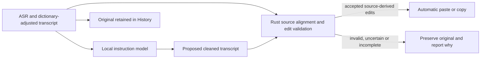

# Automatic transcript cleanup recovery plan

- **Version:** 1.0
- **Date:** 2026-09-08
- **Status:** Approved

## Contents

1. Summary
2. Problem statement
3. Design overview
4. Detailed design
5. Edge cases
6. File changes
7. Testing strategy
8. Migration plan
9. Security considerations
10. Cost analysis
11. Implementation tasks
12. Implementation status

## 1. Summary

Deliver the requested behavior: when AI cleanup is enabled, automatically paste
or copy a cleaned transcript that removes clear fillers and accidental repeats
while preserving intended wording, facts and order. Retain the original in
History. Cleanup remains off by default. A History-only suggestion is not completion
of this feature.

Use direct cleaned-transcript generation as the next model interface, then derive
and validate edits against the source in Rust. Establish a useful model/prompt
baseline before optimizing model size, memory and latency. Prefer less than 1B
parameters when quality supports it; the user's size preference is not a reason
to keep a demonstrably inadequate model.

## 2. Problem statement

The 0.8.1 detector fix restored inference for bare lowercase fillers, but the
current 350M model still removes only one of four hesitations in the reported
sentence. It emits candidate IDs instead of editing text. Repeated candidates
carry no occurrence location, and the diagnostic changes its selection when
semantically equivalent JSON field order changes.

The earlier model ranking measures this interface, not general cleanup ability.
Its semantic evaluation is also contaminated by old guard behavior: fixed96
`boundary_07` expects "We um need to uh measure the lid carefully." unchanged;
`boundary_08` expects a clear leading "Um," unchanged; `boundary_05` preserves
"uh, thank you" because it is short. Those cases cannot establish that removing
their fillers is harmful. Preserve the historical files, but supersede their use
as an automatic-cleanup acceptance benchmark.

A new direct-output diagnostic already shows that cached Qwen3.5-4B can produce
"This is a test to see if this can remove all those things from the sentences."
from the reported sentence in 1.486 seconds on this M4. This result proves one
useful behavior, not general reliability. Other direct prompts/models still
leave fillers or remove intended words, so validation remains necessary.

## 3. Design overview

The model performs a natural text-editing task. Rust resolves source occurrences,
protects content and reconstructs accepted output. This removes the model's
requirement to count duplicate candidate IDs while keeping arbitrary generated
text out of automatic delivery. Source alignment alone is insufficient: deleting
an intended word is still a possible error and needs policy and semantic tests.

## 4. Detailed design

### 4.1 Model and prompt experiments

Start with the already working direct-output Qwen3.5-4B diagnostic as a quality
control. Compare Qwen3.5-0.8B, MiniCPM5-1B, stock Qwen3.5-2B, MiniCPM5-2B and the user-requested
PollardWeights/MiniCPM5-2B-Pollard-MLX on the same semantic task. Compare Pollard
against the official MiniCPM quantization with unchanged prompts before drawing
conclusions about quantization quality. Include LFM2.5-1.2B-Instruct as a fast,
non-thinking family control. Add the previously overlooked LFM2.5-2.6B checkpoint
released August 4 as another instruction-model control; its family name does
not make it the same 350M model. Exact model identity, quantization, template,
decoding mode and revision must accompany every result.

The requested head-to-head adds abenzerps/Spark-X2.5-4B-MLX-4bit. Its
`spark2_5` architecture requires the official XHToken/Spark-MLX-LLM adapter,
which registers the architecture inside the experiment process. Inspect and pin
that code before use; vanilla mlx-lm failure is not a model-quality result.
Pollard's recommended root is mixed 4/8-bit stock MiniCPM5-2B, not new cleanup
training; test that requested artifact and optionally its q4 profile as a precision
control. Report total weights and allocated memory rather than pretending all
models have equal precision or size.

LFM2.5-2.6B's pinned native template always starts a thinking block and ignores
`enable_thinking=False`. Verify a documented supported non-thinking path or measure
native reasoning with an adequate separate reasoning/output budget, count its full
latency and clearly label the difference. Do not silently count truncated thinking
as inability to clean text. This runtime check precedes the blind comparison.

Use short, direct instructions and a few balanced examples: a multi-filler run,
a repetition, an already-clean sentence and a meaningful/literal filler word.
Keep transcript data separate from instructions. Compare zero-shot and few-shot
variants on development data. Use native chat templates, greedy non-thinking
generation first, correct EOS handling and an output budget based on transcript
tokens rather than candidate count. A supported low-temperature comparison can
follow if deterministic decoding misses a demonstrated behavior; measure repeat
stability rather than accepting one lucky generation.

Record prompt, reasoning and final-output token counts separately. Before inference,
check the pinned model's actual context limit against the complete formatted prompt
and reserved generation budget. Reserve enough final-output tokens to reproduce
the input plus a small formatting allowance; reasoning models need an additional
measured reasoning allowance. Extract the final answer using that model's supported
native boundary and require a completed generation. Exhausted budgets, missing
boundaries and deadline expiry preserve the input and count as runtime fallbacks,
not semantic model failures. The product's whole-request deadline remains bounded.

Do not infer that LFM2.5-350M is a Base checkpoint: the stock production artifact
is instruction-tuned. The issue is measured suitability, not an unverified model
type assumption. Likewise, model release dates and capability claims must come
from primary sources; newest alone does not mean best for this task.

VoiceInk currently uses a dedicated Qwen3.5-2B-derived Refine model through MLX
Swift and direct cleaned-text output. Its custom license restricts use to VoiceInk;
it is not a Sotto drop-in. It may serve as a product baseline inside the official
VoiceInk application when available. No restricted weights or implementation are
copied into Sotto, and no contact with the vendor is part of this plan.

The immediate comparison uses a separately authored 60-case semantic diagnostic
(48 ordinary cases and 12 adversarial/mixed cases), with the shared direct prompt
frozen before results are viewed. Report complete edits, preserved clean inputs,
added/lost words, fallbacks, latency by length and memory. This model comparison
informs implementation; it does not replace the larger release qualification below.

### 4.2 Source-preserving validation

Prototype a bounded word/span alignment between source and proposal. Keep original
UTF-8 byte positions and a separately normalized comparison representation.
Derive deletions, reject insertions, substitutions and reordering, then reconstruct
from the original. Punctuation and sentence-initial capitalization require explicit
rules; do not silently let the model reformat identifiers, lists or paragraphs.

Validate protected spans before accepting edits: numbers, units, dates, negations,
dictionary terms, names/identifiers, URLs, code and quoted content. Repeated tokens
can admit multiple alignments; accept only an alignment consistent with protected
spans and the permitted edit categories. Reject the proposal if this is ambiguous.
Bound alignment work and input/output size; malformed or truncated generation
must preserve the source rather than lose the ending.

Multiple alignments of an ordinary duplicate, such as which occurrence of `the`
survives, are acceptable when they produce the same reconstructed source output
and respect the same protections. Reject materially different reconstructions or
protected-span deletion; do not reject useful repetition removal solely because
equivalent alignments exist. Exact dictionary terms, syntactic identifiers and
quoted/code spans support deterministic protection. Unlisted names and meaningful
uses of ordinary words require contextual judgment and semantic validation; a
parser is not a guarantee that every possible name has been recognized.

Review the old guard independently. Bare/capitalized fillers, short utterances,
terminal fillers and clear repeated phrases must not be excluded just because
the prior implementation could not handle them. Proposed removal categories are
clear hesitation fillers, accidental repeated spans and small abandoned grammatical
fragments around a restart. The reported "all the um uh yeah, those things"
illustrates a restart; handling it must not become permission to summarize or
discard substantive corrections. Context-dependent words such as "yeah" remain
content when they convey agreement. Evaluate model proposals before and after
validation so the guard cannot appear safe merely by rejecting everything.

Freeze the permitted restart-fragment categories and their bounds with the validator
before release qualification, using development examples and counterexamples.
Do not add a special rule for the reported sentence. A proposal requiring an
unsupported edit preserves the complete cleanup input; partial salvage of an
invalid proposal is outside the initial implementation.

### 4.3 Product integration

After qualification, enabled cleanup feeds accepted reconstructed text into the
existing paste/copy pipeline. `text` stores delivered text, `raw_text` retains
original ASR when processing changes it, and `llm_applied`/`Applied` describe
actual application. Existing historical suggestions remain readable. Record
the cleanup input if needed to distinguish dictionary changes from AI deletions,
using the smallest compatible provenance change justified by the implementation.

Settings must say that enabled cleanup automatically removes fillers/repeats.
Its existing one-action preparation handles the chosen model and shows progress,
retry and readiness. Preserve default-off, private caches and existing history.
Expose a meaningful reason when output is unchanged: structural bypass, no changes
suggested, validation rejected changes, model unavailable or timeout.
The ordinary workflow must not require opening History to obtain cleaned text.

Use evidence-based status wording: identical model output means "No changes
suggested," not a guarantee that the transcript contains no disfluencies. Distinguish
a structural bypass from an actual model invocation. Rejected, unavailable and
timed-out results all deliver the unchanged cleanup input. Preserve the existing
cancellation and interrupted-capture rules, which prevent automatic delivery of
known incomplete recordings regardless of cleanup success.

## 5. Edge cases

Test names and model identifiers such as Qwen3.8-Flash-Next, accented text, mixed
languages, Portuguese/German `um`, literal mentions, deliberate emphasis, quotes,
code, amounts, negations and repeated numbers. A model need not aggressively
clean uncertain language to preserve it correctly, but unsupported language
behavior must be explicit. Do not demand that a transcript obey instructions
spoken within it; those words are data to preserve.

Include short utterances, comma-free speech, filler runs, leading capitalization,
end-of-recording fillers, minute-long dictation, paragraph boundaries, cancellation,
device interruption, setup overlap and sidecar death. No ASR buffering or recording
lifecycle changes are needed to implement cleanup.

An accepted all-filler transcript can become empty. Retain its original in History
and finish recording without pasting, copying stale clipboard contents or replacing
a selection with an empty value. Empty output from an incomplete generation or
from a source containing substantive words must fail validation instead.

## 6. File changes

- New isolated direct-output experiment and semantic fixtures under `benchmarks/llm/`.
- `src-tauri/sidecar/llm_cleanup.py`: qualified native prompt, text proposal protocol and bounded generation.
- `src-tauri/src/llm/edits.rs`: source alignment and validated reconstruction.
- `src-tauri/src/llm/{cleanup,engine}.rs`: protocol, validation, status and deadlines.
- `src-tauri/src/test_support.rs` and lifecycle test backends: migrate the mock protocol with the real backend.
- `src-tauri/src/{models,pipeline}.rs` and `hotkeys/manager.rs`: actual delivery and compatible provenance.
- Rust/Python model metadata, setup commands and bundled resources: verify the same pinned artifact and any required architecture adapter.
- Cleanup Settings, History and shared TypeScript status definitions: automatic behavior and truthful fallback messages.
- Focused regression tests, research evidence, changelog and local patch installation record.

The [implementation audit](../audit/2026-09-08-direct-cleanup-integration.md)
records exact source pointers. Resolve the existing 10-second wire deadline and
30-second outer deadline together. Direct-text responses also need explicit UTF-8
and serialized-byte bounds: the current 64 KiB response cap cannot hold every
16,000-character input when Python escapes non-ASCII characters. Preserve bounded
failure recovery; increasing generation tokens alone does not solve either limit.

## 7. Testing strategy

Maintain separate datasets for development, ordinary semantic cleanup, adversarial
preservation and structural guard regressions. Audit gold labels for intended
meaning before model runs; old guard exclusions are not semantic ground truth.
Allow documented equivalent punctuation only where intended wording is unchanged.
Keep immutable originals and record label corrections in a new dataset/version.

Review complete model proposals against intended-word preservation as well as
the preferred formatted output. Formatting differences must not be misreported
as lost meaning, and normalization must not erase meaningful identifier, numeric
or case differences. Gold may specify multiple legitimate outputs when necessary.
Keep the 60-case comparison diagnostic separate from the release holdout; once
its results inform a prompt or validator change, it is development evidence.

Build 200 independently reviewed natural validation cases (100 requiring cleanup
and 100 already usable), plus 50 separately reported adversarial cases. Include
mixed edits/content, protected terms, short/long recordings and multilingual speech. Freeze the model, prompt and
validator before opening held-out results. Inspect every changed output and every
fallback; report raw model quality and final delivered quality separately.

Proposed release gates:

- The reported sentence and independently authored variants remove every clear hesitation; removing just one of several fillers is a failure.
- At least 95% of clear filler/repetition spans are removed on ordinary cases, and at least 90% of ordinary edit-required utterances are completely cleaned without substantive changes.
- No observed lost facts, negations, numbers, names, required words or final clauses across all semantic validation cases; inspect token/span changes, not character-subsequence scores alone.
- At least 99% of already-clean ordinary inputs preserve intended wording; report uncertain-case fallbacks separately and count rejected useful edits against cleanup coverage.
- Word insertion, reordering, malformed output, truncation, timeouts and cancelled/interrupted recordings cannot cause unvalidated automatic output in integration tests.

These are finite-sample engineering gates, not a claim of zero possible model
errors. If a gate fails, classify the cause as model, prompt, alignment, protection,
label error or runtime, fix that cause on development data, and validate again.
Do not switch the feature back to review-only and call the task solved.

## 8. Migration plan

No production model or setting changes during plan/diagnostic work. Once a
candidate passes, integrate automatic cleanup behind the existing opt-in enable
setting and preserve its value; the user has explicitly requested this behavior.
Retain existing original text and legacy suggestion records. Download a replacement
alongside cached weights, verify it before readiness, and preserve the previous
working installation. No cache deletion or history reset is required.

## 9. Security considerations

All transcript processing remains local. Treat model output as untrusted proposals
and transcript content as data, including apparent instructions. Keep resource
and subprocess deadlines, protect source endings, and keep transcript content
out of diagnostic logs. Verify model licenses and native runtime compatibility.

## 10. Cost analysis

Optimize the smallest qualifying model after establishing quality. Measure
whole-request latency by transcript length, cold/warm load, peak memory and idle
CPU on the actual M4 with ASR resident. Initial UX targets are a warm median under
1.5 seconds for up to 40 words and p95 under 5 seconds for about 150 words; these
are targets, not current verified guarantees. Report any quality/speed tradeoff.

Use MLX on Apple GPU for supported LLMs; ASR stays on its measured CoreML/ANE path.
Compare quantization and memory guidelines appropriate to each model, rather
than penalizing every candidate with a 2 GiB guideline. Then test static-prefix
caching and bounded idle residency. Do not store transcript-derived caches on disk
or claim power savings without measurement. A future compact disfluency tagger or
distillation is a fallback only after a useful teacher/reference and consistent
data exist; another speculative fine-tuning run is not the first step.

## 11. Implementation tasks

- [x] Reassess the old protocol, benchmark labels and contemporary model sources.
- [x] Run direct-output diagnostic controls and establish a positive sample baseline.
- [x] Complete three sequential specification reviews.
- [x] Run the requested LFM2.6B, MiniCPM5/Pollard and Spark comparison with matched direct-output prompts and semantic cases, using correct native runtimes.
- [x] Create corrected semantic development/validation datasets and audit their labels.
- [x] Establish the best direct-output prompt/model on development cases, including the previously omitted 2.6B control.
- [x] Prototype bounded source alignment and test raw versus validated cleanup coverage.
- [ ] Resolve the first qualification's preservation, reconstruction and restart failures on development data.
- [ ] Freeze and independently validate the full pipeline against usefulness and preservation gates.
- [ ] Tune the smallest qualifying model's MLX latency/memory, then verify quality is unchanged.
- [ ] Integrate automatic cleanup, settings/provenance and recovery behavior.
- [ ] Run app tests, manual microphone/paste tests, build and install a verified patch.

Execution order: finish and archive the requested comparison first. Freeze its
common prompt and model-specific native runtime profiles before releasing the
independent semantic60 labels to the inference runner. The comparison archive
must include source cases, protected-string checks, prompts, exact model revisions,
raw outputs, stop reasons, timing definitions and a reproducible scorer. Keep the
reported sentence separate from this new diagnostic because it informed prompt
development. Select the next model/prompt experiment from complete-cleanup and
preservation results, then prototype the validator in isolation. Integration and
installation depend on full-pipeline qualification; an approved plan does not mean
that an unqualified model is ready to install.

## 12. Implementation status

Research, the requested comparison and prompt selection are complete. The selected
profile is official MiniCPM5-2B with development prompt D3: examples belong in the
system message, followed by one transcript user message. The installed 0.8.1
application is unchanged.
The [frozen head-to-head](../../benchmarks/llm/model-study-2026-09-08/direct-cleanup-diagnostic/HEAD-TO-HEAD.md)
contains 480 completed outputs from eight profiles across six models. Stock
MiniCPM5-2B is the selected development candidate, with 50/60 exact results and a
0.796-second median in its common profile. LFM2.6B received separate native pilots,
including published sampling settings; it missed the deployment latency target.

The 60-case diagnostic is now development data. Controlled follow-ups isolated
transcript framing, a leading-hesitation example, exact retained-word wording and
demonstration placement. Independent 250-case qualification gold and a separate
12-case restart supplement have been authored and reviewed, but remain withheld
from the model and validator experimenters until the full configuration is frozen.
The v3 validator plus D3 completes all 24 ordinary and four adversarial cleanup
cases in the now-public 60-case development set, with all 32 preservation inputs
unchanged. Across the older nine examples, two mixed literal/cleanup proposals
correctly fall back in full: total development cleanup coverage is 31/33, with
36/36 preservation cases intact. D4 adds no delivered benefit and is rejected.
Independent source review found escaped and multiline quote/code protection gaps;
a narrow parser correction and regressions precede the qualification freeze.
The first [250-case qualification plus 12 restart cases](../../benchmarks/llm/model-study-2026-09-08/direct-cleanup-diagnostic/qualification/RESULTS.md)
ran with D3 and frozen v5 after parser corrections. It **failed**: 90/100 ordinary
cleanup cases completed after validation, with 92.70% complete-run recall;
all 100 ordinary preservation cases stayed intact, but four adversarial cases
lost required words. The independent restart supplement completed only 1/6
required cleanups. All 262 requests completed within ten seconds; the 250-case
median was 0.932 seconds. These inputs now become development data, with their
original frozen run retained. Targeted prompt and validator changes require a
new independent qualification before production integration.

Primary references checked September 8, 2026:

- [Requested Pollard MiniCPM5-2B variant](https://huggingface.co/PollardWeights/MiniCPM5-2B-Pollard-MLX); Apache-2.0; stock MiniCPM5-2B with mixed-precision quantization, verified before isolated download.
- [Qwen3.5-0.8B](https://huggingface.co/Qwen/Qwen3.5-0.8B) and [4B](https://huggingface.co/Qwen/Qwen3.5-4B).
- [MiniCPM5-1B](https://huggingface.co/openbmb/MiniCPM5-1B), [2B](https://huggingface.co/openbmb/MiniCPM5-2B), and [release history](https://github.com/OpenBMB/MiniCPM).
- [LFM2.5-350M](https://huggingface.co/LiquidAI/LFM2.5-350M) and [newer 2.6B checkpoint](https://huggingface.co/LiquidAI/LFM2.5-2.6B).
- [VoiceInk Refine integration](https://github.com/Beingpax/VoiceInk/blob/8f089cb4bf2c9c2f217b0cc0af909d9052ff6288/VoiceInk/Features/ModelLibrary/State/VoiceInkRefineService.swift), [model card](https://huggingface.co/beingpax/VoiceInk-Refine-V1), and [restricted license](https://huggingface.co/beingpax/VoiceInk-Refine-V1/blob/ad665418d3850e379e29236e66be3ddc0ac0bf04/LICENSE.md).
- [MLX-LM generation](https://github.com/ml-explore/mlx-lm) and [Google's disfluency research](https://research.google/blog/identifying-disfluencies-in-natural-speech/).

Review 1 — Assumption validation (root): verified the reported positive direct-output
result and flawed boundary labels against archived data; corrected Base/Instruct
assumptions and explicitly distinguished diagnostic evidence from release quality.
Added Spark's required native adapter, Pollard's mixed quantization and LFM2.6B's
always-thinking template so the requested head-to-head cannot produce avoidable
runtime or truncation failures disguised as model-quality results.

Review 2 — Completeness (recording/ASR reviewer): completed after review 1.
Added explicit context/reasoning/final-output budgets and native completion checks;
distinguished equivalent duplicate-token alignments from unsafe ambiguity; scoped
deterministic protections without claiming universal name recognition; required
bounded, frozen restart policy without sentence-specific exceptions; and clarified
fallback delivery, observed unchanged statuses, interruption behavior, formatting
adjudication and diagnostic-versus-release holdout separation. The usefulness,
preservation and latency gates are unchanged. No product implementation is approved
until the third sequential review is complete.

Review 3 — Clarity and actionability (root): completed after review 2. Corrected
the remaining reference to Pollard training changes, added the non-thinking LFM
family control, and removed unsupported "no cleanup needed" status wording.
Specified experiment freeze, reproducible archive requirements and the dependency
from model comparison through isolated validation to production installation.
Independently reviewed all 60 new semantic labels without changing their frozen
hash; protected-string scoring complements lexical comparison so altered model
identifiers, URLs and numeric facts cannot disappear through normalization.
The plan is approved for execution; model selection remains conditional on evidence.

## 13. User-directed 0.8.2 local test release

On September 8 the user selected MiniCPM and explicitly requested application
integration, testing, a patch bump and local redeployment. This supersedes the
open-ended model/retry experiments for this installation. It does not turn the
failed first qualification into a pass or certify the earlier quality targets.

The local test release uses official MiniCPM5-2B-MLX at revision
`32f8dd5df1188512a20413f1297083238306634c`, D7 prompt
`2edd80834efc831c1f7d37f93da35c209622525b39dcc766c01159f6ad87de7f`,
frozen v6 source reconstruction, and the measured whatlang 0.18.0 reliable
non-English abstention. One complete proposal per request; no retry, partial
salvage or persistent transcript cache. Warm generation is bounded to ten
seconds, the wire to fifteen and whole owned lifecycle to thirty. Source and
proposal are bounded to 32,000 UTF-8 bytes and protocol lines to 256 KiB.

Review 1 (assumptions): D7/v6 development results are evidence for choosing this
candidate, not independent qualification. The short foreign-phrase and semantic
ambiguities remain limitations. Review 2 (completeness): failures retain full
source; accepted empty cleanup saves the original without pasting; stale jobs
cannot publish cleanup status; pinned model verification preserves old caches.
Review 3 (actionability): use the existing integration audit file ownership and
protocol; run production-source fixture parity, real sidecar sample validation,
Rust/frontend/Python checks and signed bundle verification before installation.

- [x] Integrate pinned MiniCPM direct-text protocol and v6 Rust reconstruction.
- [x] Apply accepted text in both pipelines; retain original History and default-off setting.
- [ ] Update settings copy and verify close behavior.
- [x] Run focused real-model smoke plus required build, tests and linter.
- [x] Bump/sign 0.8.2; installation superseded by verified 0.8.3 below.

Fresh qualification2 remains withheld for future evaluation; no results are claimed.

## 14. Startup warmup and GitHub build verification (0.8.3)

The user subsequently requested one-time preload/prewarm whenever cleanup is
enabled, a further patch bump, and a PR targeting main with verified build and
deployment behavior. Version 0.8.2 was built and smoke-tested but not installed
before this instruction; the final installation will be 0.8.3.

The existing startup task already preloads a downloaded enabled model. Reuse
Settings preparation at startup for saved enabled intent, including migration
from the old model when the new pin is absent. Concurrent preparation callers
join the same lifecycle owner. Extend the sidecar's load
operation to run one fixed synthetic transcript through the actual D7 generation
path. Discard request state, mark warmed only on completed success, and reuse the
resident model on later loads. `loaded` requires successful warmup; both Rust load
paths verify `warmed:true`. Disabled cleanup starts no inference. Generation and
process deadlines remain bounded, and the UI stays responsive during background
warmup. Dictation during preparation retains the original with an explicit busy
status rather than waiting on a download.

Add a read-only PR CI workflow that exercises the default CoreML backend, Rust
checks, frontend/Python tests and full ad-hoc macOS packaging without signing
secrets. Main pushes and version tags use the signed draft-release workflow.
Manual dispatch defaults to signed verification without publishing a release;
this lets the requested PR prove signing/notarization and upload build artifacts.
Keep the exact built commit as release target. No PR merge or public release is
part of opening the PR.

Review 1: inspected `lib.rs` preload ownership and both load consumers; merely
loading weights does not run generation kernels. The warmup uses shipped sample
data only. Review 2: failed warmup never marks ready, repeated load skips warmup,
and direct cleanup remains supported; the existing resident process owns model
state. PR jobs receive no signing secrets, while signed dispatch/main jobs use
existing repository secrets. Review 3: use sidecar `warmed`/`did_warm` fields,
update Rust identity checks and the bundled smoke driver, then inspect Actions
results for the exact PR commit. Workflow behavior follows [GitHub triggers](https://docs.github.com/en/actions/how-tos/write-workflows/choose-when-workflows-run/trigger-a-workflow)
and [Tauri's action contract](https://github.com/tauri-apps/tauri-action).

- [x] Add one-time synthetic warmup to enabled startup and explicit setup.
- [x] Verify completion, repeat-load reuse and first-user-request latency.
- [x] Add PR checks and main/manual signed build routing; audit dependencies.
- [x] Build/sign/install 0.8.3 with settings/history preserved.
- [ ] Commit and push the reviewed feature branch, open PR to main, and inspect CI plus signed verification results.

Local implementation and installation evidence: [release journal](../journals/2026-09-08-minicpm-local-release.md). Native Settings close remains unverified because computer-use access times out; automated close and unsaved-state checks pass.
