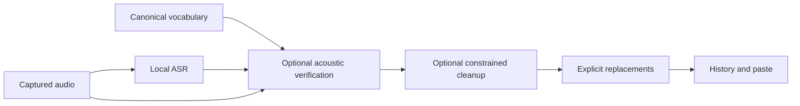

# Acoustic Vocabulary, Responsive Settings, and Measured Mac Performance

- **Version:** 1.0
- **Date:** 2026-09-08
- **Status:** Implemented

## Table of Contents

1. [Summary](#1-summary)
2. [Problem Statement](#2-problem-statement)
3. [Design Overview](#3-design-overview)
4. [Detailed Design](#4-detailed-design)
5. [Edge Cases](#5-edge-cases)
6. [File Changes](#6-file-changes)
7. [Testing Strategy](#7-testing-strategy)
8. [Migration Plan](#8-migration-plan)
9. [Security Considerations](#9-security-considerations)
10. [Cost Analysis](#10-cost-analysis)
11. [Implementation Tasks](#11-implementation-tasks)
12. [Implementation Status](#12-implementation-status)

## 1. Summary

Extend personal vocabulary beyond literal replacements, redesign Settings around clear sections, automatically prepare local cleanup when the user turns it on, and remove measured UI/inference overhead. Keep the user's cleanup contract: remove clear fillers and accidental repeats while preserving wording, facts, and order. Keep local-only processing, menu-bar-only behavior, default-off cleanup, and existing user data.

The user requested five **sequential** adversarial reviews of the entire application with improvements between every review. Each pass must inspect the integrated application after the preceding fixes, record concrete findings and evidence, implement its corrections, and verify them before the next pass. Model and performance decisions must cite current primary sources and distinguish measured results from hypotheses.

## 2. Problem Statement

| Area | Source-proven issue | Required result |
| --- | --- | --- |
| Vocabulary | Current `dictionary` is a deterministic Heard/Replacement table, without audio context | Canonical terms usable without listing every mishearing; measure acoustic vocabulary verification |
| Cleanup setup | The toggle is disabled until a separate model download; verbose inline content wraps awkwardly | One deliberate enable action starts setup with progress, retry, and cancellation; no default-on migration |
| Settings | One long form, weak loading/error state, stale Save completion can snapshot later edits | Clear navigation, bounded layout, explicit loading/errors, reliable draft/Save/Cancel behavior |
| Overlay | Audio-level array grows and is copied on every sample; waveform animates while hidden | Constant-size signal state and no hidden/idle animation work |
| History | All rows mount at once; settings advertise unused history/language behavior | Bounded rendering, truthful controls, preserved existing history |
| Native work | Blocking ASR work runs inside async tasks; settings/history disk writes are synchronous and non-atomic | Background work at shared boundaries and recoverable persistence failures |
| Models | Earlier 25-case cleanup comparison is preliminary and covered only two alternatives | Broader official model survey and expanded fixed holdout, with cold/warm measurements |

VoiceInk's [current Vocabulary documentation](https://tryvoiceink.com/docs/vocabulary) says vocabulary is AI-enhancement context and does not directly alter raw transcription; its marketing uses broader language. This does not establish native ASR hotword biasing. FluidAudio 0.15.6 includes `VocabularyBoostingSession`, auxiliary CTC acoustic matching, and constrained rescoring; exact APIs, model requirements, and false positives are being verified in [ASR research](../research/2026-09-08-vocabulary-asr.md).

[Tauri's current command documentation](https://v2.tauri.app/develop/calling-rust/) recommends asynchronous commands for heavy work and explains synchronous main-thread execution. CPU/blocking operations inside async tasks still need the blocking pool. Svelte derived values are lazy, so collapsed diff computation is not assumed to be a hotspot without measurements.

## 3. Design Overview

Keep canonical vocabulary and deterministic replacements separate in Settings. Preserve existing aliases as replacements without silently changing their meaning. Share inference, validation, and persistence helpers across the real hotkey path and testable pipeline.

## 4. Detailed Design

### 4.1 Vocabulary grounded in audio

Add a serde-defaulted canonical term list, independently validated and presented as editable words/phrases. The preferred candidate uses FluidAudio's auxiliary CTC model to evaluate terms against the recorded audio and TDT token timings. This is acoustic verification/rescoring, not fine-tuning the TDT weights or a native TDT beam-search hotword decoder. Do not claim that every configured term is always recognized correctly.

Use actual 0.15.6 public APIs rather than documentation-only overloads. Initial 40-clip/two-voice experiments already reject the stock rescoring output: it rewrote queen→Qwen, ran→CRAN, cloud→Claude, duplicated a versioned prefix, and changed punctuation. These are supported failures, not hypothetical risks. Investigate public `ctcTokenEvaluateCandidates` evidence with exact source-span application; do not accept SDK-generated rewritten text unchanged. Digits/hyphens produced unknown CTC tokens, so reject unresolved partial version-name matches rather than inserting missing components. Conservative thresholds must be tuned on development fixtures and evaluated on independent distractors; narrow guard heuristics are not proof of semantic certainty. Measure intended terms and ordinary-word distractors before selecting behavior. Preserve base ASR text when the vocabulary model is missing, unsupported, fails, or offers insufficient evidence; show its setup/status truthfully. Keep unboosted text available in history when vocabulary changes the result. Store `Settings.vocabulary: Vec<String>` with an empty serde default, at most 100 terms and 120 Unicode characters per term. Reject empty/control-containing entries; normalize surrounding whitespace and reject case-insensitive duplicates at the settings boundary. Preserve spaces/version syntax in storage, while keeping recognition eligibility separate. Auxiliary readiness checks required CTC artifacts and `tokenizer.json`, including tokenizer parse success. `tokenizer_config.json` is not required by the actual SDK tokenizer.

Expose `VocabularyStatus { supported, downloaded, loaded, preparing, download_size_mb, error }` and idempotent `prepare_vocabulary_model` / `get_vocabulary_status` commands. The supported auxiliary cache is `FluidAudio/Models/parakeet-ctc-110m-coreml`; measured public artifact size is about 103 MB. Saving the first nonempty term list starts preparation; a failed preparation preserves saved terms and ordinary ASR, with retry available. No recording-triggered network download. Clearing all terms releases the auxiliary model, and empty lists perform zero CTC inference. Snapshot terms at recording start to avoid using a later settings edit for an earlier recording.

Persist and acknowledge the validated term list **before** starting background preparation. A preparation failure is a vocabulary readiness error, not a failed Settings save; the UI must show that the words are saved and ordinary ASR remains usable. Status reads are local and never initiate downloads. Preparation is single-flight across windows, and completion must not reload an auxiliary model after the saved term list has been cleared. Closing Settings does not erase saved terms or their background preparation. Backend-normalized terms must be reflected in the acknowledged saved snapshot so normalization cannot leave the UI falsely dirty or falsely saved.

Extend the ASR result with optional original/unboosted text when vocabulary changes the output, and use that as history's raw text through subsequent cleanup/replacements in every path. Other ASR backends default to unmodified text and explicitly unsupported acoustic vocabulary. A default trait method for transcription with vocabulary keeps fallback backends compatible.

A user's deliberate vocabulary setup or cleanup enable action may download the required public local model. Model caches stay at supported locations; no existing weights are removed. Failures must not discard dictation, erase terms, or silently enable a feature. Existing explicit replacements remain independent of AI cleanup.

### 4.2 Settings and automatic cleanup setup

Use a small settings shell with navigation for General, Dictation, Vocabulary, and Advanced. At the existing native width, content should fit without horizontal scrolling; compact layouts remain keyboard accessible. Separate descriptive text, model details, and progress/error status instead of allowing long inline controls to wrap unpredictably.

The cleanup control remains clickable when the model is missing. Turning it on means prepare the local runtime/model automatically, report real pending/error/completion states, and only then enable the current draft. Cancel, turning it off, closing the view, or loading another draft invalidates late asynchronous enable completion. Downloaded files may remain cached; default settings remain off. Do not pretend to cancel an underlying transfer unless cancellation actually works.

Expose `prepare_llm_model` as the single explicit enable-preparation command (runtime setup, complete local model, load validation). `get_llm_status` reports actual preparation/error state without installing anything; existing download/update actions can remain download-only. Use one explicit enable-preparation operation and a per-draft intent generation. Repeated clicks or events cannot start parallel runtime installation/model loads. A completion is accepted only for the still-mounted current draft with a matching pending intent. During preparation keep the persisted preference unchanged; Save may persist other edits, but must not commit cleanup as enabled before readiness succeeds. Successful preparation changes only the requested cleanup field and leaves unrelated edits intact. The footer then shows that enabling awaits Save. Failed preparation leaves the draft off and provides Retry; cancelling activation may keep a shared download running only when that behavior is stated accurately.

An already-enabled saved preference is preserved on load. Cancelling unrelated draft changes must not disable that saved preference or unload its active model. Sidecar residency changes follow explicit preparation or the successfully saved preference, rather than speculative draft toggles. If download/setup succeeds but the subsequent settings save fails, retain the ready cache and editable enabled draft, show the persistence error, and allow retry without downloading again.

A failed Settings load must offer retry rather than presenting editable defaults that could overwrite a user's settings. Save captures the exact submitted snapshot; edits made during Save are not marked saved accidentally. Save/Cancel and window-close behavior are explicit and consistent. Apply shortcuts only when changed, propagate registration failures, and avoid unrelated login-item work.

Settings, permission health, cleanup readiness, and vocabulary readiness have separate loading/error states. Failure of a secondary status request must not replace or block an otherwise loaded settings draft. Ignore stale status responses, release listeners that finish registering after teardown, and retain actionable errors until retry/dismissal. Close-with-unsaved-changes offers a consistent Save/Discard/Keep Editing decision; a pending setup never turns on cleanup after the window has closed. A persisted-settings success followed by an OS shortcut/login-item failure is reported as saved with an activation error, rather than claiming all preferences rolled back.

At 520×600, navigation, panel heading, and Save/Cancel remain reachable without horizontal scrolling. Long panels scroll within the content area. Navigation uses labeled native buttons with a visible selected state and keyboard focus; if ARIA tabs are chosen instead, implement arrow/Home/End focus behavior and proper tab-panel relationships. All switches, shortcut controls, vocabulary fields, progress messages, and errors have accessible names; loading indicators must not remove the user's focused control unexpectedly. Check a narrow window, long term/model labels, and enlarged text before accepting the layout.

### 4.3 UI responsiveness and power

Replace the ever-growing audio-level array with only the latest level or a fixed ring buffer. Run waveform animation only while visible and recording; cancel RAF, observers, timers, and late event subscriptions on teardown. Read canvas geometry when it changes rather than on every frame. Update whole-second timers at the required rate rather than 60 times a second.

Render history in bounded pages or incremental batches with stable IDs. Search the complete loaded history without mounting every match at once. Preserve an expanded row's state and expose result counts/navigation clearly. A UI display limit must not introduce new automatic deletion of existing history. Remove or clarify settings that have no runtime effect instead of implying unsupported functionality.

Keep access to older entries and full-history search even when only one page is mounted. Clearing a search resets/clamps pagination predictably, and additions/deletions do not strand the view on an empty nonexistent page. Treat any repurposed `max_history` value as presentation only, or hide the inert control while preserving the stored field; never apply its default as a new retention policy. History loading and failed reads are distinct from an empty history. Failed Copy/Delete/Clear operations must not show success or erase displayed entries; destructive actions need a deliberate confirmation or a working undo path.

Benchmark baseline and revised browser rendering with fixed synthetic data and the same machine/build mode; measure mount/search/input latency, DOM size, idle frame count, and long-recording memory behavior. Native WKWebView results must be identified separately from headless Chrome measurements.

### 4.4 Inference, models, and persistence

The acceptance gate favors preservation over edit coverage. Expanded cleanup evaluation must report false deletions separately from exact-match and useful-edit rates, including an eligible-only denominator. The current stock model/prompt failed the independently reviewed 96-case set (57 exact, 32 with content deleted); its earlier 24/25 result is not sufficient evidence for promotion. Candidate development uses separate examples, and any changed prompt/guard requires fresh independently labeled validation. Target zero observed substantive deletions and at least 80% of required-edit cases receiving useful edits on the fresh validation set; report sample size and remaining semantic uncertainty. Do not weaken this gate to select a newer family.

Acoustic vocabulary must improve target-term recall without the observed ordinary-word false corrections or partial version-name insertion on independent validation. Report base accuracy, corrected/missed targets, new errors, punctuation/span integrity, added latency, and memory. If the initial CTC method fails, experiment with exact-span acoustic comparison or a supported context-conditioned ASR alternative; do not ship unsafe defaults because they expose a vocabulary API.

Keep ASR on supported CoreML hardware execution and cleanup on MLX/Metal unless a measured alternative improves the user's accuracy/latency/resource tradeoff. CoreML compute-unit permission is not proof that every operation ran on ANE. Use serialized hardware benchmark windows, cold/warm runs, fixed fixtures, and CPU/memory metrics. Report energy measurements only if accessible; do not invent wattage from latency or package metadata. `sudo -n powermetrics --help` requires a password on this host, so direct power counters are currently unavailable; CPU time, allocator memory, and latency are explicitly proxies, not measured watts.

Compare additional official small models, including newer releases, against the same expanded cleanup holdout and preservation gate. Include 1–2B controls only when they can clarify the tradeoff. Check actual total parameters, license, MLX architecture support, and artifact freshness. If no candidate improves fidelity at acceptable local cost, retain the best measured option and state the limits of the search. Record failed candidates and stop conditions.

Move blocking ASR/model setup and heavy disk work onto blocking workers through small shared helpers. Use an owned/shared engine handle for `spawn_blocking` and acquire its inference mutex inside the blocking worker, never the UI thread; apply this to startup, setup, hotkeys, and the test pipeline. Preserve sidecar ownership and bounded failure recovery. Use atomic settings/history writes; failed writes must preserve the original disk file and a truthful in-memory state. Avoid broad infrastructure replacement, new databases, agent frameworks, or cleanup fine-tuning.

### 4.5 Review-only cleanup containment (final-review amendment)

**Approved after three sequential amendment reviews.** The
expanded tests found substantive deletions in every useful automatic candidate,
including the existing stock350 model. Structural deletion-only enforcement cannot
determine whether a repeated word or a literal mention of a filler is meaningful.
Keep the automatic promotion gate unchanged. Until a model passes, opt-in cleanup
produces **experimental suggestions for review in History**, never automatic paste
or ordinary Copy. This is containment of a demonstrated defect, not a claim that
model quality passed. The currently configured compact stock model remains an
experimental suggestion generator; no failed model is promoted as an automatic
editor. The final unchanged model controls are still recorded in research.

Use one optional serde-defaulted `Transcription.cleanup_suggestion: Option<String>`.
`text` remains the vocabulary/exact-replacement-adjusted ASR result, and `raw_text`
continues to mean original unboosted ASR provenance. Apply explicit replacements
before generating a suggestion, so its diff is strictly deletions from `text`.
The existing Rust guard, protocol deadline and raw fallback remain unchanged. A
changed suggestion receives `Suggested { elapsed_ms }` status; `llm_applied` stays
false for new entries. Older Applied entries and their stored text remain unchanged.
Cancelled/interrupted/no-op/failed cleanup produces no suggestion. Include the
optional suggestion in exports and equality/serialization tests without rewriting
existing files on startup. Serialize absent suggestions by omission; legacy records
deserialize to `None`. Append a clearly named `cleanup_suggestion` CSV column while
preserving the existing columns. Escape CSV quotes and neutralize spreadsheet
formula prefixes for transcript, provenance, suggestion, and error text; current
CSV quoting alone does not neutralize formula execution. A suggestion must be
nonempty, differ from `text`, and pass the existing deletion guard against that
exact dictionary-adjusted `text`; never apply dictionary replacements a second time
to the generated suggestion. Skip model invocation entirely for interrupted or
cancelled captures. Backend status/event serialization and the frontend status union
must both recognize `suggested` with the existing elapsed-time detail shape.
The shared cleanup result/status path must expose Suggested for new proposals,
including `llm_last_status` returned by `get_llm_status`; do not leave an Applied
status in the runtime while only changing the History badge. Preserve Applied
deserialization solely for older saved entries.

History defaults to the ordinary transcript. Expanding a suggestion shows a labeled
experimental deletion diff and an explicit **Copy suggestion** button, using the
same truthful async clipboard/error handling as Copy. Ordinary Copy, Copy Last,
new-transcript events, `word_count`, and automatic paste always use `text`. No
automatic clipboard replacement, focus stealing, or second paste occurs when a
suggestion is ready. Settings explains this behavior before enable, retains the
same direct automatic setup/retry/cancel/Save flow, and stays disabled by default.
The overlay calls the outcome a suggestion, not cleaned text.

Keep the existing original-ASR-versus-transcript Raw/Diff view separate from the
transcript-versus-suggestion comparison. A suggestion alone must not imply that
dictionary edits occurred or set `raw_text`. The ordinary action should be labeled
**Copy transcript** when an expanded alternate view could make its target ambiguous;
it still copies `text` when Raw, Diff, or suggestion content is visible. Render both
diffs as escaped text spans, never model-provided HTML. Suggested entries need a
clear review badge and short warning that deletions can remove meaningful words;
the expanded suggestion action must remain keyboard accessible at the actual
History width. Only the explicit suggestion action may copy suggestion content,
and its success feedback must be distinct from normal Copy and appear only after
clipboard success. Neither action edits the stored transcript or marks a suggestion
accepted. Search and collapsed previews continue to use the ordinary transcript.

Regression verification must inject a deliberately harmful but structurally valid
model deletion and prove that normal paste, ordinary Copy/Copy Last data, and
history `text` remain unchanged while only the explicit suggestion can contain it.
Test dictionary plus suggestion, original ASR provenance, legacy history with no
new field, interrupted/cancelled paths, suggestion without dictionary edits,
suggestion diff versus original-ASR diff, and separate frontend copy failure/success.
Test ordinary Copy while an alternate view is selected and verify that exported
`text`/word count remain unchanged alongside the optional suggestion. No new
model prompt or linguistic heuristic is promoted under this containment; the
existing failed-model evidence remains visible in documentation.

Amendment review1 — **Assumption validation, primary reviewer, complete.** Checked
actual production/pipeline calls: model output currently replaces `final_text`
before history and paste despite known harmful benchmark outputs. Existing history
already provides expansion/diff/async Copy, so the review surface needs one optional
field and one deliberate action rather than a new window or approval workflow.
The byte-range guard and acoustic dictionary remain independent. A suggestion is
not a validated automatic cleanup result; historical data/default-off preferences
are preserved. Review2 completeness and review3 actionability remain pending.

Amendment review2 — **Completeness, settings/performance audit agent, complete,
after review1.** Checked current History copy/view behavior, cleanup status handling,
pipeline provenance, and CSV compatibility. Specified separate transcript/suggestion
diffs and clipboard feedback, ordinary Copy's target in alternate views, safe text
rendering, unchanged search/previews/word counts, omitted-field legacy migration,
appended CSV data, skipped interrupted/cancelled inference, and a nonempty changed
suggestion validated against the dictionary-adjusted transcript. No product source
changed during this pass. Review3 actionability remains pending.

Amendment review3 — **Clarity and actionability, recording/backend audit agent,
complete after review2; amendment approved.** Traced both manager and test-pipeline
ordering, shared cleanup status, history serialization/CSV, Copy Last, and clipboard
ownership. The implementer has a precise base-text boundary: apply explicit
replacements once, offer a validated deletion suggestion separately, preserve raw
ASR provenance, and use only ordinary text for automatic output. Clarified that
runtime status as well as History/UI uses Suggested, with Applied retained for
legacy data only. Harmful-deletion, dictionary-ordering, optional-field migration,
interrupted-capture, and distinct explicit-copy regressions define acceptance.
No model quality gate, user preference, or underlying prompt is relaxed.

## 5. Edge Cases

- Empty vocabulary, missing auxiliary model, unavailable backend, download interruption, and CPU/GPU memory pressure.
- Short/common words, acronyms, versioned model names, names in different languages, competing terms, repeated speech, quiet endings, and false-positive distractors.
- Setup finishes after Cancel/disable/close, duplicate enable clicks, offline operation, invalid runtime, and overlapping update/download/inference.
- Vocabulary terms save successfully before model preparation fails; terms clear or change during preparation; unsupported backend; incomplete/invalid tokenizer cache; status read must remain offline.
- Settings load/save failure, shortcut conflict, login-item failure, editing during Save, and unrelated settings changes.
- Save while cleanup preparation is pending, setup succeeds after another draft is loaded, successful setup followed by failed settings save, and cancelling a draft whose saved cleanup preference was already enabled.
- Thousands of history entries, long transcripts, search with no matches, deletion failure, and asynchronous event teardown.
- Narrow-window navigation, enlarged text, keyboard-only setup/retry/cancel, focus after row removal, and closing with an unsaved draft.
- Recording start/stop/cancel races, stale job completion, clipboard ownership changes, sleep/lock transitions, and missing permissions.

## 6. File Changes

| Files | Purpose |
| --- | --- |
| `src-tauri/src/asr/*`, vendored Swift/Rust bridge, ASR examples | Acoustic vocabulary and shared background inference |
| `models.rs`, `state.rs`, `commands/*`, `pipeline.rs`, `hotkeys/manager.rs` | Settings contracts, inference integration, persistence/error handling |
| `src-tauri/src/llm/*`, `sidecar/*`, cleanup benchmark files | Model setup lifecycle, measured model choice, bounded cleanup |
| `src/lib/components/settings-*`, vocabulary/dictionary components, settings store | Settings redesign and automatic enable setup |
| Overlay, waveform, timer, history components/stores | Bounded rendering, idle work elimination, error/cleanup lifecycle |
| Tests, benchmark harnesses, research/journals, five-pass audit | Evidence and reproducible verification |

## 7. Testing Strategy

Before implementation, record three sequential spec reviews: assumptions, completeness, actionability. Before model/threshold tuning, independently review and lock expanded expected outputs. Use synthetic or public licensed speech only; do not benchmark on private history.

Each adversarial application review covers audio/ASR, cleanup/vocabulary, settings/UI/history, persistence/clipboard, lifecycle/updater/packaging, privacy and accessibility. Record a coverage matrix, findings ranked by impact, actual fixes, focused regression results, and remaining limits. Five passes are sequential with implemented improvements between them; five concurrent partial reviews do not satisfy the requirement.

Each pass records the reviewed source/build revision, the prior pass's verified fixes, evidence for every application area, and at least one concrete improvement completed and checked before the next pass begins. Do not count the three spec reviews or parallel specialist audits as any of the five integrated application passes. Unreproduced physical microphone, lock/sleep, energy, and Accessibility behavior must remain explicitly unverified rather than being marked passed by a browser/mock test.

Use deferred-promise and injected-failure tests for the setup/draft lifecycle: double click, Cancel/close/new draft before completion, Save during setup, edit during Save, setup success plus persistence failure, and preserved saved-on preference. Verify vocabulary persistence completes before preparation starts, preparation errors preserve words, clear-during-prepare cannot resurrect inference, and normal recording never causes a download. History tests cover bounded mounted rows with older-result access, full search, page clamping, and failed mutations. Browser screenshots and keyboard checks must include 520×600, populated terms/replacements, all setup states, and long error/model labels.

Use meaningful focused checks after each change, and consolidated full build, Clippy, Rust tests, Svelte/type checks, frontend tests/build, Python protocol tests, real local model benchmarks, visual UI inspection, and signed bundle/startup checks at the end. Capture output with `tee` and pipefail. Repeat expensive checks only after relevant changes or failures.

## 8. Migration Plan

Add canonical vocabulary with empty default; preserve all existing replacement entries and preferences. Keep AI cleanup disabled unless the user deliberately enables it. Preserve installed settings, history, models, signing identity, and a backup app when reinstalling the final verified build. No git commit, push, tag, or public release is authorized.

## 9. Security Considerations

All speech, vocabulary, and cleanup inference stay local. Public downloads and research never receive private transcripts. Do not log full dictation or model output. Untrusted dictation remains content; generated prose cannot bypass the deletion guard. Preserve data on I/O failure and avoid new automatic history pruning. Do not bypass OS permissions to collect energy or UI metrics.

## 10. Cost Analysis

No paid APIs or training. Record auxiliary-model download size and incremental latency/memory before acceptance. Measure idle animation work and background model residency separately from active inference. Absolute best performance or lowest power cannot be established from one fixture/device; report the tested comparison and practical limits.

## 11. Implementation Tasks

1. [x] Capture current 0.8.0 implementation and installed baseline; identify initial source-proven issues.
2. [x] Research vocabulary implementations/APIs, latest model candidates, and UI/runtime best practices; measure isolated baselines.
3. [x] Complete three sequential spec reviews and finalize interfaces/acceptance gates.
4. [x] Implement canonical acoustic vocabulary plus existing replacement migration and settings status.
5. [x] Redesign Settings and automatic cleanup setup; fix draft/load/save/error behavior.
6. [x] Remove unbounded/idle UI work and bound history rendering; measure before/after.
7. [x] Benchmark model/runtime alternatives over multiple measured iterations; integrate supported improvements.
8. [x] Adversarial whole-app review 1 → implement findings → verify.
9. [x] Adversarial whole-app review 2 on revised app → implement findings → verify.
10. [x] Adversarial whole-app review 3 on revised app → implement findings → verify.
11. [x] Adversarial whole-app review 4 on revised app → implement findings → verify.
12. [x] Adversarial whole-app review 5 on revised app → implement findings → verify.
13. [x] Consolidated final checks, visual inspection, signed build/install, documentation and staged review.

Tasks 4–7 follow task 3 and can proceed in separately owned files; hardware measurements are serialized. Reviews 8–12 run in strict order with fixes completed between passes.

## 12. Implementation Status

Implemented after three sequential specification reviews, three containment-amendment reviews, and five sequential application reviews with verified fixes. The signed local0.8.0 bundle is installed; model/vocabulary claims remain limited to measured evidence. Follow-up research: [vocabulary/ASR](../research/2026-09-08-vocabulary-asr.md), [small cleanup models](../research/2026-09-08-small-cleanup-models.md), and [settings performance](../research/2026-09-08-settings-performance.md).

### Specification review record

1. **Assumption validation — complete, primary agent.** Verified VoiceInk enhancement-only vocabulary semantics in its current docs; corrected FluidAudio batch integration to actual public CTC APIs and documented unsafe SDK defaults. Defined bounded canonical terms, supported separate 103 MB model cache and required tokenizer, unchanged raw-history semantics, and missing-model fallback. Recorded actual UI array/RAF/history costs without claiming lazy Svelte diffs run while collapsed. Latest MLX/model survey and measured acceptance gates remain explicit experiments; no universal best-model or wattage claim. Root independently reviewed all 96 expanded cleanup holdout labels before new model inference; no gold changes were needed.
2. **Completeness — complete, settings/performance audit agent, after pass 1.** Specified save-before-background vocabulary preparation, single-flight/local status behavior, clear-during-prepare handling, normalized saved snapshots, and truthful preparation versus persistence errors. Added explicit cleanup draft intent generations, Save-during-setup and saved-on cancellation semantics, setup-success/save-failure recovery, separate status errors, late-listener cleanup, close-with-unsaved behavior, and OS activation failures after persistence. Defined 520×600 keyboard/layout criteria, accessible focus/status handling, bounded history with full older-result access and no pruning, and concrete async/failure fixtures. Clarified that five integrated whole-app rounds follow the spec reviews and each requires a checked improvement before the next begins. No product code changed during this pass.
3. **Clarity and actionability — complete, primary agent after pass 2.** Fixed the concrete preparation/status command boundary and persistence acknowledgement behavior; made first-term background preparation separate from successful Save, preserved canonical terms and unboosted text across every path, and required bounded history display without new deletion. Added explicit accuracy gates after the larger holdout disproved the preliminary cleanup result; prompt/threshold development and fresh validation are separate. Five integrated application reviews follow initial implementation, each with checked improvements before the next. Accepted the specification for gated implementation; unsafe model/vocabulary candidates remain experiments until measured acceptance.

The [five-pass application audit](../audit/2026-09-08-five-pass-review.md) records all five completed sequential reviews. UI measurements and frozen48-clip vocabulary validation passed their stated scope. Cleanup research completed without an automatic model passing the quality gate; the approved review-only containment is implemented. Final signed installation and startup verification passed; see the [installation journal](../journals/2026-09-08-local-080-install.md).

Final-review implementation note: the expanded automatic-cleanup quality gate was
not met. The approved §4.5 containment is implemented instead: new suggestions are
separate, explicitly reviewed/copied, and never modify ordinary output. This is a
stated limitation of model quality, not a relaxed promotion criterion. Current
model research is complete; signed-package and startup verification passed with settings/history unchanged.
