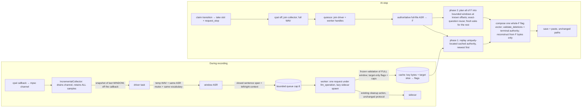

# Incremental Voice Correction During Live ASR

- **Version:** 0.8
- **Date:** 2026-09-12
- **Status:** Implemented

## Table of Contents

1. [Summary](#1-summary)
2. [Problem Statement (pre-change baseline — historical)](#2-problem-statement-pre-change-baseline--historical)
3. [Design Overview](#3-design-overview)
4. [Detailed Design](#4-detailed-design)
5. [Edge Cases](#5-edge-cases)
6. [File Changes](#6-file-changes)
7. [Testing Strategy](#7-testing-strategy)
8. [Migration Plan](#8-migration-plan)
9. [Security Considerations](#9-security-considerations)
10. [Cost Analysis (honest)](#10-cost-analysis-honest)
11. [Implementation Tasks](#11-implementation-tasks)
12. [Implementation Status and Known Limitations](#12-implementation-status-and-known-limitations)
13. [Revision Notes](#13-revision-notes)

## 1. Summary

Long dictations shipped uncorrected: post-stop cleanup was one whole-transcript
regeneration under a fixed sidecar deadline, and measured whole-text inputs
timed out at 892 words and at the 5-minute real fixture (§2, historical). This
feature corrects
**during** recording: an `IncrementalCollector` retains the full PCM (same
O(total) storage class as the channel it drains alongside), publishes bounded
window snapshots off the audio callback, and a driver/worker pair transcribes
each snapshot and asks the **unchanged** sidecar protocol to clean bounded
**context windows** (left context + target + right context) as they close.
Each settled answer is cached as per-token **deletion flags + capitalization
flips** for its exact question (key bytes + target slice), under the
recording's frozen gate-terms snapshot.

At stop the microphone path winds down first, the unchanged authoritative
full-file ASR produces `F`, and one shared bounded planner reconstructs the
result: it replays cached authority only for keys that occur **exactly once,
word-aligned** in `F` (newest settled answer owns contested targets), plans
**every** remaining token of `F` into bounded windows at known offsets, reuses
any **exact** settled question at each of its occurrences, and asks fresh
requests only for what is left. All edits compose into one whole-`F` flag
vector adjudicated by `validate_deletions` — the **terminal, global
authority** — and the delivered text is reconstructed from known `F` bytes
only: no terminal call validates a model proposal against `F`, and no
whole-text byte/word cap can refuse the composed output. One failed window
costs only its own region. The honest worst case is a full bounded re-sweep
(§10, §12).

## 2. Problem Statement (pre-change baseline — historical)

This section records the investigation that motivated the change; it
describes the **old** whole-text path and draft-stage measurements, not the
shipped contract (which is §3–§5). Exact experiment numbers live in the
journal: `docs/journals/2026-09-12-correction-baseline-experiments.md`.

### 2.1 Reported symptom

Users reported AI correction failing often for dictations longer than ~30
seconds.

### 2.2 Executed facts — old code

| # | Fact | Evidence (pre-change) |
|---|------|----------|
| F1 | ASR ran **once, file-only, after stop** on both orchestrations (production `hotkeys/manager.rs`, test harness `pipeline.rs`), which shared `llm::cleanup::run_cleanup`. | `llm/cleanup.rs` |
| F2 | Sidecar regenerated the whole input with output budget `2·input+32` tokens. | `llm_cleanup.py` |
| F3 | Fixed internal alarm: results measured over the alarm were rejected even if native work completed; a timeout yielded no proposal at all. | `llm_cleanup.py` |
| F4 | `validate_cleanup` salvage needed a *completed* proposal; it cannot rescue timeouts — exactly the long-input mode — and whole-text byte/word caps (`MAX_CLEANUP_BYTES`/`MAX_CLEANUP_WORDS`) refused large texts outright. | `validation.rs` |
| F5 | A timeout retired the sidecar handle and killed the subprocess; the **next** recording paid spawn+load+warm inside its stop path. | `llm/engine.rs` |
| F6 | Nested Rust timeouts were held under `llm_operation`; the final pass used `try_lock`, so a busy lifecycle yielded `Unavailable`. | `cleanup.rs`, `engine.rs` |
| F7 | During recording, all PCM lived only in the single-consumer mpsc channel; a second consumer of the channel itself would silently delete audio from the authoritative recording. | `capture.rs` |

### 2.3 Baseline measurements (historical)

Sidecar completion time grew roughly linearly with input length, crossing the
alarm near ~330–360 words (≈450 output tokens at the measured ~50 tok/s); a
1610-word input additionally **collapsed** — a shrunken output instead of a
copy of the input — so extending the deadline alone could not make
whole-transcript cleanup correct. Production-alarm timeouts were **observed**
at 892 words and at the 5-minute real fixture; the same ~320-word text
repeatedly measured on *either side* of the alarm only under the sweep's
extended 120 s experiment deadline (an 11,462 ms row is impossible in
production), so near-threshold production failure remained plausible-but-
unobserved, not a measured rate. The sweep's 40–120-word window rows likewise
ran on that extended deadline — they bound per-request cost relative to size,
not production pass/fail — and its "zero losses" check counted preserved
markers/numbers/names, which is not semantic fidelity. The whole-text
validator's alignment blow-up (rejected at ~108 stutter-dense words, accepted
when windowed) showed chunking widened *acceptance coverage* independently of
latency. A user log confirmed the failure signature: a 260 s recording →
cleanup Failed at the alarm; the next recording paid ≈2.6 s of sidecar respawn
inside its stop path.

Two draft-stage hypotheses were later retired by evidence and are **not** part
of the shipped rationale: post-alarm process health was initially unproven
(later a true-alarm experiment showed healthy reuse of a *responded* timeout —
shipped behavior follows §4.7), and "stop-time cost is the right edge only"
understated the miss case (shipped worst case is §10).

### 2.4 Root causes → shipped answers

1. **Request size vs fixed deadline** → no **unbounded** whole-transcript
   request survives (§4.2–§4.3); a short dictation still naturally yields one
   bounded request.
2. **No completed proposal ⇒ nothing to salvage** → authority is per-window;
   a failed window only loses its own region (§4.4).
3. **Long-input model collapse** → no unbounded whole-transcript request
   remains; deletions apply to known bytes (§4.5).
4. **Restart cascade in the user path** → responded timeouts retain the
   resident sidecar (§4.7); faults still kill it.
5. **Correction was post-stop only** → live driver/worker correct during
   recording (§4.1–§4.3).
6. **Whole-text validator blow-up** → validation runs per bounded window plus
   one flag-vector adjudication over `F` (§4.4–§4.5).

## 3. Design Overview

Decisions:

- **D1 — independent rolling windows; no provisional merged text.** Window
  snapshots are transcribed and corrected independently; no accumulated
  cross-window transcript is ever formed, prefetched, or pasted. The final
  full-file pass over retained audio remains the sole text authority.
- **D2 — the model sees context; the protocol does not change.** A request is
  an ordinary `{"action":"cleanup","text":KEY}` call where `KEY = left +
  target + right` sliced at word boundaries from one source text (live window
  transcript, or `F` at stop). Only target-token authority is kept. Judgment
  context (e.g. mid-sentence self-repairs like "or no, Monday") is why the
  window carries left context.
- **D3 — exact reuse only, in two phases.** Phase 1 replays a cached window
  iff its key bytes occur **exactly once** in `F`, aligned to word/token
  boundaries on both ends (`unique_occurrence`); a repeated key is never
  replayed on a guessed position. Phase 2 plans `F` into windows at known
  offsets and reuses an **exactly identical question** (same key bytes AND
  same target slice, `CacheKey`) at *each* occurrence with zero re-anchoring.
  Generated text never enters the result: the cache stores the frozen
  validator's own per-token deletions (+ caps flips), and the terminal output
  is `F` minus flagged tokens (§4.5).
- **D4 — collector retains everything; the channel keeps exactly one
  consumer.** The collector *is* the drain (as today) plus a retain-all Vec
  and read-only snapshots — never a second reader racing the old path. Memory
  is O(total PCM) (≈ 11.5 MB/min of 48 kHz f32) for the retained buffer plus
  bounded window snapshots and queue; finish stops cpal, joins the collector,
  and takes retained samples + its own residual drain exactly once.
- **D5 — `llm_operation` discipline preserved; the microphone never waits on
  the LLM.** One worker, one request in flight, lock acquired per bounded
  request. Stop = claim transition → take session slot + `request_stop` → cpal
  off + collector join → `quiesce` → final ASR → planner. `quiesce` signals
  stop and then **awaits the real driver/worker join handles** (§4.6); every
  *queued* wait inside those tasks is stop-interruptible, but an already
  in-flight wait is not interruptible at all — neither the native window ASR
  nor the in-flight sidecar request can be cancelled mid-run. The joins
  therefore end only when the current window ASR returns and/or the current
  request reaches its own per-request deadline; there is **no total bound on
  the join itself**.
- **D6 — per-window failure isolation.** A failed, rejected or timed-out
  window leaves only its own region uncovered; independently validated edits
  elsewhere still apply, and the uncorrected original always remains in
  History. There is no whole-cleanup outer timeout and no whole-text refusal.
- **D7 — protection is enforced by adjudication, not prefiltering.** There is
  deliberately **no** accumulated-text protection prefilter and no global
  protected-span drop step: each window's authority is re-derived through the
  frozen validator over its full key (protection/repeat/restart rules computed
  jointly), and every composed run is re-adjudicated over the whole `F` by the
  shared `DeletionContext` before acceptance. Quotes, code, identifiers and
  terms are protected by the same rules at both levels — nothing is skipped
  wholesale.
- **D8 — no silent drops.** Phase 2 plans **every** uncovered token of `F`;
  gaps, live failures and the unclosed tail are all re-askable. The stop path
  is exhaustive but bounded per request; cost honesty in §10.

## 4. Detailed Design

### 4.1 PCM collector (`src-tauri/src/audio/capture.rs`)

`IncrementalCollector::start` spawns the drain/retain task when the
incremental path is eligible (§4.8): it drains the shared channel, appends to
a retained `Vec<f32>` behind a std mutex, and answers `snapshot(window)`.

- `snapshot` copies the most recent `window` samples (or all, if fewer) —
  read-only over the retained buffer, off the audio callback.
- Stop flag → final drain → `join` returns; finish merges **retained prefix +
  residual drain in arrival order** — every chunk appended once, exactly once.
  Cancel joins the same way; its retained PCM still flows to the existing
  cancelled-recording history path (§4.6), it is not simply discarded.
- With no collector, the historical finish path runs verbatim.

### 4.2 Live windowing (`src-tauri/src/llm/correction.rs` driver)

Per recording the driver runs while `!stopped`:

1. Every `interval` (6 s), snapshot the last `window` (20 s) of PCM, write a
   temp WAV, and transcribe via the same production interface as the stop
   path: `transcribe_file_with_vocabulary` on the shared ASR mutex
   (`with_engine`) with the recording's vocabulary snapshot; the temp WAV is
   removed after success **and** failure (window audio is a slice of the
   retained full recording, so it has no recovery value).
2. **Dispatch gate:** a chunk ends at a sentence terminator within the
   `max_target_words = 20` cap, else **at the cap** (punctuation is not
   required). A live chunk is dispatched only when at least
   `close_ctx_tokens = 6` real tokens trail it inside the window — proof the
   ASR saw enough after the chunk to judge it; a tail with fewer trailing
   tokens is held, and phase 2 covers it.
3. Context assembly: `left ≤ 12` + target + `right ≤ 8` words from the window
   text, clamped under `max_request_words = 100` (guard) and a soft 4 KB byte
   clamp; a promise of right context that the clamp cannot afford ⇒ the target
   is not sent (stays uncovered; re-planned at stop).
4. Candidates are deduped by full `CacheKey` against queued/settled/failed and
   pushed to a queue of cap 8 (oldest unsent dropped — the stop path re-plans
   everything uncovered, so nothing is silently lost).

There is **no** sidecar-resident eligibility gate: the worker lazily spawns
the installed sidecar through the same `ensure_running` post-stop cleanup
uses, under the same deadline.

### 4.3 Window request + cache

- `WindowRequest { key, target_range (relative to key), source_start }`;
  `CacheKey = (key bytes, target_start, target_end)`. The gate-terms snapshot
  is **not** in the key — the handle freezes the protected-terms slice at
  start and `plan_cleanup` requires exact slice equality with the final terms
  before *any* reuse (mid-recording settings edit ⇒ zero reuse, full re-plan).
- `CacheEntry { request, deleted: Vec<bool> over `word_spans(key)`, flips:
  Vec<(token, letter)>, elapsed_ms, seq }`. All-false = settled **NO-CHANGE**
  authority (never re-asked); `seq` is a monotonic per-session settle stamp.

### 4.4 Worker: settling authority per window

One worker per recording, one request in flight, `llm_operation` acquired per
bounded request and released. Per candidate: send `key` via the unchanged
cleanup action; then `target_authority`:

1. `validate_cleanup_with_edits(key, proposal, terms)` — the **frozen full-key
   validator** (protection, repeat/restart, punctuation rules all recompute
   jointly on the full key).
2. Keep only target-token deletions; re-adjudicate that subset over the full
   key with `validate_deletions`, rebuild the candidate with
   `deletions_candidate`, and require the frozen pass to **re-derive the same
   subset** — what caches is exactly what the frozen gate accepts. Extract the
   caps flips the frozen pass baked into its own output, restricted to target
   tokens.
3. Ok ⇒ store entry; Err/transport-fail ⇒ `remember_failed` (the stop path
   re-plans failures against `F` with fresh offsets; the live key is not
   re-asked mid-recording).

### 4.5 Stop planning (`plan_cleanup` — every cleanup caller, session or not)

Inputs: final text `F`, final gate terms, optional drained handle.

1. **Terms gate:** reuse the cache only under exact gate-terms slice equality.
2. **Phase 1 (unique-location replay):** for each entry, `unique_occurrence`
   finds the key in `F` iff it matches at exactly one word/token boundary and
   ends on a real token end of `F` (the frozen tokenizer's own spans —
   e.g. blocks a cached "can" matching inside "can't"). Candidates are sorted
   by `seq` **descending**: the newest settled answer composes first, and any
   older entry whose *target* tokens overlap already-owned ones is skipped to
   re-plan (context may overlap freely).
3. **Phase 2 (known-offset plan):** `plan_windows(F)` tiles **all** of `F`
   into ≤ 20-word targets with 12/8 context at planner-computed absolute
   offsets. A window fully owned by phase-1 authority is never re-asked. A
   window whose *exact* question is settled reuses that authority at this
   window's own offset — a repeated occurrence is never skipped. Otherwise the
   question is asked once (duplicate fresh questions allowed; the second
   identical one reuses the just-settled answer).
4. **Ownership is one-way:** a phase-2 window's authority (deletions AND caps)
   is clipped to target tokens **not** owned by newer phase-1 authority
   (`clip_uncovered`); the clipped runs are re-adjudicated like everything
   else. Fresh work can never overwrite newer cached authority.
5. **Composition + terminal authority:** every run from every source is OR-ed
   into one whole-`F` flag vector; after each tentative accept the **shared
   `DeletionContext`** (prepared once per `(F, terms)`) re-adjudicates the
   whole vector — deletions are non-monotonic, so joint legality is checked
   jointly, never per window in isolation. Only the run that breaks
   admissibility is dropped. The flag vector *is* the authority (equivalent to
   `validate_deletions(F, flags, terms)`); `authorized_caps` then applies the
   collected flips (per-flip revert if a flip alone loses literal counts). The
   delivered text is reconstructed **only from known `F` bytes** — no
   model-proposal alignment against `F`, no LCS, no whole-text byte/word cap.
6. Status: when any safe change survives composition the result is `Applied`
   regardless of individual window failures. `NoChanges` when everything
   validated clean; when **nothing** changed, the first window failure is
   reported (transport/window failure outranks model rejection), else
   `Rejected`; a wholesale failure (no sidecar at all, nothing cached) returns
   `F` verbatim.

### 4.6 Lifecycle (`hotkeys/manager.rs` + `pipeline.rs` mirror)

Both normal and cancel stops wind down in one order: claim transition → take
the session slot + `request_stop()` → `finish_recording_capture` (cpal stopped
**before** reading health/samples; mic off) → `handle.quiesce().await` (cancel
takes the slot + signals stop first so the driver queues no further windows;
its joins complete after capture). Afterwards only the **normal** stop
continues: final ASR → `run_cleanup_with(state, F, terms, handle)` →
save/paste. The **cancel** path skips exactly the correction: the taken
correction cache is dropped and no LLM cleanup or paste ever runs, while the
**existing** cancelled-ASR/history behavior is preserved — retained audio is
still transcribed and saved as `Transcription { cancelled: true,
cleanup_suggestion: None, llm_applied: false }` (a placeholder row when too
short to transcribe), and the next recording starts with a fresh empty handle.
`quiesce` joins the **real** task handles, no timeout-abandoned joins: queued
waits (pending `llm_operation` lock, queue
sleep, interval sleep) are `select!`-interruptible, but in-flight native
window ASR and the in-flight `sidecar_cleanup` request are **not**
cancellable — the join ends when they complete or the request hits its own
30 s deadline; there is no tighter bound on the join itself (measured on the
paced replays: post-stop joins ≈ 0.5 s / 1.1 s; journal §15). A quiesced
session handle provably holds no lock, request, or engine slot of **its own
tasks** (other owners of those shared resources are outside this guarantee);
the planner then sees a drained cache.

### 4.7 Sidecar lifecycle policy (`llm/engine.rs`)

A **clean model timeout** (the sidecar *responded* with a timeout status — the
model finished/aborted under its own alarm while the pipe is healthy) retains
the resident handle: proven healthily reusable after a true-alarm run.
Transport/process faults (pipe death, `operation_failed`, no response) still
retire the handle and `kill_orphan` the process; the next call respawns
lazily. Per-request: one 30 s outer deadline + orphan kill; model generation
is not retried live, but a failed window may be freshly processed at stop
against `F` (D6/D8). `ensure_running`'s existing startup attempts are
unchanged. No protocol, prompt, model, or sidecar-file changes.

### 4.8 Non-English guard

The whole-text language guard stays on the final path; live windows are still
requested during recording (bounded waste, queue-capped). Non-English
dictations finalize Unchanged as before.

## 5. Edge Cases

| Case | Handling |
|---|---|
| Stop during window ASR / in-flight request | cpal off first; `quiesce` joins the tasks — in-flight native ASR and sidecar legs are uncancellable, so the join ends when they complete / hit the request's own 30 s deadline; no tighter total bound. Mic never waited on the LLM. |
| Cancel / new recording (generation bump) | Wind-down order as stop, then skip exactly the correction: cache dropped, no LLM cleanup, no paste; the existing cancelled-ASR/history path still transcribes retained audio and saves a `cancelled: true` row (placeholder if too short); tasks joined; next handle empty; no task leaks. |
| Quote/code spans | No prefilter, no wholesale skip: frozen full-key validation plus whole-`F` composition adjudication reject edits inside protection at both levels (§4.4, §4.5 step 5); long quoted passages simply remain uncorrected. |
| Unpunctuated long stretch | Live windows still dispatch ≤ 20-word cap chunks once ≥ 6 real right-context tokens trail the chunk (closure is token-count proof, not punctuation); only a tail with < 6 trailing tokens is held, and phase 2 covers it with word-boundary clamps. |
| `F` differs from every window (ASR provisional→final drift) | Keys don't match ⇒ full bounded re-sweep (measured: 26/135 keys locatable on the 5-min fixture; journal §15). Correct, slower; never silently skipped. |
| Key occurs ≥2× (or 0×) in `F` | Phase-1 miss ⇒ region covered by phase 2; if the exact question is settled it is applied at **each** occurrence at that window's offset; otherwise freshly asked. |
| Repeated phrase cached once, appears twice in `F` | Known-offset reuse (phase 2) handles every occurrence; unique-search (phase 1) refuses to guess between them. |
| Settings (gate terms) change mid-recording | Exact slice equality fails ⇒ cache dropped, full re-plan against final terms. |
| A run would delete across protected/literal rules jointly | Whole-`F` re-adjudication drops **only that run**; other runs stand (D6). |
| Dictionary replacements land inside a cached span | Same mechanism as gate terms: replacement terms are part of the exact snapshot compared at reuse time. |
| `F` very long (≥ 32 KB) | Individual requests stay ≤ 100 words ≪ caps; the composed flag vector has **no** whole-text cap — old byte/word refusals cannot fire (output is `F` bytes only). |
| Sidecar busy/not resident during recording | Worker waits on the lock (async, off the user path); lazy spawn on first request. |
| `llm_cleanup_enabled = false` | No collector/driver/worker; historical path verbatim. |
| Paste/clipboard/history failure paths | Untouched. |

## 6. File Changes

| File | Op | Change (as shipped) |
|---|----|--------|
| `src-tauri/src/llm/validation.rs` | modify | Exposed the frozen pass's internals as the terminal API: `word_spans`, `sentence_boundaries`, `validate_cleanup_with_edits`, `deletions_candidate`, `validate_deletions`, shared `DeletionContext` (prepare/adjudicate over (source, terms)), `caps_flips`, `authorized_caps` (per-flip literal guard); literal protection wired into validation/adjudication/caps paths. |
| `src-tauri/src/llm/correction.rs` | **new** | Config (20/12/8 + close 6 + caps §4.2), `IncrementalCollector` hookup, driver loop, closed-sentence selection, context assembly, `CacheKey`/`CacheEntry` + queue/failed dedupe, worker settle path, `quiesce`, `unique_occurrence`, `contiguous_runs`/`compose_runs`/`clip_uncovered`, `plan_cleanup` (both phases + terminal composition). 14 contract regressions in-module. |
| `src-tauri/src/audio/capture.rs` | modify | `IncrementalCollector` (drain+retain+snapshot+join, retained-prefix/residual-order merge); finish consumes collector when present; historical path otherwise. |
| `src-tauri/src/llm/cleanup.rs` | modify | `sidecar_cleanup` shared request primitive (worker + planner); `run_cleanup` takes+quiesces+drains the session slot; `run_cleanup_with` planner call; no whole-text size refusal, no whole-cleanup outer timeout; per-window 30 s deadline lives in the primitive. |
| `src-tauri/src/llm/engine.rs` | modify | Responded-timeout handle retention (§4.7); `kill_orphan` on fault classes. |
| `src-tauri/src/state.rs` | modify | `incremental_correction` recording-scoped handle slot (+ lifecycle plumbing). |
| `src-tauri/src/hotkeys/manager.rs` | modify | §4.6 stop/cancel ordering (production). |
| `src-tauri/sidecar/llm_cleanup.py` | **unchanged** | Protocol, prompt, timeout, caps identical; existing python suite passes untouched. |

(`pipeline.rs` and `test_support.rs` shipped unchanged: the test harness
inherits the session slot through the same `run_cleanup` wrapper, and the
contract regressions use in-module fakes rather than shared mocks.)

## 7. Testing Strategy

Consumer-observable behavior; regressions exist where a plausible bug would
fail them (all shipped and green):

1. **Capture integrity:** retained+residual merge delivers every chunk once in
   arrival order (incl. a stop-time callback tail); snapshots are read-only
   views over retained PCM (`audio/capture.rs` tests).
2. **Window planning contracts:** closed-sentence requirement (live path won't
   send unclosed tails), target/context caps, byte-clamp context trade,
   right-context promise unaffordable ⇒ not sent (`correction.rs`).
3. **Terminal authority:** composed flag vector equals `validate_deletions`;
   independently bad runs are dropped while good runs survive; caps applied
   once globally; reconstructed text is `F` bytes only.
4. **Cache semantics:** all-false = settled NO-CHANGE (never re-asked);
   failures retried only at stop against `F`; gate-terms slice drift drops all
   reuse; supersession by `seq` newest-first, never HashMap order;
   `unique_occurrence` rejects repeated keys, mid-token starts/ends (incl.
   apostrophe-spanning tokenizer cases); known-offset exact reuse applies at
   every occurrence; one-way ownership clips phase-2 authority around newer
   phase-1 authority.
5. **Per-window isolation:** injected single-window failure ⇒ other regions'
   edits ship, failed region raw, original retained in History.
6. **Sidecar unchanged:** existing `test_llm_cleanup.py` passes unmodified.
7. **Runtime qualification (executed):** paced WAV replays through production
   functions with real ASR + real sidecar from cold start — 40.9 s and 299.8 s
   fixtures, cached vs same-planner no-cache, byte-identical outputs;
   lifecycle cancel exercise proved mic-stop-then-join ordering and no PCM leak
   (evidence: journal §15–§16; the harnesses were throwaway and removed
   post-evidence).

## 8. Migration Plan

No schema, no data migration, no feature-gate shim: the incremental path *is*
the cleanup path when `llm_cleanup_enabled`; disabled reproduces the historical
behavior exactly (no collector/driver/worker). Rollback = revert the changeset.

## 9. Security Considerations

Local-only unchanged. Window temp WAVs live under the system temp dir with a
uuid name and are removed after both success and failure (no recovery value —
the slice exists in the retained full recording). Logs carry byte counts, token
counts, elapsed ms and region ids —
never transcript text. The cache is process-memory only, cleared with the
session (fresh handle per recording).

## 10. Cost Analysis (honest)

- **ANE/ASR:** one 20 s window transcribed per 6 s of wall time while speaking
  — comfortably inside measured RTF; windows serialize with the final pass on
  one engine mutex.
- **LLM tokens:** the live path **adds** sidecar work — window overlap,
  per-window prompts, and stop-time reprocessing of missed regions are all
  extra model traffic beyond a single pass; only the *stop-time* share lands
  on the critical path, the rest overlaps speech. (No measured total-token
  multiplier is claimed.)
- **Stop path:** measured on the two paced fixtures: 40 s cleanup 8.8 s cached
  / 13.1 s same-planner no-cache; 5-min 112.7 s cached / 169.4 s no-cache,
  byte-identical either way. **Worst case = a full bounded re-sweep**, serial
  per window. Chosen trade-off (D8): coverage over tail latency; reported
  honestly rather than capping requests.
- **RAM:** O(total PCM) retained (as the channel was), plus one bounded
  window snapshot and a ≤ 8-entry request queue per recording. No duplicate
  full-recording copy; no peak-RSS claim beyond that structure.

## 11. Implementation Tasks

Shipped in director-gated order: (1) engine responded-timeout retention;
(2) validator edit-range/flag API (`validate_cleanup_with_edits`,
`validate_deletions`, `DeletionContext`, caps pair) with the literal-guard
core work; (3) collector + finish merge; (4) `correction.rs` config/driver/
worker/cache/quiesce; (5) `plan_cleanup` two-phase planner + terminal
composition wired through `cleanup.rs`, `state.rs`, `manager.rs`,
`pipeline.rs`; (6) contract regressions + full-suite gates (§12).

## 12. Implementation Status and Known Limitations

**Implemented 2026-09-12.** Gates: full `cargo test` 212 passed / 0 failed;
`cargo build` and `cargo clippy --all-targets -- -D warnings` clean
(`/tmp/sotto-final-{build,clippy,test}.log`). Qualification: real-model
planner probe + two paced live replays (cold sidecar start) + lifecycle
cancel exercise — raw numbers, honest readings and per-experiment detail in
journal §14–§16; `/tmp/sotto-{probe-run1,replay-40s,replay-5min,lifecycle}.txt`.

Known limitations (measured, deliberately not tuned away):

- **Stop-path planning is serial per window.** With a mostly-missing live
  cache a 5-minute recording still spends ≈ 113 s in post-stop cleanup (the
  old whole-text path measured a timeout at that fixture; and vs 8.8 s at
  40 s). −33% vs the same planner uncached.
- **Live-cache coverage is bounded by ASR text equality:** provisional window
  transcripts often differ from the final full-file transcript (26 of 135
  settled keys were uniquely locatable on the 5-min fixture). Exact-match
  reuse was kept strict by ruling; no fuzzy/case-fold relaxation.
- **Phase-1 contested targets are skipped whole, not clipped:** on the 5-min
  fixture 4 older cached entries were deferred to re-planning because their
  targets overlapped newer authority (≈ 5.1% token upper bound of lost
  replay). Phase-2 ownership **clipping** around newer authority does ship
  (§4.5 step 4); partial-clipping of phase-1 skips was measured not worth it.
- **Short dictations are slower than the historical one-shot** (8.8 s vs 3.8 s
  at 40 s): the win is bounded request size and reliability at length, not
  universal speedup.
- **Cleanup remains conservative:** residual fillers, ASR word errors and
  awkward phrasing survive; the feature is correction, not rewriting.

## 13. Revision Notes

- v0.1–v0.4 (draft + review passes 1–3): salvage/lock/prompt corrections;
  validator-owned edit ranges (external diffing removed); completeness passes
  on duplicate-key, generation, non-English, cross-window-quote cases.
- v0.3: F9 corrected — no during-capture disk writer existed; retain-all
  collector replaced a destructive drop-older scheme; stop-cpal-first ordering
  fixed; MAX_STOP_REQUESTS cap removed (exhaustive reprocess); global
  protection added; respawn and feature-shim dropped; guarantee language
  replaced with measured probabilities + collapse fact.
- v0.5: consumed the window sweep (per-request headroom, marker-count checks,
  near-threshold straddle, alignment blow-up at 108 stutter-dense words as an
  acceptance-coverage argument).
- v0.6: director approval + implementation order; true-alarm health experiment
  resolved timeout-reuse: responded timeouts retain the sidecar.
- v0.7 (implementation): §12 recorded the shipped deltas over the draft —
  flag-vector terminal authority (byte-range replay dropped), two-phase
  replay/known-offset reuse, quiesce joins, 20/12/8 defaults (80/30/20 draft
  values replaced by probe + replay evidence), and measured limitations.
- **v0.8 (this revision, cleanup phase):** the draft §3–§5 prose is rewritten
  to the shipped contract per §12 — accumulated-text `A` and the protection
  prefilter (never built), interval/word draft sizing, dict/vocab-gen/prompt-
  SHA cache identities and source-order byte-range replay replaced by the
  exact-key + relative-target identity, token flags, seq-newest-first
  unique-boundary search and known-offset reuse; unproven "timeout restart
  unchanged" replaced by shipped §4.7; joins described truthfully (await owned
  tasks; native ASR not cancellable); file table corrected
  (`llm/correction.rs`). Historical baseline kept and labeled; journal owns
  historical numbers.
