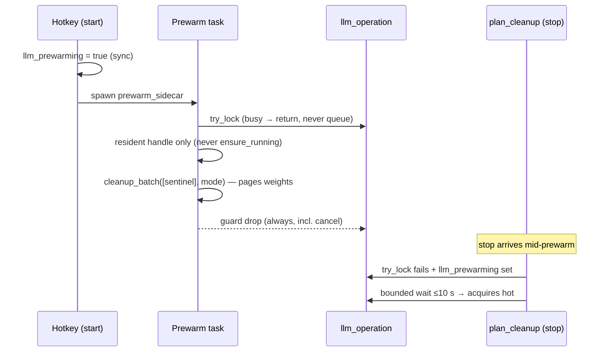

# Recording-Start Speculative Cleanup Prewarm

- **Version:** 1.0
- **Date:** 2026-09-14
- **Status:** Implemented

## 1. Summary

The first dictation after an idle period pays a multi-second voice-cleanup
delay because macOS swaps the MLX sidecar's weights out while nothing
records. This spec covers a speculative prewarm fired when recording starts:
a fixed benign generation through the resident cleanup sidecar pages the
weights back in during the recording window, so cleanup at stop time starts
hot. Measurement history lives in
`docs/journals/2026-09-14-idle-cleanup-latency.md`.

## 2. Problem Statement

Logs correlate idle gap with cleanup latency: gap 133 min → 6443 ms,
62 min → 5814 ms, ≤15 min → ≤1990 ms, <2 min → ~1100–1700 ms. The sidecar
process stays resident (same pid) but its RSS drops to ~0.02 GB idle against
~1.5–2.2 GB active on a 16 GB machine with ~8 GB swap in use. The spawn and
load path is NOT the cost: the latency timer starts after `ensure_running`
returns. The cost is pure page-in inside the first generation. Users feel it
as "the first correction is slow".

## 3. Design Overview

The recording window (seconds of speech) is free capacity: capture is
audio-only, and one ~1 s warm generation cannot contend with it. Warming at
recording START (not on a timer) means the page-in overlaps speech instead
of the stop path.

## 4. Detailed Design

- `AppState::llm_prewarming: AtomicBool` — set synchronously by
  `handle_start_recording` BEFORE the spawn (closes the race where a
  sub-frame recording stops before the task starts); cleared by an RAII
  guard inside `prewarm_sidecar` on every exit path.
- `cleanup::prewarm_sidecar(state)`:
  1. Gates on `is_feature_compiled() && is_platform_supported()`.
  2. Snapshots `llm_cleanup_enabled` + `llm_cleanup_mode`, DROPS the
     settings lock before touching `llm_operation` (lock-order rule).
  3. `llm_operation.try_lock()` — busy ⇒ return (never queue behind real
     work).
  4. Borrows ONLY an already-resident handle from `state.llm_engine`
     (`is_alive()` check; a dead handle is dropped and `llm_loaded`
     cleared). **Never calls `ensure_running`** — no spawn, no load, no
     second MLX process, ever.
  5. `cleanup_batch([PREWARM_SENTINEL], mode)` on `spawn_blocking`; handle
     restored afterwards; zombie-classified errors retire the handle exactly
     as the stop path does. Panics kill the orphan.
  - `PREWARM_SENTINEL` = the sidecar's own `WARMUP_TEXT`
    ("Please um keep this readiness check local.") — fixed benign English,
    byte-identical across machines, zero user data on the wire.
  - `warm_model()` alone cannot serve this role: it short-circuits on the
    stale `_warmed` bool; only a real generation pages weights back.
    Both heads are already warm at load, so the sentinel dispatch pages
    shared weights through the configured mode's head.
- `correction::acquire_cleanup_operation(state, handoff_wait)` replaces the
  bare busy gate:
  - free ⇒ proceed (all existing behavior).
  - busy AND `llm_prewarming` ⇒ `tokio::time::timeout(PREWARM_HANDOFF_WAIT
    = 10 s, lock)`. The prewarm's generation IS this cleanup's page-in;
    skipping it would silently discard a real correction.
  - busy otherwise ⇒ immediate Unavailable (download/prepare/real-cleanup
    semantics byte-identical to before; every existing busy test unchanged).
  - wait expiry ⇒ the same Unavailable (fail behavior preserved).
- `PREWARM_HANDOFF_WAIT` is a parameter of the helper so the expiry path is
  unit-tested in milliseconds, not 10 s.

## 5. Edge Cases

| Case | Handling |
|---|---|
| Cold side (no resident sidecar) | Prewarm returns; stop path unchanged (spawn+load as today) |
| Cleanup disabled / Replace mode | Settings snapshot respected; sentinel sent in configured mode (pages the same weights either way) |
| Stop during prewarm | Bounded 10 s handoff wait → cleanup runs warm |
| Prewarm panics/hangs | outer stop-path timeouts unchanged; guard clears flag on cancel; stale flag worst case = one bounded wait then normal busy answer |
| Dead handle found at borrow | Dropped, `llm_loaded=false`; no respawn from prewarm |
| Prewarm generation itself times out (15 s sidecar alarm) | Handled inside `cleanup_batch` client path; handle retained/retired per classification; cleanup proceeds normally |
| Two recordings back-to-back | Second prewarm sees `llm_operation` busy ⇒ returns; flag cleared by its own guard |

## 6. File Changes

| File | Change |
|---|---|
| `src-tauri/src/state.rs` | `llm_prewarming` field + both constructors |
| `src-tauri/src/llm/cleanup.rs` | `PREWARM_SENTINEL`, `PREWARM_HANDOFF_WAIT`, guard + `prewarm_sidecar` |
| `src-tauri/src/llm/correction.rs` | `acquire_cleanup_operation` + handoff gate in `plan_cleanup` |
| `src-tauri/src/hotkeys/manager.rs` | sync flag set + spawn in `handle_start_recording` |
| `src-tauri/sidecar/test_llm_cleanup.py` | harness ported to `_heads`/mode/combined pin (pre-release gate + CI) |

## 7. Testing Strategy

- Rust: sentinel dispatch + flag clear; never-spawns (empty engine field stays
  empty, disabled settings untouched); never-queues (busy ⇒ no dispatch);
  handoff wait applies under `llm_prewarming`; handoff expiry falls back to
  busy-Unavailable (parameterized timeout).
- Python: `python3 -m unittest discover -s src-tauri/sidecar` — 34 green
  (3 real-model tests skip without the cached artifact).
- Manual smoke: press hotkey after idle; log shows prewarm dispatch/complete;
  immediate stop yields Applied, not busy.

## 8. Security Considerations

No new wire surface: the prewarm reuses the existing `cleanup_batch` action
with a constant literal. No user text ever reaches the prewarm. The flag is
a local AtomicBool; no IPC, no persistence.

## 9. Cost Analysis

One extra tiny generation (warm ≈1 s, swapped ≈6.5 s worst measured) per
recording start, running concurrently with capture. Metal/CPU work overlaps
speech; stop-path latency for the first dictation drops from 2.8–6.4 s to the
warm ~1.1–1.7 s band.

## 10. Implementation Status

Implemented in 0.10.1 (2026-09-14). 223 lib tests + 34 sidecar tests green.
